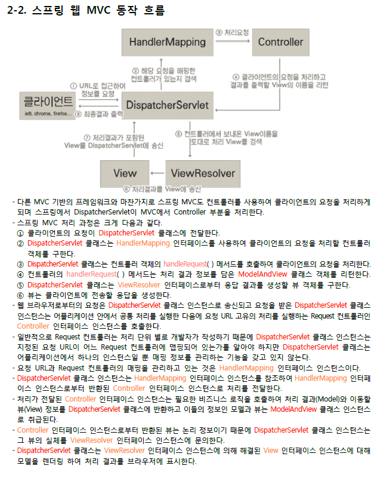

# 팁

# MAVEN
* [메이븐]('https://jeong-pro.tistory.com/m/168?category=793347')
```java
#1 빌드란?
 - 소스코드 파일을 컴퓨터에서 실행할 수 있는 독립 소프트웨어 가공물로 변환하는 과정 또는 그에 대한 결과물 이다.
 - 이를 좀더 쉽게 풀어 말하자면 우리가 작성한 소스코드(java), 프로젝트에서 쓰인 각각의 파일 및 
자원 등(.xml, .jpg, .jar, .properties)을 JVM이나 톰캣같은 WAS가 인식할 수 있는 구조로 패키징 하는 과정 및 결과물이라고 할 수 있다.

 

#2 빌드 도구(Build tool)
 - 빌드 도구란 프로젝트 생성, 테스트 빌드, 배포 등의 작업을 위한 전용 프로그램.
 - 빠른기간동안 계속해서 늘어나는 라이브러리 추가, 프로젝트를 진행하며 라이브러리의 버전 동기화의 어려움을 해소하고자 등장.
 - 초기의 java 빌드도구로 Ant를 많이 사용하였으나 최근 많은 빌드도구들이 생겨나 Maven이 많이 쓰였고, 현재는 Gradle이 많이 쓰인다.
(Ant는 스크립트 작성도 많고, 라이브러리 의존관리가 되지 않아 불편함)

 
```

```JAVA
제목과 같은 질문에 필자는 제대로 답변할 수 없었다.

단순하게는 maven repository에서 dependency 추가해서 필요한 라이브러리 쓰는 정도?

무엇을 위해 쓰는지, 왜 쓰는지, 어떻게 쓰는지에 대한 구체적으로 알지 못했다. 

사실 지금까지 알 필요도 없었고, 초보 프로그래머의 기준에서는 Maven을 몰라도 대중적이면서도 다양한 라이브러리를 많이 
접하고 써보면 "장땡"이었기 때문이었다.

사실 지금도 자세히는 모른다.

그러나, 조금 더 나은 프로그래머가 되기 위해서 maven에 대한 이해가 필요하다고 생각해서 정리한 것이다.
("maven을 빠삭하게 알아야 해!"가 아니라 "maven을 알아가는 길에 한 발자국을 떼보자!"다.)

pom.xml을 분석하기 전 maven 입문

1. Maven은 무엇인가?

Maven은 자바 프로젝트의 빌드(build)를 자동화 해주는 빌드 툴(build tool)이다.

즉, 자바 소스를 compile하고 package해서 deploy하는 일을 자동화 해주는 것이다.


2. Maven이 참조하는 설정 파일

Maven 전체를 보기보다 프로그래밍에 직접적인 연관이 있는 두 개의 설정파일을 알아보면 된다.

1) settings.xml

settings.xml은 maven tool 자체에 관련된 설정을 담당한다.

MAVEN_HOME/conf/ 아래에 있다. ( * MAVEN_HOME은 환경변수에 설정한 경로)

Maven 자체에 설정 값을 바꾸는 일은 일단 잘 없으므로 넘어가고 기획한대로 pom.xml을 살펴본다.


2) pom.xml

하나의 자바 프로젝트에 빌드 툴로 maven을 설정했다면, 프로젝트 최상위 디렉토리에 "pom.xml"이라는 파일이 생성되었을 것이다.

pom.xml은 POM(Project Object Model)을 설정하는 부분으로 프로젝트 내 빌드 옵션을 설정하는 부분이다.

꼭 pom.xml이라는 이름을 가진 파일이 아니라 다른 파일로 지정할 수도 있다. (mvn -f ooo.xml test)

그러나 maven의 원칙(습관에 의한 편의성?)으로 다른 개발자들이 헷갈릴 수 있으므로 그냥 pom.xml으로 쓰기를 권장한다.


Spring boot에서 프로젝트를 생성했을 때 나오는 pom.xml의 내용이다.

pom.xml은 <project>...</project>로 둘러싸여서 section별로 여러 정보를 나타내며 설정할 수 있다.

1) 프로젝트 정보

제일 위에 태그부터 살펴보도록 한다.

<modelVersion> : 4.0.0이라고 써있는데 이것은 maven의 pom.xml의 모델 버전이다. 형식이 4.0.0 버전이라고 이해하면 된다.

<groupId> : 프로젝트를 생성한 조직 또는 그룹명으로 보통, URL의 역순으로 지정한다.

<artifactId> : 프로젝트에서 생성되는 기본 아티팩트의 고유 이름이다.

메이븐에 의해 생성되는 일반적인 artifact는 <artifact>-<version>.<extention>이다. (ex demo-0.0.1-SNAPSHOT.jar)

<version> : 애플리케이션의 버전. 접미사로 SNAPSHOT이 붙으면 아직 개발단계라는 의미이며, 메이븐에서 라이브러리를 
관리하는 방식이 다르다고 한다.

<packaging> : jar, war, ear, pom등 패키지 유형을 나타낸다.

<name> : 프로젝트 명

<description> : 프로젝트 설명

<url> : 프로젝트를 찾을 수 있는 URL

위와 같은 태그들은 프로젝트 정보에 관련된 내용이다.

* <properties> : pom.xml에서 중복해서 사용되는 설정(상수) 값들을 지정해놓는 부분. 다른 위치에서 ${...}로 
표기해서 사용할 수 있다. (java.version에 1.8을 적용하고 다른 위치에서 ${java.version}이라고 쓰면 "1.8"이라고 쓴 것과 같다.

* <profiles> : dev, prod 이런식으로 개발할 때, 릴리즈할 때를 나눠야할 필요가 있는 설정 값은 profiles로 설정할 수 있다.

maven goal 부분에 -P 옵션으로 프로파일을 선택할 수 있다.

mvn compile -P prod 라고 하면 ${java.version}은 1.9가 된다. (예를 이렇게 해서 그렇지 자바 버전을 바꾸는 일은 잘 없다...)

2. 의존성 라이브러리 정보

의존성 라이브러리 정보를 적을 수 있다.

최소한 groupId, artifactId, version 정보가 필요하다.

스프링부트의 spring-boot-starter-*같은 경우에는 부모 pom.xml에서 이미 버전정보가 있어서 version은 따로 지정할 필요가 없다.
특히 스프링부트는 해당 스프링버전에 잘 맞는 버전으로 이미 설정되어 있기 때문에 오버라이드해서 문제가 생기는 부분은 순전히 
개발자 탓이다.

그리고 A라는 라이브러리를 사용하는데 B,C,D가 의존성을 가진다면 A를 dependency에 추가하면 자동으로 필요한 B,C,D도 가져오는 기능이 있다.

dependency에 <scope>의 경우 compile, runtime, provided, test등이 올 수 있는데 해당 라이브러리가 언제 필요한지, 
언제 제외되는지를 나타내는 것으로 따로 검색해보면 알 수 있다.

3. build 정보

build tool : maven의 핵심인 빌드와 관련된 정보를 설정할 수 있는 곳이다.

<build> 부분에서 설정할 수 있는 값들에 대해 설명하기 전에 "라이프 사이클(life-cycle"에 대해서 알 필요가 있다.

객체의 생명주기처럼 maven에는 라이프 사이클이 존재한다.

크게 default, clean, site 라이프 사이클로 나누고 세부적으로 페이즈(phase) 있다. 아래 그림 참조

[출처 : https://www.slideshare.net/ssuser5445b7/ss-56566336?qid=927855f5-7c8a-4f88-a834-d31292324fd2&v=&b=&from_search=4]

메이븐의 모든 기능은 플러그인(plugin)을 기반으로 동작한다.

플러그인에서 실행할 수 있는 각각의 작업을 골(goal)이라하고 하나의 페이즈는 하나의 골과 연결되며, 하나의 플러그인에는
여러 개의 골이 있을 수 있다.


* 라이프 사이클

mvn process-resources : resources:resources의 실행으로 resource 디렉토리에 있는 내용을 target/classes로 복사한다.

mvn compile : compiler:compile의 실행으로 src/java 밑의 모든 자바 소스를 컴파일해서 target/classes로 복사

mvn process-testResources, mvn test-compile : 이것은 위의 두 개가 src/java였다면 test/java의 내용을 
target/test-classes로 복사. (참고로 test만 mvn test 명령을 내리면 라이프사이클상 원본 소스로 컴파일된다.)

mvn test : surefire:test의 실행으로 target/test-classes에 있는 테스트케이스의 단위테스트를 진행한다. 
결과를 target/surefire-reports에 생성한다.

mvn package : target디렉토리 하위에 jar, war, ear등 패키지파일을 생성하고 이름은 <build>의 <finalName>의 값을 사용한다
지정되지 않았을 때는 아까 설명한 "artifactId-version.extention" 이름으로 생성

mvn install : 로컬 저장소로 배포

mvn deploy : 원격 저장소로 배포

mvn clean : 빌드 과정에서 생긴 target 디렉토리 내용 삭제

mvn site : target/site에 문서 사이트 생성

mvn site-deploy : 문서 사이트를 서버로 배포

위와 같은 진행 순서로 라이프 사이클이 진행된다.


이제 <build>에서 설정할 수 있는 값을 확인해보자.

<finalName> : 빌드 결과물(ex .jar) 이름 설정

<resources> : 리소스(각종 설정 파일)의 위치를 지정할 수 있다.

- <resource> : 없으면 기본으로 "src/main/resources"

<testResources> : 테스트 리소스의 위치를 지정할 수 있다.

- <testResource> : 없으면 기본으로 "src/test/resources"

<Repositories> : 빌드할 때 접근할 저장소의 위치를 지정할 수 있다. 기본적으로 메이븐 중앙 저장소인
http://repo1.maven.org/maven2로 지정되어 있다.

<outputDirectory> : 컴파일한 결과물 위치 값 지정, 기본 "target/classes"

<testOutputDirectory> : 테스트 소스를 컴파일한 결과물 위치 값 지정, 기본 "target/test-classes"

<plugin> : 어떠한 액션 하나를 담당하는 것으로 가장 중요하지만 들어가는 옵션은 제 각각이다. 다행인 것은
플러그인 형식에 대한 것은 안내가 나와있으니 그것을 참고해서 작성하면 된다.

plugin이 작성되어 있다고 무조건 실행되는 것은 아니다. 명확한 것은 아니지만 따로 실행할 플러그인을 메이븐
명령어로 실행해야 하는 것으로 알고 있다.

- <executions> : 플러그인 goal과 관련된 실행에 대한 설정

- <configuration> : 플러그인에서 필요한 설정 값 지정

apache CXF를 이용한 code generate 플러그인은 아래에서 소개되고 사용한다.

http://cxf.apache.org/docs/maven-cxf-codegen-plugin-wsdl-to-java.html

번외. <Parent> pom.xml 상속

<Parent> : pom.xml은 상속을 받을 수 있다. 스프링부트의 경우 부모 pom.xml에 자주 사용하는 라이브러리들의 
버전정보나 dependency들을 이미 가지고 있어서 참조하기 편리하다.

* 참고로 super pom.xml이라는 것이 있다.
```

## 그림
* JSP -> (Post, GET) -> Controller ->(Data Parameter) -> DAO/Service -> Model -> DB
	* DAO: Interface(서비스) + DAO(자바)

## MVC 흐름


1. 클라이언트(Client)가 서버에 어떤 요청(Request)을 한다면 스프링에서 제공하는 DispatcherServlet 이라는 클래스(일종의 front controller)가 요청을 가로챈다.

(web.xml에 살펴보면 모든 url ( / )에 서블릿 매핑을하여 모든 요청을 DispatcherServlet이 가로채게 해둠(변경 가능))

2. 요청을 가로챈 DispatcherServlet은 HandlerMapping(URL 분석등..)에게 어떤 컨트롤러에게 요청을 위임하면 좋을지 물어본다.

(servlet-context.xml에서 @Controller로 등록한 것들을 스캔해서 찾아준다.)

3. 요청에 매핑된 컨트롤러가 있다면 @RequestMapping을 통하여 요청을 처리할 메서드에 도달한다.

4. 컨트롤러에서는 해당 요청을 처리할 Service를 주입(DI)받아 비즈니스로직을 Service에게 위임한다.

5. Service에서는 요청에 필요한 작업 대부분(코딩)을 담당하며 데이터베이스에 접근이 필요하면 DAO를 주입받아 DB처리는 DAO에게 위임한다.

6. DAO는 mybatis(또는 hibernate등) 설정을 이용해서 SQL 쿼리를 날려 DB의 정보를 받아 서비스에게 다시 돌려준다.

(이 때 보통 VO(dto)를 컨트롤러에서 부터 내려받아 쿼리의 결과를 VO에 담는다. (mybatis의 resultType) 

7. 모든 로직을 끝낸 서비스가 결과를 컨트롤러에게 넘긴다.

8. 결과를 받은 컨트롤러는 Model객체에 결과물 어떤 view(jsp)파일을 보여줄 것인지등의 정보를 담아 DispatcherServlet에게 보낸다.

9. DispatcherServlet은 ViewResolver에게 받은 뷰의 대한 정보를 넘긴다.

10. ViewResolver는 해당 JSP를 찾아서(응답할 View를 찾음) DispatcherServlet에게 알려준다.

(servlet-context.xml에서 suffix, prefix를 통해 /WEB-INF/views/index.jsp 이렇게 만들어주는 것도 ViewResolver)

11. DispatcherServlet은 응답할 View에게 Render를 지시하고 View는 응답 로직을 처리한다.

12. 결과적으로 DispatcherServlet이 클라이언트에게 렌더링된 View를 응답한다.

```java
DispatcherServlet
* 클라이언트의 요청을 전달받는다. 
* Controller에게 클라이언트의 요청을 전달하고, Controller가 리턴한 결과값을 View에 전달하여 알맞은 응답을 생성하도록 한다.

HandlerMapping
* 클라이언트의 요청 URL을 어떤 Controller가 처리할지를 결정한다.

Controller
* 클라이언트의 요청을 처리한 뒤, 그 결과를 DispatcherServlet에 알려준다. 스트러츠의 Action과 동일한 역할을 수행다.

ViewResolver
* Commander의 처리 결과를 보여줄 View를 결정한다.

View
Commander의 처리 결과를 보여줄 응답을 생성한다.

```
```java
	<context-param>
		<param-name>contextConfigLocation</param-name>
		<param-value>/WEB-INF/spring/root-context.xml</param-value>
	</context-param>
	
	<!-- Creates the Spring Container shared by all Servlets and Filters -->
	<listener>
		<listener-class>org.springframework.web.context.ContextLoaderListener</listener-class>
	</listener>

	<!-- Processes application requests -->
	<servlet>
		<servlet-name>appServlet</servlet-name>
		<servlet-class>org.springframework.web.servlet.DispatcherServlet</servlet-class>
		<init-param>
			<param-name>contextConfigLocation</param-name>
			<param-value>/WEB-INF/spring/appServlet/servlet-context.xml</param-value>
		</init-param>
		<load-on-startup>1</load-on-startup>
	</servlet>
		
	<servlet-mapping>
		<servlet-name>appServlet</servlet-name>
		<url-pattern>/</url-pattern>
	</servlet-mapping>
```

# Web Application Structure(웹 서비스 기본 설정 구조)
```java
1. src/main/java
자바 코드

2. src/main/resources
	config/configuration.xml

	db/mapper.xml
	
	log4j.xml


----


1. src
개발자가 작성한 Servlet 코드가 저장된다.
2. Libraries
Servlet이나 JSP에서 추가로 사용하는 라이브러리 또는 드라이버
jar로 압축한 파일이어야 한다.
3. WebContent
Deploy할 때 WebContent 디렉터리 전체가 .war로 묶어서 보내진다.
WEB-INF
	lib:
	추가한 모든 라이브러리 또는 드라이버가 이곳에 모두 저장된다.
	classes:
	작성한 Java Servlet 파일이 나중에 .class로 이곳에 모두 저장된다.
	spring
		appServlet
			servlet-context.xml
		root-context.xml
			<bean class="org.mybatis.spring.SqlSessionFactoryBean" id="sqlSessionFactoryBean" >
				<property name="configLocation" value="classpath:/config/configuration.xml" />
				<property name="mapperLocations" value="classpath:/db/mapper.xml" />
				
			
	web.xml:
	SUN에서 정해놓은 규칙에 맞게 작성해야 하며 모든 WAS에 대하여 작성 방법이 동일하다.
	아래 추가 설명

.html 파일들
관련된 HTML 소스를 저장한다.
Ex) WebContent - views Directory - index.html는 http://localhost/helloLogin/views/index.html와 매핑된다.
https://gmlwjd9405.github.io/2018/10/29/web-application-structure.html

```
# configuration.xml
```java
<?xml version="1.0" encoding="UTF-8" ?>
<!DOCTYPE configuration
PUBLIC "-//mybatis.org//DTD Config 3.0//EN"
"http://mybatis.org/dtd/mybatis-3-config.dtd">
<configuration>
<environments default="development">
<environment id="development">
<transactionManager type="JDBC"/>
<dataSource type="POOLED">
<property name="driver" value="oracle.jdbc.OracleDriver"/>
<property name="url" value="jdbc:oracle:thin:@127.0.0.1:1521:orcl"/>
<property name="username" value="scott"/>
<property name="password" value="tiger"/>
</dataSource>
</environment>
</environments>
<mappers>
<mapper resource="mapper/Mapper.xml" />
</mappers>
</configuration>
```

```java
5행~20행 : <configuration> ~ </configuration>
⎽ <configuration> 태그는 중앙 허브 역할을 하며 전역 설정 정보이다.
 6행 ~ 16행 : <environments default="development"> ~ </environments>
⎽ <environments> 태그는 트랜잭션 관리와 커넥션 풀링을 위한 환경적인 설정하며 environments 요소의 default
속성은 기본 환경의 임의의 식별자를 지정하고 environment 요소의 id 속성의 식별자와 일치해야 하며 공백
문자열로 지정하거나 environment 요소의 id 속성의 임의의 식별자와 일치하지 않으면 예외가 발생한다.
 7행 ~ 15행 : <environment id="development"> ~ </environment>
⎽ <environment> 태그는 각각의 트랜잭션 관리와 커넥션 풀링을 위한 환경적인 설정하고 environment 요소의
id 속성은 각각의 환경을 정의한 임의의 식별자를 지정한다.
 8행 : <transactionManager type="JDBC" />
⎽ <transactionManager> 태그는 트랜잭션 관리를 설정한다.
⎽transactionManager 요소의 type 속성의 JDBC 키워드는 간단하게 JDBC 커밋과 롤백을 처리하고 트랜잭션의
범위를 관리하기 위해 <dataSource> 태그로 부터 커넥션을 가져온다.
 9행~14행 : <dataSource type="POOLED"> ~ </dataSource>
⎽ <dataSource> 태그는 요소는 데이터베이스의 연결을 설정하고 dataSource 요소의 type 속성의 POOLED 키워드
는 DataSource 인터페이스에 풀링이 적용된 JDBC 커넥션을 위한 구현체이다.
 10행 : <property name="driver" value="oracle.jdbc.OracleDriver"/>
⎽ property 요소의 name 속성의 값에 driver를 지정하며 템플릿 방식에 지정하는 driverClassName와 주의해야
한다.
 17행~19행 : <mappers> ~ </mappers>
⎽<mappers> 태그는 SQL 코드와 매핑 정의를 가지는 XML 파일인 mapper의 목록을 지정한다.
 18행 : <mapper resource="mapper/Mapper.xml" />
⎽<mapper> 태그는 sql 구문이 정의된 xml 파일을 위치를 속성으로 설정하며 경로 설정 방식에 주의해야 한다.
```

# configuration.xml
* Configuration 설정파일은 다양한 세팅과 프로퍼티를 가지며 중앙 허브 역할을 하며 전역 설정 위한 파일이다.

## 네임스페이스의 선언
* ⎼MyBatis 프레임워크는 다음과 같이 Configuration 설정을 위하여 네임스페이스를 선언한다.
```java
<!DOCTYPE configuration
PUBLIC "-//mybatis.org//DTD Config 3.0//EN"
"http://mybatis.org/dtd/mybatis-3-config.dtd">
```

```java
(2) 주요 태그
① <configuration> 태그
<configuration>
… 설정 …
</configuration>
⎼<configuration> 태그는 중앙 허브 역할을 하며 전역 설정 정보이다.
⎼configuration 요소는 MyBatis 프레임워크가 실행되는 데 필요한 트랜잭션 관리정보, DataSource 인터페이스
객체 생성을 위한 설정 정보, mapper 파일 위치, DB Connection 등 여러 설정들을 한다.

② <properties> 태그
<properties resource="config/db.properties" />
⎼<properties> 태그는 외부 자원으로 이동한다.
⎼properties 요소의 resource 속성으로 이동할 경로를 지정하고 명시된 속성을 가장 먼저 읽는다.

③ <typeAliases> 태그
<typeAliases>
<typeAlias alias="DeptDTO" type="min.bean.dto.DeptDTO" />
</typeAliases>
⎼<typeAliases> 태그는 자바 클래스에 대한 좀 더 짧은 이름이며 오직 XML 설정에서만 사용된다.
⎼<typeAliases> 태그의 자식 태그인 <typeAliase> 태그로 설정한다.
⎼typeAliase 요소의 alias 속성은 별칭의 이름을 명시한다.
⎼typeAliase 요소의 type 속성은 별칭에 사용할 클래스를 지정한다.

④ <typeHandlers> 태그
<typeHandlers>
<typeHandler javaType="String" jdbcType="VARCHAR" handler="min.bean.dto.DeptDTO" />
</typeHandlers>
⎼<typeHandlers> 태그는 PreparedStatement 인터페이스에 파라미터를 세팅하고 ResultSet 인터페이스에서
값을 가져올 때마다 적절한 자바 데이터타입을 가져오기 위해 사용된다.
⎼지원하지 않거나 비표준인 타입에 대해서는 개발자가 개발을 하고 TypeHandler 인터페이스를 오버라이드 할
수 있다.
⎼TypeHandler 인터페이스를 구현하고 자바 데이터타입에 TypeHandler를 매핑하면 된다.
⎼<typeHandlers> 태그의 자식 태그인 <typeHandler> 태그로 설정한다.
⎼typeHandler 요소의 javaType 속성은 자바에서 사용할 데이터타입을 지정한다.
⎼typeHandler 요소의 jdbcType 속성은 데이터베이스에서 적용할 데이터베이스 데이터타입을 지정한다.
⎼typeHandler 요소의 handler 속성은 자바의 데이터타입이 적용될 클래스를 지정한다.
- 396 -

⑤ <environments> 태그
<environments default="development">
<environment id="development">
… 설정 …
</environment>
⎼<environments> 태그는 다중 환경을 설정할 수 있지만 SqlSessionFactory 인터페이스 인스턴스마다 한개만
사용할 수 있다.
⎼<environments> 태그는 파라미터가 없으면 디폴트 환경이 로드된다.
⎼environments 요소의 default 속성은 디폴트 환경에 대한 기본 식별자를 지정한다.
⎼<environments> 태그의 자식 태그인 <environment> 태그는 각각의 환경을 정의한 환경을 지정한다.
⎼environment 요소의 id 속성은 각각의 환경에 대한 식별자로 environments 요소의 default 속성에서 지정한
기본 식별자와 동일하게 적용한다.

⑥ <transactionManager> 태그
<transactionManager type="JDBC[MANAGED]" />
⎼<transactionManager> 태그는 트랜잭션 관리를 설정한다.
⎼transactionManager 요소의 type 속성은 트랜잭션 관리에 적용한 속성값을 지정한다.

가. JDBC 속성값
⎼JDBC 속성값은 간단하게 JDBC 커밋과 롤백을 처리하기 위해 사용된다.
⎼ JDBC 속성값은 트랜잭션의 스코프를 관리하기 위해 <dataSource> 태그로 부터 커넥션을 가져온다.

나. MANAGED 속성값
⎼ MANAGED 속성값은 어떤 것도 하지 않으며 결코 커밋이나 롤백을 하지 않는 대신에 대신 컨테이너가 트랜잭션의
모든 생명주기를 관리한다.
⎼ MANAGED 속성값은 디폴트로 커넥션을 해제 하지만 몇몇 컨테이너는 커넥션을 해제 하는 것을 또한 기대하지
않기 때문에 커넥션 해제 하는 것으로 멈추고자 한다면 closeConnection 프로퍼티(속성)를 false로 설정해야
한다.

⑦ <dataSource> 태그
<dataSource type="POOLED[UNPOOLED/JNDI]">
<property name="driverClassName" value="${jdbc.driver}" />
<property name="url" value="${jdbc.url}" />
<property name="username" value="${jdbc.username}" />
<property name="password" value="${jdbc.password}" />
</dataSource>
<dataSource type="POOLED[UNPOOLED/JNDI]">
<property name="driverClassName" value="oracle.jdbc.OracleDriver" />
<property name="url" value="jdbc:oracle:thin:@127.0.0.1:1521:orcl" />
<property name="username" value="scott" />
<property name="password" value="tiger" />
</dataSource>
⎼<dataSource> 태그는 데이터베이스의 연결을 설정한다.
⎼dataSource 요소의 type 속성은 데이터베이스의 연결을 설정할 속성값을 지정한다.
⎼<dataSource> 태그의 하위 태그인 <property> 태그는 dataSource 요소의 type 속성에 지정한 속성값에 대한
프로퍼티를 지정한다.
⎼property 요소의 name 속성은 프로퍼티의 이름을 지정한다.
⎼property 요소의 value 속성은 프로퍼티의 이름에 대한 값을 지정한다.
- 397 -

가. UNPOOLED 속성값
⎼ 매번 요청에 대해 커넥션을 열고 닫는 간단한 DataSource 인터페이스로 성능을 크게 필요로 하지 않는 간단한
어플리케이션에 적합하다.

① driver 프로퍼티
⎼JDBC 드라이버의 패키지 경로를 포함한 자바 클래스명이다.

② url 프로퍼티
⎼데이터베이스 인스턴스에 대한 JDBC URL이다.

③ username 프로퍼티
⎼ 데이터베이스에 로그인 할 때 사용할 사용자명이다.

④ password 프로퍼티
⎼ 데이터베이스에 로그인 할 때 사용할 패스워드이다.

⑤ defaultTransactionIsolationLevel 프로퍼티
⎼ 커넥션에 대한 디폴트 트랜잭션 격리 레벨이다.

나. POOLED 속성값
⎼DataSource 인터페이스에 풀링이 적용된 JDBC 커넥션을 위한 구현체로 새로운 Connection 인터페이스 인스턴스
를 생성하기 위해 매번 초기화하는 것을 피하게 해 주므로 빠른 응답을 요구하는 웹 어플리케이션에서는
가장 많이 사용되고 있다.

⎼ POOLED 속성값은 UNPOOLED 속성값에서 제공하는 프로퍼티를 모두 제공하며 그 이외에도 많은 프로퍼티를
제공한다.
① poolMaximumActiveConnections 프로퍼티
⎼주어진 시간에 존재할 수 있는 활성화된 커넥션의 수로 디폴트는 10이다.
② poolMaximumIdleConnections 프로퍼티
⎼ 주어진 시간에 존재할 수 있는 유휴 커넥션의 수이다.
③ poolMaximumCheckoutTime 프로퍼티
⎼강제로 리턴되기 전에 풀에서 체크아웃 될 수 있는 커넥션의 시간으로 디폴트는 20000ms(20초)이다.
④ poolTimeToWait 프로퍼티
⎼pool이 로그 상태를 출력하고 비정상적으로 긴 경우 커넥션을 다시 얻으려고 시도하는 로우 레벨로
디폴트는 20000ms(20초)이다.
⑤ poolPingQuery 프로퍼티
⎼ 커넥션이 작업하기 좋은 상태이고 요청을 받아서 처리할 준비가 되었는지 체크하기 위해 데이터베이
스에 던지는 핑 쿼리이다.
⎼ 디폴트는 핑 쿼리가 없음이며 대부분의 데이터베이스로 하여금 에러 메시지를 보게 할 수도 있다.
⑥ poolPingEnabled 프로퍼티
⎼ping 쿼리를 사용할지 말지를 결정하고 오류가 없는(그리고 빠른) SQL을 사용하여 poolPingQuery 프
로퍼티를 세팅해야 하며 디폴트는 false이다.
⑦ poolPingConnectionsNotUsedFor 프로퍼티
⎼ poolPingQuery 프로퍼티가 얼마나 자주 사용될지 설정하고 필요이상의 핑을 피하기 위해 데이터베이
스의 타임아웃 값과 같을 수 있고 디폴트는 0이며 디폴트값은 poolPingQuery 프로퍼티가 true 일 경
우에만 모든 커넥션이 매번 핑을 던지는 값이다.
다. JNDI 속성값
⎼JNDI 속성값은 DataSource 인터페이스 구현체는 컨테이너에 따라 설정이 변경되고 JNDI 컨텍스트를 참조한다.
⎼ DataSource 인터페이스는 오직 두개의 프로퍼티만 제공한다.
① initial_context 프로퍼티
⎼ InitialContext 인터페이스에서 컨텍스트를 찾기 위해 사용된다.
⎼ initial_context 프로퍼티는 선택적인 값으로 생략하면 data_source 프로퍼티가 InitialContext 인터페이
스에서 직접 찾는다.
② data_source 프로퍼티
⎼ DataSource 인터페이스 인스턴스의 참조를 찾을 수 있는 컨텍스트 경로이다.
⎼ initial_context 프로퍼티 룩업을 통해 리턴 된 컨텍스트에서 찾으며 initial_context 프로퍼티가 지원
되지 않는다면 InitialContext 인터페이스에서 직접 찾는다.
```

```java
<?xml version="1.0" encoding="UTF-8" ?>
<!DOCTYPE configuration
PUBLIC "-//mybatis.org//DTD Config 3.0//EN"
"http://mybatis.org/dtd/mybatis-3-config.dtd">
<configuration>
<typeAliases>
<typeAlias alias="DeptDTO" type="min.mybatis.template.dto.DeptDTO" />
</typeAliases>
</configuration>
```

```java
 5행~9행 : <configuration> ~ </configuration>
⎽ <configuration> 태그는 중앙 허브 역할을 하며 전역 설정 정보이다.
 6행~8행 : <typeAliases> ~ </typeAliases>
⎽<typeAliases> 태그는 자바 클래스에 대한 좀 더 짧은 이름이며 오직 XML 설정에서만 사용된다.
 7행 : <typeAlias alias="DeptDTO" type="min.mybatis.template.DeptDTO" />
⎽ <typeAliase> 태그로 설정하며 typeAliase 요소의 alias 속성으로 별칭의 이름을 DeptDTO로 명시하고 type
속성으로 별칭에 사용할 클래스를 min.mybatis.template.DeptDTO로 지정한다.
```


# log4j.xml
* ⎼프로그램 개발이나 운영 시 발생하는 문제점을 추적하거나 운영 상태를 모니터링하기 위한 텍스트인 로그(Log)를통해 확인한다.
* ⎼일반적으로 개발을 하면서 변수에 대한 값을 확인하기 위해서 System.out.println( )로 확인을 하는데 이런 작업들이 로그라고 할 수 있으며 System.out.println( )로 작업을 할 때 문제가 발생할 수 있는데 그 문제는 다음과 같다.
* ① System.out.println( )를 지워준다면 몰라도 그렇지 않을 경우에는 계속 출력이 되므로 운영 시에 불필요한 로그가 계속 출력된다.
* ② 모든 로그를 지워버리면 에러가 발생 했을 경우에 그 에러 원인을 찾기가 어려울 수도 있다.
* ③ System.out.println( )를 많이 호출하면은 성능에 큰 영향을 미치는데 다중 처리를 하는 웹에서는 큰 문제를 만들 수도 있다.
* ⎼Log4j는 자바기반의 로깅 유틸리티로 Apache에서 만든 오픈소스 라이브러리로 로그를 전담하는 프레임워크로 위와 같은 문제점을 손쉽게 해결할 수 있다.
* ⎼Logj4는 시스템의 성능에 큰 영향을 미치지 않으면서도 옵션 설정을 통해서 다양한 로깅 방법을 제공한다.
* ⎼Logj4는 환경설정을 통해서 선택적인 로그를 남긴다거나 특정 파일등에 로그를 생성하는 등 다양한 이점을 가지고 있다.
* ⎼Logj4는 소스 폴더에 log4j.xml 파일로 설정한다.


## 라이브러리
```java
⎼log4j 라이브러리를 pom에 등록하여 적용한다.

<dependency>
<groupId>log4j</groupId>
<artifactId>log4j</artifactId>
<version>1.2.17</version>
</dependency>
```

## (3) log4j.xml 파일에서의 네임스페이스의 선언
```java
⎼Log4j는 다음과 같이 configuration 설정을 위하여 네임스페이스를 선언한다.
<!DOCTYPE log4j:configuration PUBLIC "-//APACHE//DTD LOG4J 1.2//EN" "log4j.dtd">
<log4j:configuration xmlns:log4j="http://jakarta.apache.org/log4j/">
… 설정 …
</log4j:configuration>
```

## logj4의 구성
```java
<appender name="console" class="org.apache.log4j.ConsoleAppender">
	<param name="Target" value="System.out" />
	<layout class="org.apache.log4j.PatternLayout">
		<param name="ConversionPattern" value="%-5p: %c - %m%n" />
	</layout>
</appender>
<logger name="min.mybatis.template">
	<level value="info" />
</logger>
<root>
	<priority value="info" />
	<appender-ref ref="console" />
</root>
```

## ① Logj4의 주요 요소
```java
가. Logger 요소
⎼Logger 요소는 출력할 메시지를 Appender 요소에 전달한다.
나. Appender 요소
⎼Appender 요소는 전달된 로그를 콘솔 출력, 파일 기록, DB 저장 등 어디에 출력할 지를 결정한다.
다. Layout 요소
⎼Layout 요소는 로그를 어떤 형식으로 출력할 지를 결정한다.
② Logj4의 주요 로그 레벨
가. info 로그 레벨
⎼info 로그 레벨은 어떠한 상태변경과 같은 정보성 메시지를 나타낸다.
나. debug 로그 레벨
⎼debug 로그 레벨은 개발 할 때 디버그 용도로 사용하는 메시지를 나타낸다.
다. fatal 로그 레벨
⎼fatal 로그 레벨은 아주 심각한 에러가 발생한 상태를 나타낸다.
라. error 로그 레벨
⎼error 로그 레벨은 어떠한 요청을 처리하는 중 문제가 발생한 상태를 나타낸다.
마. warn 로그 레벨
⎼warn 로그 레벨은 프로그램의 실행에는 문제가 없지만 향후 시스템 에러의 원인이 될 수 있는 경고성 메시지를
나타낸다.
바. trace 로그 레벨
⎼trace 로그 레벨은 디버그 레벨이 너무 광범위한 것을 해결하기 위해서 좀 더 상세한 이벤트를 나타낸다
```

# web.xml
* web application의 설정을 위한 deployment descriptor

1. DispatcherServlet 클래스
* ⎼DispatcherServlet 클래스는 그 자체가 서블릿이기 때문에 1개 이상의 DispatcherServlet 클래스를 설정하는 것이 가능하며 DispatcherServlet 클래스는 각각 별도의 WebApplicationContext 인터페이스를 생성하게 된다.
* ⎼DispatcherServlet 클래스는 한 개 이상의 설정 파일을 사용해야 하는 경우나 기본 설정 파일 이름이 아닌 다른 이름의 설정 파일을 사용할 경우에 DispatcherServlet 클래스를 설정할 때 contextConfigLocation 초기화 파라미터에 설정 파일 목록을 지정하면 된다.
* ① DispatcherServlet 클래스의 다이나믹 웹 프로젝트와 메이븐 웹 프로젝트 서블릿 설정

## 역할
* Deploy할 때 Servlet의 정보를 설정해준다.
* 브라우저가 Java Servlet에 접근하기 위해서는 WAS(Ex. Tomcat)에 필요한 정보를 알려줘야 해당하는 Servlet을 호출할 수 있다.
* 정보 1) 배포할 Servlet이 무엇인지
* 정보 2) 해당 Servlet이 어떤 URL에 매핑되는지

## 예시
```java
<web-app>

    <!-- 1. aliases 설정 -->
    <servlet>
        <servlet-name>welcome</servlet-name>
        <servlet-class>servlets.WelcomeServlet</servlet-class>
    </servlet>

    <!-- 2. 매핑 -->
    <servlet-mapping>
        <servlet-name>welcome</servlet-name>
        <url-pattern>/welcome</url-pattern>
    </servlet-mapping>

</web-app>
https://gmlwjd9405.github.io/2018/10/29/web-application-structure.html
```

## spring MVC에서의 web.xml 구체적인 설정 내용
* DispatcherServlet
* ContextLoaderListener
* encodingFilter

1. DispatcherServlet
```java
Spring Container를 생성한다.
Spring Container: Controller의 lifecycle 관리

 
클라이언트의 요청을 처음으로 받는 클래스 (Spring에서 제공)
클라이언트의 요청을 Handler(Controller)에 보낸다.


그 외에 필요한 것
HadlerMapping
어떤 url을 받을지 결정

ViewResolver
logical view name — prefix, suffix —> pysical view object

예를 들어, 쇼핑몰의 경우 의류 / 가구에 대한 요청을 별도로 처리할 수 있다.
각 기능의 요청 별로 DispatcherServlet을 할당한다.
아래와 같은 설정을 각 기능에 맞게 추가한다.
```

```java
<servlet>
  <servlet-name>salesServlet</servlet-name>
  <servlet-class>org.springframework.web.servlet.DispatcherServlet</servlet-class>
  <!-- contextLoader가 해당 위치의 설정 파일을 읽어, 해당 파일을 dispatcher servlet으로 만든다. -->
  <init-param>
    <param-name>contextConfigLocation</param-name>
    <param-value>/WEB-INF/salesServlet-servlet.xml</param-value>
  </init-param>
  <load-on-startup>1</load-on-startup>
</servlet>

<!-- /sales로 시작하는 url 요청을 받아 salesServlet에서 처리한다. -->
<servlet-mapping>
  <servlet-name>salesServlet</servlet-name>
  <url-pattern>/sales</url-pattern>
</servlet-mapping>
https://gmlwjd9405.github.io/2018/10/29/web-application-structure.html


<init-param>부분은 생략이 가능하다.
<servlet-name> 에 설정한 이름 + -servlet.xml 형식으로 설정 파일 이름을 만들고, 
web.xml과 같은 위치(/WEB-INF 하위)에 있어야 contextLoader가 해당 파일을 찾아서 읽을 수 있다.
위와 같이 설정하면 init-param으로 dispatcher xml 파일의 이름 설정하지 않아도 자동으로 로드된다.
Ex) salesServlet-servlet.xml
salesServlet-servlet.xml 안의 설정 내용 (* 아래 참고)
https://gmlwjd9405.github.io/2018/10/29/web-application-structure.html
```

2. ContextLoaderListener
```java
Controller가 공유하는 Bean들을 포함하는 Spring Container를 생성한다.
공유하는 Bean: Dao, DataSource, Service

각 Bean에 대한 설정 파일을 따로 생성한다.
service-context.xml: Service 관련
dao-context.xml: Dao 관련
applicationContext.xml: DataSource 관련, properties 등록, SessionFactory, TransactionManager 등
security-context.xml: Security 관련, BCryptPasswordEncoder 등
cf) salesServlet-servlet.xml: controller 관련, ViewResolver, mvc:annotation-driven 설정 등
DispatcherServlet에 의해 생성된 Bean은 ContextLoaderListener에 의해 생성된 Bean을 참조할 수 있다.
https://gmlwjd9405.github.io/2018/10/29/web-application-structure.html
```
```java
<!-- 이렇게 등록된 설정 파일에 따라 등록된 Bean들은 모두 공유가 가능하다. -->
<context-param>
  <param-name>contextConfigLocation</param-name>
  <param-value>
    /WEB-INF/service-context.xml
    /WEB-INF/dao-context.xml
    /WEB-INF/applicationContext.xml
    /WEB-INF/security-context.xml
  </param-value>
</context-param>

<listener>
  <listener-class>org.springframework.web.context.ContextLoaderListener</listener-class>
</listener>
https://gmlwjd9405.github.io/2018/10/29/web-application-structure.html
```

# was
- server.xml -> web.xml


3. encodingFilter
```java
인코딩을 UTF-8로 설정하여 필터링하겠다는 설정이다.
<filter>
    <filter-name>encodingFilter</filter-name>
    <filter-class>org.springframework.web.filter.CharacterEncodingFilter</filter-class>
    <init-param>
        <param-name>encoding</param-name>
        <param-value>UTF-8</param-value>
    </init-param>
    <init-param>
        <param-name>forceEncoding</param-name>
        <param-value>true</param-value>
    </init-param>
</filter>

<!-- /의 형식으로 시작하는 url에 대하여 UTF-8로 인코딩 -->
<filter-mapping>
    <filter-name>encodingFilter</filter-name>
    <url-pattern>/*</url-pattern>
</filter-mapping>
https://gmlwjd9405.github.io/2018/10/29/web-application-structure.html
```

4. 참고 salesServlet-servlet.xml 안의 설정 내용
```java

Annotation 활성화
<mvc:annotation-driven />


Component 패키지 지정
<context:component-scan base-package="controller"/>
이 패키지를 스캔하며 annotaion이 달린 것을 bean으로 생성하여 Container에 담아둔다.
이 내용은 service, dao 설정에도 필요하다.
<context:component-scan base-package="service"/>
<context:component-scan base-package="dao"/>


정적인 data 위치 mapping
<mvc:resources mapping="/static/**" location="/static/" />
<mvc:resources mapping="/resources/**" location="/resources/" />
Controller가 처리할 필요 없이 해당 위치의 디렉터리에서 바로 접근할 수 있다.
HTTP GET 요청에서의 정적인 data에 바로 매핑이 가능하다.


ViewResolver
<bean class="org.springframework.web.servlet.view.InternalResourceViewResolver">
  <property name="prefix" value="/WEB-INF/views/"/>
  <property name="suffix" value=".jsp"/>
</bean>
https://gmlwjd9405.github.io/2018/10/29/web-application-structure.html
```

# servlet-context.xml 
* ⎼ 에서는 뷰와 서비스 지원에 관련한 서블릿 관련 을 설정한다 servlet-context.xm Bean . 
1. 뷰 설정
2. Bean 설정
3. 어노테이션 설정
4. 리소스 설정
5. 프로퍼티 파일 데이터 연동


3. 어노테이션 설정
```java
⎼ <annotation-driven> 태그는 스프링 컴포넌트들의 MVC 디폴트 설정을 가지고 활성화를 위해서 사용된다.
⎼ <annotation-driven> 태그는 @Component 어노테이션이 속한 Bean 스캔 어노테이션의 설정을 확인한다.
⎼ <context:component-scan> 태그를 XML 파일에서 빈을 생성하기 위해 사용하면서 <annotation-driven> 태그를
포함시키지 않아도 MVC 어플리케이션은 작동한다.
⎼ <annotation-driven> 태그는 @Controllers 어노테이션에게 요청을 전파하기 위해 요구되는 HandlerMapping
인터페이스와 HandlerAdapter 인터페이스를 등록한다.
⎼<annotation-driven> 태그와 <context:component-scan> 태그의 선언에는 어떤 의존성이 없으므로 상호 연관성
이 없다.
⎼ <context:component-scan> 태그를 포함해주면 <annotation-driven> 태그를 선언 안 해준 @Controller 어노테
이션과 @RequestMapping 어노테이션은 이슈 없이 잘 동작한다.
```


# root-context.xml 
* 에서는 데이터베이스 등의 을 설정한다 root-context.xml , Repository(DAO), log Bean . 
1.  데이터베이스 설정
2.  MyBatis 추가 설정 


# Controller 설정


# WEB-INF 디렉토리에 뷰 설정 


# 자바 관련 파라미터 타입


# autowire
1. 자료형으로 인식
2. id로 구분
3. @Aulifier("exam") 으로 id를 


# 스프링 실행
* 톰켓의 server.xml -> web.xml -> 프로젝트 web.xml -> config -> root

## web.xml
- jsp -> 서블릿(xml) -> 자바 -> DB -> 자바 -> 서블릿(xml) -> jsp 
- 자바 -- web.xml -- 웹, 모바일
- web.xml을 어노테이션으로 구현(코드의 불필요 부분을 줄임)
- 존슨이 Spring을 이용하여 EJB를 사용하지 않고 구성.
1. 파일의 성격을 구성
2. 오류 페이지 구성
3. http 프로토콜의 영향 설정
4. 리스너 -> TCP/IP
5. 공통된 인코딩 설정 가능
- web.xml 파일은 Web Application 의 환경 파일로 작성 규칙은 XML Schema로 정의되어 있다.
- web.xml 파일은 <web-app> 태그로 시작하고 종료하는 문서로서 web.xml 파일에서는 정의된 Web Application 으로 구성된 임의의 디렉토리는 다음과 같은 것들이 존재한다.
1.  JSP 와 HTML 파일 그리고 이미지 파일과 같은 정형 데이터 파일 등 클라이언트에서 수행되는 파일
2. DD(Deployment Desciptor) 파일
3. 환경 파일
4. Servlet 과 같은 서버 상에서 수행되는 클래스 파일


## 설정파일
- 자바 -> JDK 필요
- 웹, 모바일 -> 서블릿(추상클래스; 자바와 웹을 연동)
- xml: 매핑, 상속

### web.xml
- 자바 -- web.xml -- 웹, 모바일
- web.xml을 어노테이션으로 구현(코드의 불필요 부분을 줄임)
- 존슨이 Spring을 이용하여 EJB를 사용하지 않고 구성.


## WEB-INF
```java
	<beans:bean
		class="org.springframework.web.servlet.view.InternalResourceViewResolver">
		<beans:property name="prefix" value="/WEB-INF/views/" />
		<beans:property name="suffix" value=".jsp" />
	</beans:bean>
```
	* WEB-INF로 접근 불가

# ModelAndView
* DB, 파라미터, 경로 모두 담는 
* ● Controller 처리 결과 후 응답할 view와 view에 전달할 값을 저장

## 생성자
- ModelAndView(String viewName) : 응답할 view 설정
- ModelAndView(String viewName, Map values) : 응답할 view와 view로 전달할 값들을 저장한

## Map 객체

- ModelAndView(String viewName, String name, Object value) : 응답할 view 이름, view로 넘길 객체의 name-value


# 스프링 역사
* beean(메소드로 접근) -> EJB(디자인패턴; 팩토리패턴) -> XML에서 빈 생성; new 호출

# EJB
* Java bean이란 자바 객체를 재사용 가능하게 컴포넌트화 시킬 수 있는 코딩 방침을 정의한 것을 의미합니다.( bean은 쉽게 component 또는 객체라고 이해하면 좋습니다. ) 그리고 Java bean 스펙에 맞게 구현된 코드를 웹에서 쉽게 사용하기 위해서 JSP 표준 액션 태그를 지원 합니다.
* ( <jsp:useBean> , <jsp:getProperty> , <jsp:setProperty> )
* EJB란 Enterprise 개발을 단순화하기 위해 발표한 스펙입니다. 애플리케이션에는 비즈니스와 관련된 객체가 많기 때문에, "비즈니스 객체들을 관리하는 컨테이너를 만들어서 필요할 때 마다 컨테이너로부터 객체를 받는 식으로 관리하면 좋겠다"고 생각을 했고, 그래서 EJB가 탄생했습니다.
* 당시 EJB의 개념이 획기적이었기 때문에 J2EE 서버 개발 벤더들은 EJB 스펙을 구현하여 여러 WAS 제품을 출시했습니다. ( WebLogic , Jeus 등 … ) 그런데 보안, 트랜잭션, 분산 컴퓨팅 등 컨테이너의 다양한 서비스를 제공 받기 위해서는 EJB 스펙을 지켜야 했으며, EJB 컨테이너가 없을 경우 WAS의 다양한 서비스를 사용할 수 없다는 단점이 있었습니다.
* 그 결과 서비스가 구현해야 하는 실제 비즈니스 로직보다 EJB 컨테이너를 사용하기 위한 상투적인 코드들이 많다는 문제가 발생하기 시작했죠. 예를들어 DAO에서 사용하는 메서드는 고작 3개인데, EJB 스펙을 지키기 위해 여러 클래스를 상속 받아야 하고, 구현해야 하는 클래스가 많다보니 DAO 자체의 메서드보다 EJB를 사용하기 위한 코드가 많아졌습니다. 또한 벤더 사마다 EJB 컨테이너를 구현한 내용이 다르기 때문에 다른 벤더 사의 컨테이너로의 변경에 어려움이 있었고, 설정이 너무 복잡하다는 문제점이 부각되기 시작했습니다. 이런 문제들이 발생한 이유는 비즈니스 로직에 특정 기술이 종속되어 있다는 것입니다. 이를 기술 침투라고 하는데, 이것이 EJB의 가장 큰 문제점입니다.

## EJB의 목적
* 애초에 컨테이너는 필요할 때 마다 다른 객체를 컨테이너에서 받아내는 방식을 통해 객체들간의 의존성 해결이 목적이였습니다. 스프링 창시자인 로드 존슨은 EJB를 사용하지 않고도 객체간 의존성 해결이 가능한 컨테이너를 개발했는데, 이것이 스프링의 시작이 되었습니다. 즉 특정 기술에 종속되지 않고( 기술 비침투적 ) 객체를 관리할 수 있는 컨테이너를 제공하는 것이 스프링의 기본 철학입니다.

## EJB 역사
* POJO를 이해하려면 POJO라는 단어가 만들어진 역사적 배경을 살펴볼 필요가 있다. POJO는 마틴 파울러가 2000년 가을에 열렸던 어느 컨퍼런스의 발표를 준비하면서 처음 만들어낸 말이다. 마틴 파울러는 EJB(Enterprise JavaBean)보다는 단순한 자바 오브젝트에 도메인 로직을 넣어 사용하는 것이 여러 가지 장점이 있는데도 왜 사람들이 그 EJB가 아닌 ‘평범한 자바 오브젝트’를 사용하기를 꺼려하는지에 대해 의문을 가졌다. 그리고 그는 단순한 오브젝트에는 EJB와 같은 그럴듯한 이름이 없어서 그 사용을 주저하는 것이라고 결론 내렸다. 그래서 만든 단어가 POJO라는 용어인 것이다. POJO 기반의 기술을 사용한다고 말하면 왠지 첨단 기술을 사용하는 앞선 개발자인 듯한 인상을 주기 때문이다. 
* 이 POJO라는 용어를 만들어낸 전략은 매우 성공적이었다. EJB의 문제점과 한계를 느낀 많은 개발자들은 새로운 기술처럼 보이는 POJO 프로그래밍이라는 것에 관심을 가지게 되었고, POJO 기반의 프로그래밍 기술이 EJB의 강력한 대안으로 등장하기 시작했다. POJO 기반의 프레임워크, POJO 애플리케이션을 위한 플랫폼 등이 점점 인기를 끌게 되었고, 결국 POJO가 배제하려고 했던 EJB는 POJO 기반의 기술에 밀려 이제 레거시 기술로 사라질 위기에 처했다. 그렇다면 단지 EJB를 사용하지 않으면 모두 POJO라고 할 수 있을까? 그렇지는 않다. POJO 프로그래밍이라는 개념은 단지 ‘EJB가 아닌 자바’ 이상의 특징을 가지고 있는 프로그래밍 모델이다. POJO 기반의 개발은 생각보다 단순하지 않다. 
* POJO를 좀더 이해하려면 EJB의 장단점을 함께 이해해야 한다. 그것은 POJO 프로그래밍이 다시 EJB 시대 이전으로 돌아가자는 것이 아니고, EJB를 넘어 그보다 더 앞으로 나아가자는 것이기 때문이다.


## EJB와 엔터프라이즈 서비스
* 자바에서 EJB 기술의 등장은 필연적인 것이었다. 기업의 IT 시스템은 점점 그 중요성이 증대되고 그에 따라 점점 복잡한 기술이 요구되었으며 자바의 기초적인 JDK만으로는 그것을 충족시킬 수 없었다. 서버 기반의 자바 기술인 J2EE(Java2 Enter pise Edition)가 등장했지만 Servlet, JSP 레벨의 최소한의 서버 프로그래밍 인터페이스만 가지고는 복잡한 엔터프라이즈 애플리케이션을 제작하는 데 부담이 적지 않았다.
* 엔터프라이즈 시스템의 복잡도는 두 가지 다른 영역에서 증대되었다. 하나는 기업 업무처리의 IT 시스템에 대한 의존도가 높아지면서 시스템이 다뤄야 하는 비즈니스 로직 자체가 점차로 복잡해진 것이다. 또 다른 하나는 많은 사용자의 처리요구를 빠르고 안정적이면서 확장 가능한 형태로 유지하기 위해 필요한 로우레벨의 기술적인 처리 요구들이다. 단순히 DB와 연동하는 수준의 C/S 기반의 스탠드얼론(standalone) 애플리케이션과는 달리 서버에서 동작하는, 그것도 웹 기반으로 많은 처리 요구를 받는 시스템에는 감당해야 할 중요한 기술적인 요구사항들이 많다. 대표적으로 트랜잭션 처리, 상태 관리, 멀티스레딩, 리소스 풀링, 보안 등이 있다.
* 애플리케이션 로직의 복잡도와 상세 기술의 복잡함을 개발자들이 한 번에 다룬다는 것은 쉬운 일이 아니었다. 한 개발자가 보험업무와 관련된 계산 로직을 자바로 어떻게 구현해야 하는지에 집중하면서 동시에 시스템 레벨에서 멀티 DB로 확장 가능한 트랜잭션 처리와 보안 기능을 멀티스레드 세이프하게 만드는 것에 신경 써야 한다면 여간 부담되는 게 아닐 것이다.
* EJB는 이런 문제를 다루기 위해 등장했다. EJB 1.0의 스펙이 제시한 EJB의 비전은 ‘EJB는 애플리케이션 개발을 쉽게 만들어 준다. 애플리케이션 개발자는 로우레벨의 기술들에 관심을 가질 필요도 없다’였다. 애플리케이션 개발자들은 다뤄야 하는 해당 도메인과 비즈니스 로직에만 집중하면 된다는 것이었다. 게다가 EJB는 독립적으로 개발한 컴포넌트들을 서버에 자유롭게 배포하고 서로 연동해 사용하게 하는 컴포넌트 기반의 개발 모델을 제시할 뿐더러, 여러 대의 서버에 분산되어 있는 모듈간의 리모팅 처리도 개발자들이 거의 신경 쓰지 않고 개발할 수 있게 했다. 더 나아가 벤더별로 제각각 발전시켜 혼란에 빠지기 쉬운 자바의 서버 기술을 일관성 있게 구현하게 지원하므로 특정 서버에 종속되지 않고 서버간의 이동성(portability)을 보장해 준다고 약속했다.
* 과연 EJB는 스펙을 통해 제시한 그런 환상적인 기대를 충족시켰는가? 이제는 누구나 다 잘 알고 있듯이 현실에서는 그렇지 못했다. EJB는 불필요할 만큼 과도한 엔지니어링으로 실패한 대표적인 케이스였다. EJB에서는 현실에서 1% 미만의 애플리케이션에서만 필요한 멀티 DB를 위한 분산 트랜잭션을 위해 나머지 99%의 애플리케이션도 무거운 JTA 기반의 글로벌 트랜잭션 관리 기능을 사용해야 했다. EJB의 혜택을 얻기 위해 모든 기능이 다 필요하지도 않은 고가의 WAS(CPU 당 몇 백에서 몇 천만 원씩 하는)를 구입해야 했고, 고급 IDE의 도움 없이는 손쉽게 다룰 수 없는 복잡한 설정 파일 속에서 허우적대야 했다. EJB 컴포넌트는 컨테이너 밖에서는 정상적으로 동작할 수 없으므로 개발자들은 끝도 없이 반복되는 수정-빌드-배포-테스트의 지루한 과정으로 많은 시간을 낭비해야 했고, 간단한 기능에 대해서조차 자동화된 테스트를 만드는 것은 거의 불가능에 가까웠다. 테스트는 서버에 배치 후에 대부분 수동으로 해야 했고, 느린 배포 작업 탓에 그나마도 자주 반복되기 힘들게 만들었다. 특별한 경우가 아니라면 그다지 장점이 없는 EJB의 원격분산 모델은 성능을 떨어뜨리고 서버의 복잡도만 증가시켰다. 가장 최악의 문제점은 EJB 스펙을 따르는 비즈니스 오브젝트들은 객체지향적인 특징과 장점을 포기해야 했다는 것이다. EJB빈은 상속과 다형성 등의 혜택을 제대로 누릴 수 없었다. 간단한 기능 하나를 위해서도 많은 인터페이스와 EJB 의존적인 상속 등을 사용해야 했다. EJB 옹호자들 사이에서조차 외면 받아온 엔티티빈에 대해 말하는 것은 시간 낭비일 것이다. 상태 있는 세션빈(SFSL)도 기술적인 한계와 비효율성으로 인해 현장에서는 많이 사용되고 있지 않다. 그나마 오랫동안 사용된 EJB는 상태 없는 세션빈(SLSF) 뿐이다.
* 그럼에도 EJB가 계속 사용되었던 이유는 무엇일까? 그것은 EJB가 스펙에서 제시한 그 몇 가지 장점 때문이었다. 엔터프라이즈 애플리케이션에서 반드시 필요로 하는 주요한 엔터프라이즈 서비스들을 애플리케이션 코드와 분리해서 독립적인 서비스로 사용할 수 있게 만들어줬다는 점이다. 비록 불완전하고 불필요한 복잡도가 남아있긴 했지만 선언적인 트랜잭션 관리(Declarative Transaction Management)나 역할 기반의 보안(Role based Security) 기능들을 제공했다. 비즈니스 오브젝트를 배포하고 관리하는 컨테이너를 제공하고 기본적인 스레드 관리, 인스턴스/리소스 풀링을 제공하는 등의 것들이다. 한편으로는 ‘개발자들이 로우레벨의 기술적인 문제에 신경 쓰지 않고 비즈니스 로직에 충실히 개발하게 함으로써 애플리케이션 개발을 손쉽게 만들어 준다’는 처음 약속을 어느 정도 지켰다고 볼 수 있다. 하지만 EJB의 문제는 앞서 지적한 것처럼 한편으로는 애플리케이션 개발의 복잡도를 제거하면서 다른 한편으로는 더 많은 문제와 복잡성을 가지고 왔다는 것이다.
* 결국 EJB는 형편없는 생산성과 느린 성능, 불필요한 기술적인 복잡도, 벤더 사이의 알력으로 과도하게 높아진 스펙 등으로 인해 자바의 엔터프라이즈 개발에 대한 불신을 가중시켰다. 마침내 마틴 파울러를 비롯한 많은 오피니언 리더들은 EJB와 같은 잘못 설계된 과도한 기술을 피하고, 객체지향 원리에 따라 만들어진 자바 언어의 기본에 충실하게 비즈니스 로직을 구현하는 일명 POJO 방식으로 돌아서야 한다고 지적하고 나섰다. POJO 방식의 개발은 EJB가 잃어버린 소중한 가치인 객체지향적인 설계와 자동화된 테스트의 편의성, 개발생산성 등을 회복시켜 줄 수 있는 길이기 때문이다.


## POJO로 돌아간 이유
* 결국 EJB는 형편없는 생산성과 느린 성능, 불필요한 기술적인 복잡도, 벤더 사이의 알력으로 과도하게 높아진 스펙 등으로 인해 자바의 엔터프라이즈 개발에 대한 불신을 가중시켰다. 마침내 마틴 파울러를 비롯한 많은 오피니언 리더들은 EJB와 같은 잘못 설계된 과도한 기술을 피하고, 객체지향 원리에 따라 만들어진 자바 언어의 기본에 충실하게 비즈니스 로직을 구현하는 일명 POJO 방식으로 돌아서야 한다고 지적하고 나섰다. POJO 방식의 개발은 EJB가 잃어버린 소중한 가치인 객체지향적인 설계와 자동화된 테스트의 편의성, 개발생산성 등을 회복시켜 줄 수 있는 길이기 때문이다.
 

## 참조
* https://itewbm.tistory.com/entry/POJOPlain-Old-Java-Object

# POJO
* POJO = Java Beans; 여기서 Java Beans는 Sun의 Java Beans나 EJB의 Bean을 뜻하는것이 아닌 순수하게 setter, getter 메소드로 이루어진 Value Object성의 Bean을 말한다.
* 스프링 프레임워크 이전에는 원하는 엔터프라이즈 기술이 있다면 그 기술을 직접적으로 사용하는 객체를 설계했습니다. 그리고 이러한 개발 방식이 만연하고 있었습니다. 특정 기술과 환경에 종속되어 의존하게 된 자바 코드는 가독성이 떨어져 유지보수에 어려움이 생겼습니다. 또한, 특정 기술의 클래스를 상속받거나, 직접 의존하게 되어 확장성이 매우 떨어지는 단점이 있었습니다. 이 말은 객체지향의 화신인 자바가 객체지향 설계의 장점들을 잃어버리게 된 것입니다.
* 스프링: 자바 라이브러리 + 스프링 라이브러리 + 의존 라이브러리
	* 스프링 라이브럴리와 의존 라이브러리 사이의 관계를 메이븐으로 관리
* POJO는 Plain Old Java Object의 약자인데 그 어느 곳에도 종속되지 않은 (즉, 상속받지도, 구현하지도 않은 독립적인) Java Class를 말한다.
	* 다른 곳에 종속되지 않는 다는 것은 해당 클래스를 사용하기 위해 다른 프레임워크 같은 외부 환경이 필요하고, 해당 환경이 특정 인터페이스를 구현할 것을 강요하는 것 같은 제약에서 자유롭다는 것을 뜻합니다.
	* implement -> annotation
* 스프링은 세션빈이 제공하던 중요한 엔터프라이즈 서비스들을 POJO 기반으로 만든 비즈니스 오브젝트에서 사용할 수 있게 한다. 대표적인 것이 선언적인 트랜잭션 서비스와 보안이다. 또한 EJB와 마찬가지로 오브젝트 컨테이너를 제공해서 인스턴스의 라이프사이클을 관리하고 필요에 따라 스레딩, 풀링 및 서비스 인젝션 등의 기능을 제공한다. 또한 OOP를 더 OOP답게 사용할 수 있게 하는 AOP 기술을 적용해서 POJO 개발을 더 쉽게 만든다.


## ORM
* 예를들어, ORM(Object Relationship Mapping)이 새롭게 등장 했을 때를 생각해보겠습니다. ORM 기술을 사용하고 싶었다면 ORM을 지원하는 ORM 프레임워크를 사용해야 합니다. (대표적으로 Hibernate라는 프레임워크도 있습니다.) 만약 자바 객체가 ORM 기술을 사용하기 위해서 Hibernate프레임워크를 직접 의존하는 순간! POJO라고 할 수 없습니다. 특정 '기술'에 종속되었기 때문입니다.


## POJO를 사용하지 않은 예
* public HelloServlet extends HttpServlet{ ... } 
	* 자바 서블릿 코드를 작성할 때는 이렇게 반드시 HttpServlet을 상속바아야 한다. 서블릿 프로그래밍을 한다는 이유로 객체지향 프로그래밍의 핵심적인 기능 중 하나인 상속을 빼앗긴 것이나 마찬가지이다. 코드를 작성하고 있는 개발자가 직접 상속을 사용할 수 있는 기회가 없어졌으니.. 그리고 extends HttpServlet이 추가되면서 이 코드를 이해하기 어려워 진다.HttpServlet에서 어떤 기능을 제공하는지 어떤 코드를 어떻게 재사용해야 할지 판단하기도 어렵다. POJO는 그러한 제약이 없는 일반적인 객체를 말한다.  상속이나 인터페이스 구현을 사용하지 않은 객체를 말하는 것이 아니라, 그런 것을 라이브러리나 프레임워크로부터 강제받지 않는 객체라는 것이다. 

## 그럼 특정 기술을 사용하고 싶다면? (스프링이 POJO를 유지하면서 Hibernate를 사용할 수 있는 이유) - PSA
* 하지만 Hibernate는 스프링 개발에서 많이 사용하고 있는 기술입니다. 특정 기술에 종속적이면 POJO가 아니라면서 스프링에서는 어떻게 가능한 걸까요? 바로 스프링에서 정한 표준 인터페이스가 있기 때문입니다. 스프링 개발자들은 ORM이라는 기술을 사용하기 위해서 'JPA'라는 표준 인터페이스를 정해두었습니다. 그리고 이제 여러 ORM 프레임워크들은 이 JPA라는 표준 인터페이스 아래, 구현되어 실행됩니다. 이것이 스프링이 새로운 엔터프라이즈 기술을 도입 하면서도 POJO를 유지하는 방법입니다. (그리고 이런 방법을 스프링의 PSA라고 얘기합니다.)

## SPRING CONATAINER
* 스프링 컨테이너는 특정 클래스를 상속하거나 인터페이스를 구현하지 않는 평범한 자바 클래스(POJO, Plain Old Java Object)를 이용하여 EJB의 기능을 유지하면서 복잡성을 제거하고, 객체들의 라이프 사이클을 관리해줍니다
* 각 라이브러리들의 객체들은 스프링 컨테이너에서 관리하기 때문에 사용법이 일관적이라는 특징이 있습니다. Spring Container는 위의 그림과 같이 여러 객체들이 모여있는 공장( Bean Factory )과 같은 개념입니다. Spring Container를 Bean Factory 또는 IoC Container 라고도 합니다.
* SPRING AOP, SPRING ORM, SPRING DAO, SPRING WEB, SPRING CONTEXT, SPRING WEB MVC, SPRING CORE

## DI  (POJO@의존성)
* 컨테이너의 주 목적은 의존성 해결이라고 했었습니다. 그렇다면 의존성은 무엇일까요?
* 의존성 주입이란 사용자가 직접 new 키워드를 사용하여 객체를 생성하지 않고, 외부( 컨테이너 )에서 생성된 객체를 주입 받는 방식을 말합니다.
* 빈 생성 하는 것을 XML에서 가능
* 스프링 컨테이너에 저장되는 자바 객체는 특정한 인터페이스를 구현하거나 클래스를 상속받지 않아도 되므로 기존에 작성한 코드를 수정할 필요 없이 스프링에서 사용할 수 있다.
* 번째 방법의 그림을 보시면 A객체에서 직접 생성하지 않고, 외부에서 생성된 객체를 setter( )혹은 생성자를 이용해서 사용합니다. 이런걸 "주입"한다고 하며 스프링에서 사용하는 방식(DI)인거죠. 스프링은 다른 객체들이 사용하고, 다른 서비스를 위해 사용할 수 있는 클래스를 컨테이너 형태로 이 기능을 제공해줍니다. A라는 객체에서 B, C객체를 사용(의존)할 때 A객체에서 직접 생성을 하는 것이 아닌 외부(IOC컨테이너)에서 생성된 B, C객체를 조립(주입)시켜 setter 혹은 생성자를 통해 사용할 수 있는거죠.
	* Spring이 제공하는 대표적인 DI Container는 BeanFactory와 ApplicationConext가 있다.

### 의존성 해결
```XML
설정 파일에서 아래와 같이 bean을 등록하면 의존성이 해결 됩니다.

<bean id=’a’ class=”A” ref=’b’>
<bean id=’b’ class=”B” >

또는 어노테이션 @Autowired를 통해 의존성 주입을 해결 합니다.
```

## IOC 의존성@소멸
* 스프링에서는 이와 같이 의존성 주입을 통해 객체 간의 의존성 문제를 해결하며, 객체의 생성과 소멸을 개발자가 관리하지 않고 스프링에서 관리하는데, 이러한 현상을 제어 역전 ( IoC, Inversion of Control )이라 합니다.

# 메소드
* 스프링에서는 메소드가 객체

	1. DB(DAO): Repository
	2. AJAX(resetCOntroller)
	3. 파라미터(리다이렉트, 포워드): controller
	4. getter, setter: service

# IOC
* A a = new A(); 제어권이 넘어가 것

# 관점지향(Aspect Oriented Porgramming, AOP)
```java
관점지향 프로그래밍은 비즈니스 메소드를 개발할 때 핵심 비즈니스 로직과 각 비즈니스 메소드마다 반복해서 등장하는 공통 로직을 분리함으로써 응집도가 높게 개발할 수 있도록 지원한다.

공통으로 사용하는 기능들을 외부의 독립된 클래스로 분리하고 해당 기능을 프로그램 코드에 직접 명시하지 않고 선언적으로 처리하여 적용하는 것이 AOP의 기본 개념이다.

이렇게 되면 공통 기능을 분리하여 관리할 수 있으므로 응집도가 높은 비즈니스 컴포넌트를 만들 수 있을 뿐만 아니라 유지보수를 혁신적으로 향상 시킬 수 있다.
```

# 컨테이너(Container)
```java
컨테이너는 특정 객체의 생성과 관리를 담당하며 객체 운용에 필요한 다양한 기능을 제공한다.

컨테이너는 일반적으로 서버 안에 포함되어 배포 및 구동된다.

대표적인 컨테이너로 Servlet 객체를 생성하고 관리하는 Servlet 컨테이너와 EJB 객체를 생성하고 관리하는 EJB 컨테이너가 있다.

그리고 Servlet 컨테이너는 우리가 사용하는 톰캣 서버에도 포함되어 있다.
애플리케이션 운용에 필요한 객체를 생성하고 객체 간의 의존 관계를 관리한다는 점에서 스프링도 일종의 컨테이너라고 할 수 있다.
```

## ini


### - UTF-8 일괄 설정 
- vmargs 밑에
- -Dfile.encoding=UTF-8

# 스프링 구조

## 메이븐
- 자동 빌드 도구; 파이썬의 아나콘다

## AOP

## POJO

# Spring의 4가지 특징
## 의존성 주입(IoC / DI)
- 자바의 new를 xml에 심는 방식
⎼ 객체간의 의존 관계를 설정한다.

## 관점 지향 프로그래밍(AOP)
- 필터, 인터페이스
⎼ 기능들을 분리해서 각 모듈에 적용할 수 있다.

## 포터블 서비스 추상화(PSA)
- 특정 기술 환경인 어플리케이션계층과 서비스 계층 그리고 기술 서비스 계층 등에 종속되지 않는 포터블 코드를 생성할 수 있다.

## POJO;
- 스프링 컨테이너에 저장되는 자바 객체로 특정한 인터페이스를 구현하거나 클래스를 상속받지 않아도 된다.


# loc
1. DL(의존성 찾기) -> 패턴 EJB Spring
2. DI(의존성 주입) 
  - Setter
  - Const
  - Method(AOP; 관점 지연 방식)
 
 # pom.xml
1. build 영역
2. properties 영역
3. dependencies 영역

# EJB
## EJB 장점 -
1. 정형화된 비즈니스 계층을 제공. 비즈니스 계층에 대하여 논리적인 분리 뿐만 아니라 물리적인 분리까지 가능하도록 지원함
2. 선언적인 트랜잭션 관리와 같이 Non EJB 아키텍처 에는 지원하기 힘들었던 기능을 EJB 컨테이너가 제공함.
3. EJB는 다양한 클라이언트에 대한 지원이 가능. EJB는 웹 UI 계층뿐만 아니라 Swing 과 같은 GUI 클라이언트도 지원하는 것이 가능
4. 분산 기능을 지원이 가능
5. 비즈니스 객체를 여러 서버에 분산시키는 것이 가능

##  EJB 단점 -
1. 실행속도 가 가장 큰 문제점, 분산환경을 지원하기 위해 객체를 직렬화 하는 과정 때문에 실행속도 저하가 발생함.
2. 개발 사이클의 소스 수정, 빌드, 배포, 테스트와 같이 복잡한 과정을 거치기 때문에 개발 생산성이 저하되는 결과를 가져옴
3. EJB 는 EJB컨테이너가 종속적이기 때문에 개발한 후 EJB컨테이너에 배포한 다음에 테스트를 진행하여야함. 테스트를 어렵게 만들며, 테스트의 어려움으로 인해 제품의 질이 저하되는 결과를 초래합니다.
4. EJB의 실행 속도 문제를 해결하기 위한 방법으로 EJB를 위한 변형된 패턴들이 나타나면서 객체 지향적으로 개발하는데 제약사항이 됨
5. EJB 자체 스팩이 가지고있는 실행속도가 떨어진다는 문제로 인해 EJB 컨테이너를 만드는 대형 벤더들 나름대로 자신들만의 기능들을 추가함으로써 EBJ 컨테이너 사이의 이식성이 떨어짐 


# 아나콘다
- 아나콘다에 포함되어 있는 라이브러리들이 불필요한 경우에는 기본 Python만 설치해도 무관합니다. 하지만, 요즘 유행하는 인공지능이나 빅데이터 관련 개발을 할 경우에는 결국 아나콘다에 포함된 라이브러리들을 설치할 가능성이 높기 때문에 애초에 아나콘다를 설치하는 것이 더 유리합니다. 일일이 라이브러리들을 설치하다보면 의존성 문제 등이 발생할 수도 있기 때문입니다.

# 모듈
- 파이썬, 루비 -> 의존성 풀, 컨텍스트화된 의존성 룩업

# 빈
- loc에서 빈에서 호출
- 컨테이너 담아 놓는 구조; 빈(new 키워드의 기능 가지고 있다.
  - BeanFactory 인터페이스 -> ApplicationContext
  
## 싱글톤 패턴
- 애플리케이션이 시작될 때 어떤 클래스가 최초 한번만 메모리를 할당하고(Static) 그 메모리에 인스턴스를 만들어 사용하는 디자인패턴.
- 생성자가 여러 차례 호출되더라도 실제로 생성되는 객체는 하나고 최초 생성 이후에 호출된 생성자는 최초에 생성한 객체를 반환한다. (자바에선 생성자를 private로 선언해서 생성 불가하게 하고 getInstance()로 받아쓰기도 함)
- 싱글톤 패턴은 단 하나의 인스턴스를 생성해 사용하는 디자인 패턴이다.

### 싱글톤 패턴 쓰는 이유
- 고정된 메모리 영역을 얻으면서 한번의 new로 인스턴스를 사용하기 때문에 메모리 낭비를 방지할 수 있음
- 또한 싱글톤으로 만들어진 클래스의 인스턴스는 전역 인스턴스이기 때문에 다른 클래스의 인스턴스들이 데이터를 공유하기 쉽다.
- DBCP(DataBase Connection Pool)처럼 공통된 객체를 여러개 생성해서 사용해야하는 상황에서 많이 사용. (쓰레드풀, 캐시, 대화상자, 사용자 설정, 레지스트리 설정, 로그 기록 객체등)
- 싱글톤 인스턴스가 너무 많은 일을 하거나 많은 데이터를 공유시킬 경우 다른 클래스의 인스턴스들 간에 결합도가 높아져 "개방-폐쇄 원칙" 을 위배하게 된다. (=객체 지향 설계 원칙에 어긋남) 따라서 수정이 어려워지고 테스트하기 어려워진다
- 또한 멀티쓰레드환경에서 동기화처리를 안하면 인스턴스가 두개가 생성된다든지 하는 경우가 발생할 수 있음

## 팩토리 패턴
- new 키워드를 통한 객체 생성을 모듈화 하겠다.

## 프록시 패턴
- 객체를 생성하고 담아놓고 호출해 사용한다.(AOP)
  - AOP: 로그 영역, 수행 영역, 실행 영역

## 커맨드 패턴
- 캡슐화

## 객체
- 다 컨테이너 -> 설정파일 -> 메타 정보

# 자바빈
- new를 사용안하고 new를 xml에 심는다.
- <bean class="jae.spring.test.Begin" id="begin"/>; id는 주로 클래스의 

## 자바빈을 쓰는 이유 = new를 안쓰는 이유
- 모델에 접근하기 위해서 모두 new를 사용하면 나중에 데이터가 커지면 문제가 생김 -> 객체화 해서 사용; 충돌 방지, 속도 

## 자바빈 불러오기
- ApplicationContext context = new ClassPathXmlApplicationContext("in.bean.xml");
- Begin begin = context.getBean("begin", Begin.class);
  - 앞에 begin은 bean의 id, 뒤에 .class 붙이면 강제 형변환 할 필요 없다.

## 자바빈의 int
- int형이 없으니 value 값에 "" 넣어주어야 한다.

## SpringCall1
		- ApplicationContext context = new ClassPathXmlApplicationContext("in/bean.xml");
		- Parameter parameter = (Parameter) context.getBean("parameter");
		- System.out.println(parameter);


## JavaCall1
		- Parameter parameter = new Parameter("홍길동");
		- System.out.println(parameter);
		
## JavaCall2
		- Parameter parameter = new Parameter();
		- ParameterBean parameterBean = new ParameterBean(parameter);
		- parameterBean.msg();
		
## SpringCall2
- ApplicationContext context = new ClassPathXmlApplicationContext("in/bean.xml");
- ParameterBean parameterBean = (ParameterBean) context.getBean("parameterBean");
		parameterBean.msg();

- ApplicationContext context = new GenericXmlApplicationContext("classpath:/context/Template.xml"); classpath 보다 generic을 쓰는 추세; 이때 classpath:를 쓰는 것을 권장한다.

## javabean2
- <bean class="jae.spring.test.Parameter" id="parameter"></bean>
- <bean class="jae.spring.test.ParameterBean" id="parameterBean">
- <constructor-arg ref="parameter"></constructor-arg>
- </bean>

## 프로퍼티
## property
- 메소드를 통해 관리되는 데이터를 프로퍼티(property) 라고 부르며 get, set 을 뗀 나머지 부분에서 첫문자를 소문자로 바꾼 이름을 프로퍼티 이름으로 취급한다.
- Bean을 주입 받을 경우에는 ref속성을 쓰고, 기본 데이터 타입 및 STring 클래스 타입의 경우는 value 속성을 사용한다.

## autowire
- autowire: byName: 이름 참조;  byTpye: 타입 참조


## 어노테이션
- 사용 위해: <context:annotation-config/>
- @Autowired: 타입 -> 이름; 스프링 지원
	- 어노테이션, 생성자, 필드, 메소드에 
- @Inject: 타입 -> 이름; 자바에서 지원
	- autowire 보다도 inject를 사용하는 추세; 다른 언어와의 
- @Resource: 이름 -> 타입; 자바에서 지원
- @

# bean.xml
## 네임스페이스
- beans: 프로퍼티
- p: 프로퍼티
- 1. context: 어노테이션 네임스페이스  2. <context:annotation-config/>

# String
- Spring에서 STring은 클래스가 아니라 java.lang.String이라고 말해야 한다.

# <context:component-scan base-package="jae.ha.spring"/>
- bean 사용 안하기 

## Component
- context: component-scan 사용
- base-package; 저 패키지 안에 있는 패키지는 영향 받지 않아도 되는 패키지 입력.
- set 생략 가능

## Controller
- 프론트에서 사용

## Service
- 비즈니스 메소드
- bean 만들 필요 없다.

## Repository
- DAO

# AOP
- 공통 기능 추출 -> 일괄처리
- 프록시 패턴을 이용하여 메소드를 조정한다.

## AOP 예제
1. 인코딩
2. 세션을 통한 로그인
3. DAO (마이바티스 사용)
4. WAS가 Web.xml을 걸쳐 오는 구조
5. Oracle 클 때 커밋 되는 것: 

## AOP의 종류
- 필터: 서블릿에서 사용; 스프링 web에서 사용
- 인터럽트: 스프링 web에서 사용
- 스프링 aop: 메소드 조정; 스프링 java에서 사용
	- DTO, DAO

## 그림
- aspect조인 포인트의 포인트컷(경로) + 어드바이스(동작) -> 조인 포인트 -> 타겟 - 타겟의 인스턴스(프록시) -> 인터셉트(write)

## 프록시 패턴
- connection pool 같이 담아 놓은 것을 갖다 쓰는 것.

## 조인 포인트
- before: 조인 포인트 실행전
- after: 조인 포인트 실행 후
- around: 실행전, 실행후, 예외처리 등 모든 시점에서 적용

### Weaving
- before, after, around를 정하는 것

### 타겟
- before, after를 실행시켜주는 클래스

### 프록시
- 타겟 안의 new 클래스

# 팩토리 패턴
- 주는 인스턴스에 따라 리턴에 주는 new가 다르다.

## ant 패턴
- xpath 기법 이용

## Aspect(조인 포인트의 포인트컷(경로) + 어드바이스(동작))
- 조인 포인트에의 포인트컷(위치: 어디에서); ex) jae.spring.log
	- 위치: 패키징 / 매핑명
- 어드바이스(동작: 무엇을 할 것인가); write
	- 어드바이스: aop

### aop의 객체
- 동적 객체 = 메소드


# resources 폴더
- html, js, json, img는 resource 폴더 안에 넣어주어야 한다.
	- 스프링은 무조건 MVC2 패턴으로 이루어져 있다.
	
## servlet-context.xml
- 서블릿에서 사용한 bean이 들어간다.
- 여기서 bean을 사용하려면 <beans:bean /> 이렇게 사용

## root-context.xml
- 데이터베이스 연동, DAO 연동에 필요한 bean이 들어간다.
- ⎼context 방식은 Spring MVC Project의 root-context.xml에서는 지원되지 못하므로 클래스 로드 방식으로 설정해야 한다.


# 트랜젝션
- 커밋과 롤백과 관계; 
	- 기본키의 중복(등록); 
		- 시퀀스는 점프기능이라는 단점은 있지만 트랜젝션의 발생은 막아준다.
- 이왕이면 sequence나 script로 방어; 왜냐하면 부하가 많이 일어나기 때문이다. 그리고 Rollback을 많이 주면 나중에 코드가 꼬인다.

## expression
- <aop:config>
- <aop:pointcut id="txPointCut" expression="execution(* jae.ha.spring.db.ConnectDB..insert*(..))"/>
	- (..): 매개변수가 1개 이상; 
- <aop:advisor advice-ref="txAdvice" pointcut-ref="txPointCut" />
- </aop:config>


# ORM
- insert, update, delete 쿼리문을 xml에 심어주겠다.
- 바인드 변수를 #{deptno}로 사용
- 바인드 변수를 DB에 넣으려면 ${deptno} 사용

# ORM 정의
- ORM은 데이터베이스 연계처리를 위하여 기존의 SQL에 의존하는 것이 아니라 직접 테이블의 컬럼을 자바 클래스에 매핑하거나 XML 형태의 SQL을 실행하여 처리를 수행하는 Persistence Layer를 담당하는 Framework 개발모델로 대표적으로 Hibernate, iBatis, MyBatis, Spring JPA 등이 있다.
- ORM은 객체타입 데이터인 Java의 Object와 관계형 데이터인 관계형 데이터베이스의 테이블 사이에서 개념적으로 일치하지 않는 부분을 해결하기 위하여 이 둘 사이의 데이터를 매핑(Mapping)하는 것으로 객체타입 데이터와 관계형 데이터의 각 속성들을 매핑할 경우에 관계형 데이터를 객체타입 데이터처럼 사용하는 것이 가능하다.
- 자바 코드 내에서 SQL문 작성 없이 간단한 매핑 설정으로 데이터베이스의 테이블 데이터를 자바 객체로 전달 받을 수 있는 것이다.

## 데이터베이스 설정

## 매퍼; 쿼리문
- CRUD: 기본적인 데이터 처리; Create Read Update Delete


# 마이바티스
- 기본이 PreparedStatement가 기준

# TCP
- 클라이언트 <> 서버
- 클라이언트 > 브라우저 > 웹서버/WAS -> 서버
- 클라이언트(URL) <> 톰켓(server.xml(URL에 들어있는 파라미터 전송역할) => 리슨 -> web.xml(파일의 경로))
	- server.xml: 파라미터 인코딩, 파라미터 전송
	- web.xml: 파일의 경로, 파일의 인코딩, 파일의 보안, 지원하는 확장자, 파일의 인덱스


## AJAX; 클라이언트 서버 사이에 request 별도
- 클라이언트 -> request 별도(xml json) -> 서버 (포워드) -> 자바
- 비동기식; 절대 경로 사용
- 통신이 모두 request 객체만을 이용하여 통신하는 것이 아닌 

## iframe
- 두 개 이상의 request 객체를 필요로 함

## 동기식
- request 객체로만 이용한 통신

## Request 객체
- http 프로토콜 꺼; 웹으로 돌면 다 http의 request 객체를 

## TCP/IP
- Request가 아니라 패킷으로 

## 비동기식 데이터 통신 처리
- request 객체가 아닌 XML이나 JSON 방식으로 객체를 받아오게 되는 경우를 의미
- 자바 스크립트 -> XML http request -> 웹서버(요청 받음 -> 요청 처리 -> XML or TEXT 생성 ) -> XML http request > 자바스크립트

## content-type
- value = "/json"
- method = RequestMethod.POST;  consumes="application/json"
- method = RequestMethod.GET;   produces="application/json"
- 여기서 json 값은 키와 값으로 이루어져 있지만 값은 한번밖에 안들어가기 때문에 라이브러리 사용이 필요시된다.

