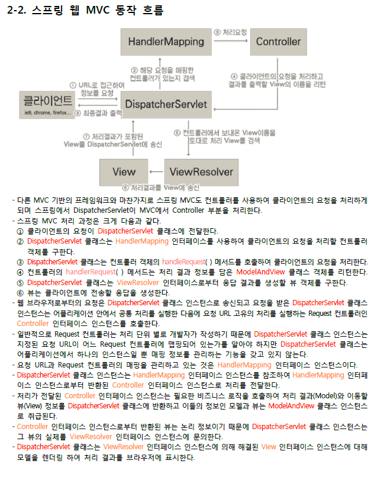

# 팁

## 그림
* JSP -> (Post, GET) -> Controller ->(Data Parameter) -> DAO/Service -> Model -> DB
	* DAO: Interface(서비스) + DAO(자바)

## MVC 흐름



<hr/>
## WEB-INF
```java
	<beans:bean
		class="org.springframework.web.servlet.view.InternalResourceViewResolver">
		<beans:property name="prefix" value="/WEB-INF/views/" />
		<beans:property name="suffix" value=".jsp" />
	</beans:bean>
```
	* WEB-INF로 접근 불가

## ModelAndView
* DB, 파라미터, 경로 모두 담는 


# 스프링 역사
* beean(메소드로 접근) -> EJB(디자인패턴; 팩토리패턴) -> XML에서 빈 생성; new 호출

# EJB
* Java bean이란 자바 객체를 재사용 가능하게 컴포넌트화 시킬 수 있는 코딩 방침을 정의한 것을 의미합니다.( bean은 쉽게 component 또는 객체라고 이해하면 좋습니다. ) 그리고 Java bean 스펙에 맞게 구현된 코드를 웹에서 쉽게 사용하기 위해서 JSP 표준 액션 태그를 지원 합니다.
* ( <jsp:useBean> , <jsp:getProperty> , <jsp:setProperty> )
* EJB란 Enterprise 개발을 단순화하기 위해 발표한 스펙입니다. 애플리케이션에는 비즈니스와 관련된 객체가 많기 때문에, "비즈니스 객체들을 관리하는 컨테이너를 만들어서 필요할 때 마다 컨테이너로부터 객체를 받는 식으로 관리하면 좋겠다"고 생각을 했고, 그래서 EJB가 탄생했습니다.
* 당시 EJB의 개념이 획기적이었기 때문에 J2EE 서버 개발 벤더들은 EJB 스펙을 구현하여 여러 WAS 제품을 출시했습니다. ( WebLogic , Jeus 등 … ) 그런데 보안, 트랜잭션, 분산 컴퓨팅 등 컨테이너의 다양한 서비스를 제공 받기 위해서는 EJB 스펙을 지켜야 했으며, EJB 컨테이너가 없을 경우 WAS의 다양한 서비스를 사용할 수 없다는 단점이 있었습니다.
* 그 결과 서비스가 구현해야 하는 실제 비즈니스 로직보다 EJB 컨테이너를 사용하기 위한 상투적인 코드들이 많다는 문제가 발생하기 시작했죠. 예를들어 DAO에서 사용하는 메서드는 고작 3개인데, EJB 스펙을 지키기 위해 여러 클래스를 상속 받아야 하고, 구현해야 하는 클래스가 많다보니 DAO 자체의 메서드보다 EJB를 사용하기 위한 코드가 많아졌습니다. 또한 벤더 사마다 EJB 컨테이너를 구현한 내용이 다르기 때문에 다른 벤더 사의 컨테이너로의 변경에 어려움이 있었고, 설정이 너무 복잡하다는 문제점이 부각되기 시작했습니다. 이런 문제들이 발생한 이유는 비즈니스 로직에 특정 기술이 종속되어 있다는 것입니다. 이를 기술 침투라고 하는데, 이것이 EJB의 가장 큰 문제점입니다.

## EJB의 목적
* 애초에 컨테이너는 필요할 때 마다 다른 객체를 컨테이너에서 받아내는 방식을 통해 객체들간의 의존성 해결이 목적이였습니다. 스프링 창시자인 로드 존슨은 EJB를 사용하지 않고도 객체간 의존성 해결이 가능한 컨테이너를 개발했는데, 이것이 스프링의 시작이 되었습니다. 즉 특정 기술에 종속되지 않고( 기술 비침투적 ) 객체를 관리할 수 있는 컨테이너를 제공하는 것이 스프링의 기본 철학입니다.

## EJB 역사
* POJO를 이해하려면 POJO라는 단어가 만들어진 역사적 배경을 살펴볼 필요가 있다. POJO는 마틴 파울러가 2000년 가을에 열렸던 어느 컨퍼런스의 발표를 준비하면서 처음 만들어낸 말이다. 마틴 파울러는 EJB(Enterprise JavaBean)보다는 단순한 자바 오브젝트에 도메인 로직을 넣어 사용하는 것이 여러 가지 장점이 있는데도 왜 사람들이 그 EJB가 아닌 ‘평범한 자바 오브젝트’를 사용하기를 꺼려하는지에 대해 의문을 가졌다. 그리고 그는 단순한 오브젝트에는 EJB와 같은 그럴듯한 이름이 없어서 그 사용을 주저하는 것이라고 결론 내렸다. 그래서 만든 단어가 POJO라는 용어인 것이다. POJO 기반의 기술을 사용한다고 말하면 왠지 첨단 기술을 사용하는 앞선 개발자인 듯한 인상을 주기 때문이다. 
* 이 POJO라는 용어를 만들어낸 전략은 매우 성공적이었다. EJB의 문제점과 한계를 느낀 많은 개발자들은 새로운 기술처럼 보이는 POJO 프로그래밍이라는 것에 관심을 가지게 되었고, POJO 기반의 프로그래밍 기술이 EJB의 강력한 대안으로 등장하기 시작했다. POJO 기반의 프레임워크, POJO 애플리케이션을 위한 플랫폼 등이 점점 인기를 끌게 되었고, 결국 POJO가 배제하려고 했던 EJB는 POJO 기반의 기술에 밀려 이제 레거시 기술로 사라질 위기에 처했다. 그렇다면 단지 EJB를 사용하지 않으면 모두 POJO라고 할 수 있을까? 그렇지는 않다. POJO 프로그래밍이라는 개념은 단지 ‘EJB가 아닌 자바’ 이상의 특징을 가지고 있는 프로그래밍 모델이다. POJO 기반의 개발은 생각보다 단순하지 않다. 
* POJO를 좀더 이해하려면 EJB의 장단점을 함께 이해해야 한다. 그것은 POJO 프로그래밍이 다시 EJB 시대 이전으로 돌아가자는 것이 아니고, EJB를 넘어 그보다 더 앞으로 나아가자는 것이기 때문이다.


## EJB와 엔터프라이즈 서비스
* 자바에서 EJB 기술의 등장은 필연적인 것이었다. 기업의 IT 시스템은 점점 그 중요성이 증대되고 그에 따라 점점 복잡한 기술이 요구되었으며 자바의 기초적인 JDK만으로는 그것을 충족시킬 수 없었다. 서버 기반의 자바 기술인 J2EE(Java2 Enter pise Edition)가 등장했지만 Servlet, JSP 레벨의 최소한의 서버 프로그래밍 인터페이스만 가지고는 복잡한 엔터프라이즈 애플리케이션을 제작하는 데 부담이 적지 않았다.
* 엔터프라이즈 시스템의 복잡도는 두 가지 다른 영역에서 증대되었다. 하나는 기업 업무처리의 IT 시스템에 대한 의존도가 높아지면서 시스템이 다뤄야 하는 비즈니스 로직 자체가 점차로 복잡해진 것이다. 또 다른 하나는 많은 사용자의 처리요구를 빠르고 안정적이면서 확장 가능한 형태로 유지하기 위해 필요한 로우레벨의 기술적인 처리 요구들이다. 단순히 DB와 연동하는 수준의 C/S 기반의 스탠드얼론(standalone) 애플리케이션과는 달리 서버에서 동작하는, 그것도 웹 기반으로 많은 처리 요구를 받는 시스템에는 감당해야 할 중요한 기술적인 요구사항들이 많다. 대표적으로 트랜잭션 처리, 상태 관리, 멀티스레딩, 리소스 풀링, 보안 등이 있다.
* 애플리케이션 로직의 복잡도와 상세 기술의 복잡함을 개발자들이 한 번에 다룬다는 것은 쉬운 일이 아니었다. 한 개발자가 보험업무와 관련된 계산 로직을 자바로 어떻게 구현해야 하는지에 집중하면서 동시에 시스템 레벨에서 멀티 DB로 확장 가능한 트랜잭션 처리와 보안 기능을 멀티스레드 세이프하게 만드는 것에 신경 써야 한다면 여간 부담되는 게 아닐 것이다.
* EJB는 이런 문제를 다루기 위해 등장했다. EJB 1.0의 스펙이 제시한 EJB의 비전은 ‘EJB는 애플리케이션 개발을 쉽게 만들어 준다. 애플리케이션 개발자는 로우레벨의 기술들에 관심을 가질 필요도 없다’였다. 애플리케이션 개발자들은 다뤄야 하는 해당 도메인과 비즈니스 로직에만 집중하면 된다는 것이었다. 게다가 EJB는 독립적으로 개발한 컴포넌트들을 서버에 자유롭게 배포하고 서로 연동해 사용하게 하는 컴포넌트 기반의 개발 모델을 제시할 뿐더러, 여러 대의 서버에 분산되어 있는 모듈간의 리모팅 처리도 개발자들이 거의 신경 쓰지 않고 개발할 수 있게 했다. 더 나아가 벤더별로 제각각 발전시켜 혼란에 빠지기 쉬운 자바의 서버 기술을 일관성 있게 구현하게 지원하므로 특정 서버에 종속되지 않고 서버간의 이동성(portability)을 보장해 준다고 약속했다.
* 과연 EJB는 스펙을 통해 제시한 그런 환상적인 기대를 충족시켰는가? 이제는 누구나 다 잘 알고 있듯이 현실에서는 그렇지 못했다. EJB는 불필요할 만큼 과도한 엔지니어링으로 실패한 대표적인 케이스였다. EJB에서는 현실에서 1% 미만의 애플리케이션에서만 필요한 멀티 DB를 위한 분산 트랜잭션을 위해 나머지 99%의 애플리케이션도 무거운 JTA 기반의 글로벌 트랜잭션 관리 기능을 사용해야 했다. EJB의 혜택을 얻기 위해 모든 기능이 다 필요하지도 않은 고가의 WAS(CPU 당 몇 백에서 몇 천만 원씩 하는)를 구입해야 했고, 고급 IDE의 도움 없이는 손쉽게 다룰 수 없는 복잡한 설정 파일 속에서 허우적대야 했다. EJB 컴포넌트는 컨테이너 밖에서는 정상적으로 동작할 수 없으므로 개발자들은 끝도 없이 반복되는 수정-빌드-배포-테스트의 지루한 과정으로 많은 시간을 낭비해야 했고, 간단한 기능에 대해서조차 자동화된 테스트를 만드는 것은 거의 불가능에 가까웠다. 테스트는 서버에 배치 후에 대부분 수동으로 해야 했고, 느린 배포 작업 탓에 그나마도 자주 반복되기 힘들게 만들었다. 특별한 경우가 아니라면 그다지 장점이 없는 EJB의 원격분산 모델은 성능을 떨어뜨리고 서버의 복잡도만 증가시켰다. 가장 최악의 문제점은 EJB 스펙을 따르는 비즈니스 오브젝트들은 객체지향적인 특징과 장점을 포기해야 했다는 것이다. EJB빈은 상속과 다형성 등의 혜택을 제대로 누릴 수 없었다. 간단한 기능 하나를 위해서도 많은 인터페이스와 EJB 의존적인 상속 등을 사용해야 했다. EJB 옹호자들 사이에서조차 외면 받아온 엔티티빈에 대해 말하는 것은 시간 낭비일 것이다. 상태 있는 세션빈(SFSL)도 기술적인 한계와 비효율성으로 인해 현장에서는 많이 사용되고 있지 않다. 그나마 오랫동안 사용된 EJB는 상태 없는 세션빈(SLSF) 뿐이다.
* 그럼에도 EJB가 계속 사용되었던 이유는 무엇일까? 그것은 EJB가 스펙에서 제시한 그 몇 가지 장점 때문이었다. 엔터프라이즈 애플리케이션에서 반드시 필요로 하는 주요한 엔터프라이즈 서비스들을 애플리케이션 코드와 분리해서 독립적인 서비스로 사용할 수 있게 만들어줬다는 점이다. 비록 불완전하고 불필요한 복잡도가 남아있긴 했지만 선언적인 트랜잭션 관리(Declarative Transaction Management)나 역할 기반의 보안(Role based Security) 기능들을 제공했다. 비즈니스 오브젝트를 배포하고 관리하는 컨테이너를 제공하고 기본적인 스레드 관리, 인스턴스/리소스 풀링을 제공하는 등의 것들이다. 한편으로는 ‘개발자들이 로우레벨의 기술적인 문제에 신경 쓰지 않고 비즈니스 로직에 충실히 개발하게 함으로써 애플리케이션 개발을 손쉽게 만들어 준다’는 처음 약속을 어느 정도 지켰다고 볼 수 있다. 하지만 EJB의 문제는 앞서 지적한 것처럼 한편으로는 애플리케이션 개발의 복잡도를 제거하면서 다른 한편으로는 더 많은 문제와 복잡성을 가지고 왔다는 것이다.
* 결국 EJB는 형편없는 생산성과 느린 성능, 불필요한 기술적인 복잡도, 벤더 사이의 알력으로 과도하게 높아진 스펙 등으로 인해 자바의 엔터프라이즈 개발에 대한 불신을 가중시켰다. 마침내 마틴 파울러를 비롯한 많은 오피니언 리더들은 EJB와 같은 잘못 설계된 과도한 기술을 피하고, 객체지향 원리에 따라 만들어진 자바 언어의 기본에 충실하게 비즈니스 로직을 구현하는 일명 POJO 방식으로 돌아서야 한다고 지적하고 나섰다. POJO 방식의 개발은 EJB가 잃어버린 소중한 가치인 객체지향적인 설계와 자동화된 테스트의 편의성, 개발생산성 등을 회복시켜 줄 수 있는 길이기 때문이다.


## POJO로 돌아간 이유
* 결국 EJB는 형편없는 생산성과 느린 성능, 불필요한 기술적인 복잡도, 벤더 사이의 알력으로 과도하게 높아진 스펙 등으로 인해 자바의 엔터프라이즈 개발에 대한 불신을 가중시켰다. 마침내 마틴 파울러를 비롯한 많은 오피니언 리더들은 EJB와 같은 잘못 설계된 과도한 기술을 피하고, 객체지향 원리에 따라 만들어진 자바 언어의 기본에 충실하게 비즈니스 로직을 구현하는 일명 POJO 방식으로 돌아서야 한다고 지적하고 나섰다. POJO 방식의 개발은 EJB가 잃어버린 소중한 가치인 객체지향적인 설계와 자동화된 테스트의 편의성, 개발생산성 등을 회복시켜 줄 수 있는 길이기 때문이다.
 

## 참조
* https://itewbm.tistory.com/entry/POJOPlain-Old-Java-Object

# POJO
* POJO = Java Beans; 여기서 Java Beans는 Sun의 Java Beans나 EJB의 Bean을 뜻하는것이 아닌 순수하게 setter, getter 메소드로 이루어진 Value Object성의 Bean을 말한다.
* 스프링 프레임워크 이전에는 원하는 엔터프라이즈 기술이 있다면 그 기술을 직접적으로 사용하는 객체를 설계했습니다. 그리고 이러한 개발 방식이 만연하고 있었습니다. 특정 기술과 환경에 종속되어 의존하게 된 자바 코드는 가독성이 떨어져 유지보수에 어려움이 생겼습니다. 또한, 특정 기술의 클래스를 상속받거나, 직접 의존하게 되어 확장성이 매우 떨어지는 단점이 있었습니다. 이 말은 객체지향의 화신인 자바가 객체지향 설계의 장점들을 잃어버리게 된 것입니다.
* 스프링: 자바 라이브러리 + 스프링 라이브러리 + 의존 라이브러리
	* 스프링 라이브럴리와 의존 라이브러리 사이의 관계를 메이븐으로 관리
* POJO는 Plain Old Java Object의 약자인데 그 어느 곳에도 종속되지 않은 (즉, 상속받지도, 구현하지도 않은 독립적인) Java Class를 말한다.
	* 다른 곳에 종속되지 않는 다는 것은 해당 클래스를 사용하기 위해 다른 프레임워크 같은 외부 환경이 필요하고, 해당 환경이 특정 인터페이스를 구현할 것을 강요하는 것 같은 제약에서 자유롭다는 것을 뜻합니다.
	* implement -> annotation
* 스프링은 세션빈이 제공하던 중요한 엔터프라이즈 서비스들을 POJO 기반으로 만든 비즈니스 오브젝트에서 사용할 수 있게 한다. 대표적인 것이 선언적인 트랜잭션 서비스와 보안이다. 또한 EJB와 마찬가지로 오브젝트 컨테이너를 제공해서 인스턴스의 라이프사이클을 관리하고 필요에 따라 스레딩, 풀링 및 서비스 인젝션 등의 기능을 제공한다. 또한 OOP를 더 OOP답게 사용할 수 있게 하는 AOP 기술을 적용해서 POJO 개발을 더 쉽게 만든다.


## ORM
* 예를들어, ORM(Object Relationship Mapping)이 새롭게 등장 했을 때를 생각해보겠습니다. ORM 기술을 사용하고 싶었다면 ORM을 지원하는 ORM 프레임워크를 사용해야 합니다. (대표적으로 Hibernate라는 프레임워크도 있습니다.) 만약 자바 객체가 ORM 기술을 사용하기 위해서 Hibernate프레임워크를 직접 의존하는 순간! POJO라고 할 수 없습니다. 특정 '기술'에 종속되었기 때문입니다.


## POJO를 사용하지 않은 예
* public HelloServlet extends HttpServlet{ ... } 
	* 자바 서블릿 코드를 작성할 때는 이렇게 반드시 HttpServlet을 상속바아야 한다. 서블릿 프로그래밍을 한다는 이유로 객체지향 프로그래밍의 핵심적인 기능 중 하나인 상속을 빼앗긴 것이나 마찬가지이다. 코드를 작성하고 있는 개발자가 직접 상속을 사용할 수 있는 기회가 없어졌으니.. 그리고 extends HttpServlet이 추가되면서 이 코드를 이해하기 어려워 진다.HttpServlet에서 어떤 기능을 제공하는지 어떤 코드를 어떻게 재사용해야 할지 판단하기도 어렵다. POJO는 그러한 제약이 없는 일반적인 객체를 말한다.  상속이나 인터페이스 구현을 사용하지 않은 객체를 말하는 것이 아니라, 그런 것을 라이브러리나 프레임워크로부터 강제받지 않는 객체라는 것이다. 

## 그럼 특정 기술을 사용하고 싶다면? (스프링이 POJO를 유지하면서 Hibernate를 사용할 수 있는 이유) - PSA
* 하지만 Hibernate는 스프링 개발에서 많이 사용하고 있는 기술입니다. 특정 기술에 종속적이면 POJO가 아니라면서 스프링에서는 어떻게 가능한 걸까요? 바로 스프링에서 정한 표준 인터페이스가 있기 때문입니다. 스프링 개발자들은 ORM이라는 기술을 사용하기 위해서 'JPA'라는 표준 인터페이스를 정해두었습니다. 그리고 이제 여러 ORM 프레임워크들은 이 JPA라는 표준 인터페이스 아래, 구현되어 실행됩니다. 이것이 스프링이 새로운 엔터프라이즈 기술을 도입 하면서도 POJO를 유지하는 방법입니다. (그리고 이런 방법을 스프링의 PSA라고 얘기합니다.)

## SPRING CONATAINER
* 스프링 컨테이너는 특정 클래스를 상속하거나 인터페이스를 구현하지 않는 평범한 자바 클래스(POJO, Plain Old Java Object)를 이용하여 EJB의 기능을 유지하면서 복잡성을 제거하고, 객체들의 라이프 사이클을 관리해줍니다
* 각 라이브러리들의 객체들은 스프링 컨테이너에서 관리하기 때문에 사용법이 일관적이라는 특징이 있습니다. Spring Container는 위의 그림과 같이 여러 객체들이 모여있는 공장( Bean Factory )과 같은 개념입니다. Spring Container를 Bean Factory 또는 IoC Container 라고도 합니다.
* SPRING AOP, SPRING ORM, SPRING DAO, SPRING WEB, SPRING CONTEXT, SPRING WEB MVC, SPRING CORE

## DI  (POJO@의존성)
* 컨테이너의 주 목적은 의존성 해결이라고 했었습니다. 그렇다면 의존성은 무엇일까요?
* 의존성 주입이란 사용자가 직접 new 키워드를 사용하여 객체를 생성하지 않고, 외부( 컨테이너 )에서 생성된 객체를 주입 받는 방식을 말합니다.
* 빈 생성 하는 것을 XML에서 가능
* 스프링 컨테이너에 저장되는 자바 객체는 특정한 인터페이스를 구현하거나 클래스를 상속받지 않아도 되므로 기존에 작성한 코드를 수정할 필요 없이 스프링에서 사용할 수 있다.
* 번째 방법의 그림을 보시면 A객체에서 직접 생성하지 않고, 외부에서 생성된 객체를 setter( )혹은 생성자를 이용해서 사용합니다. 이런걸 "주입"한다고 하며 스프링에서 사용하는 방식(DI)인거죠. 스프링은 다른 객체들이 사용하고, 다른 서비스를 위해 사용할 수 있는 클래스를 컨테이너 형태로 이 기능을 제공해줍니다. A라는 객체에서 B, C객체를 사용(의존)할 때 A객체에서 직접 생성을 하는 것이 아닌 외부(IOC컨테이너)에서 생성된 B, C객체를 조립(주입)시켜 setter 혹은 생성자를 통해 사용할 수 있는거죠.
	* Spring이 제공하는 대표적인 DI Container는 BeanFactory와 ApplicationConext가 있다.

### 의존성 해결
```XML
설정 파일에서 아래와 같이 bean을 등록하면 의존성이 해결 됩니다.

<bean id=’a’ class=”A” ref=’b’>
<bean id=’b’ class=”B” >

또는 어노테이션 @Autowired를 통해 의존성 주입을 해결 합니다.
```

## IOC 의존성@소멸
* 스프링에서는 이와 같이 의존성 주입을 통해 객체 간의 의존성 문제를 해결하며, 객체의 생성과 소멸을 개발자가 관리하지 않고 스프링에서 관리하는데, 이러한 현상을 제어 역전 ( IoC, Inversion of Control )이라 합니다.

# 메소드
* 스프링에서는 메소드가 객체

	1. DB(DAO): Repository
	2. AJAX(resetCOntroller)
	3. 파라미터(리다이렉트, 포워드): controller
	4. getter, setter: service

# IOC
* A a = new A(); 제어권이 넘어가 것

## ini


### - UTF-8 일괄 설정 
- vmargs 밑에
- -Dfile.encoding=UTF-8

# 스프링 구조

## 메이븐
- 자동 빌드 도구; 파이썬의 아나콘다

## AOP

## POJO

# Spring의 4가지 특징
## 의존성 주입(IoC / DI)
- 자바의 new를 xml에 심는 방식
⎼ 객체간의 의존 관계를 설정한다.

## 관점 지향 프로그래밍(AOP)
- 필터, 인터페이스
⎼ 기능들을 분리해서 각 모듈에 적용할 수 있다.

## 포터블 서비스 추상화(PSA)
- 특정 기술 환경인 어플리케이션계층과 서비스 계층 그리고 기술 서비스 계층 등에 종속되지 않는 포터블 코드를 생성할 수 있다.

## POJO;
- 스프링 컨테이너에 저장되는 자바 객체로 특정한 인터페이스를 구현하거나 클래스를 상속받지 않아도 된다.


# loc
1. DL(의존성 찾기) -> 패턴 EJB Spring
2. DI(의존성 주입) 
  - Setter
  - Const
  - Method(AOP; 관점 지연 방식)
 
 # pom.xml
1. build 영역
2. properties 영역
3. dependencies 영역

# EJB
## EJB 장점 -
1. 정형화된 비즈니스 계층을 제공. 비즈니스 계층에 대하여 논리적인 분리 뿐만 아니라 물리적인 분리까지 가능하도록 지원함
2. 선언적인 트랜잭션 관리와 같이 Non EJB 아키텍처 에는 지원하기 힘들었던 기능을 EJB 컨테이너가 제공함.
3. EJB는 다양한 클라이언트에 대한 지원이 가능. EJB는 웹 UI 계층뿐만 아니라 Swing 과 같은 GUI 클라이언트도 지원하는 것이 가능
4. 분산 기능을 지원이 가능
5. 비즈니스 객체를 여러 서버에 분산시키는 것이 가능

##  EJB 단점 -
1. 실행속도 가 가장 큰 문제점, 분산환경을 지원하기 위해 객체를 직렬화 하는 과정 때문에 실행속도 저하가 발생함.
2. 개발 사이클의 소스 수정, 빌드, 배포, 테스트와 같이 복잡한 과정을 거치기 때문에 개발 생산성이 저하되는 결과를 가져옴
3. EJB 는 EJB컨테이너가 종속적이기 때문에 개발한 후 EJB컨테이너에 배포한 다음에 테스트를 진행하여야함. 테스트를 어렵게 만들며, 테스트의 어려움으로 인해 제품의 질이 저하되는 결과를 초래합니다.
4. EJB의 실행 속도 문제를 해결하기 위한 방법으로 EJB를 위한 변형된 패턴들이 나타나면서 객체 지향적으로 개발하는데 제약사항이 됨
5. EJB 자체 스팩이 가지고있는 실행속도가 떨어진다는 문제로 인해 EJB 컨테이너를 만드는 대형 벤더들 나름대로 자신들만의 기능들을 추가함으로써 EBJ 컨테이너 사이의 이식성이 떨어짐 


# 아나콘다
- 아나콘다에 포함되어 있는 라이브러리들이 불필요한 경우에는 기본 Python만 설치해도 무관합니다. 하지만, 요즘 유행하는 인공지능이나 빅데이터 관련 개발을 할 경우에는 결국 아나콘다에 포함된 라이브러리들을 설치할 가능성이 높기 때문에 애초에 아나콘다를 설치하는 것이 더 유리합니다. 일일이 라이브러리들을 설치하다보면 의존성 문제 등이 발생할 수도 있기 때문입니다.

# 모듈
- 파이썬, 루비 -> 의존성 풀, 컨텍스트화된 의존성 룩업

# 빈
- loc에서 빈에서 호출
- 컨테이너 담아 놓는 구조; 빈(new 키워드의 기능 가지고 있다.
  - BeanFactory 인터페이스 -> ApplicationContext
  
## 싱글톤 패턴
- 애플리케이션이 시작될 때 어떤 클래스가 최초 한번만 메모리를 할당하고(Static) 그 메모리에 인스턴스를 만들어 사용하는 디자인패턴.
- 생성자가 여러 차례 호출되더라도 실제로 생성되는 객체는 하나고 최초 생성 이후에 호출된 생성자는 최초에 생성한 객체를 반환한다. (자바에선 생성자를 private로 선언해서 생성 불가하게 하고 getInstance()로 받아쓰기도 함)
- 싱글톤 패턴은 단 하나의 인스턴스를 생성해 사용하는 디자인 패턴이다.

### 싱글톤 패턴 쓰는 이유
- 고정된 메모리 영역을 얻으면서 한번의 new로 인스턴스를 사용하기 때문에 메모리 낭비를 방지할 수 있음
- 또한 싱글톤으로 만들어진 클래스의 인스턴스는 전역 인스턴스이기 때문에 다른 클래스의 인스턴스들이 데이터를 공유하기 쉽다.
- DBCP(DataBase Connection Pool)처럼 공통된 객체를 여러개 생성해서 사용해야하는 상황에서 많이 사용. (쓰레드풀, 캐시, 대화상자, 사용자 설정, 레지스트리 설정, 로그 기록 객체등)
- 싱글톤 인스턴스가 너무 많은 일을 하거나 많은 데이터를 공유시킬 경우 다른 클래스의 인스턴스들 간에 결합도가 높아져 "개방-폐쇄 원칙" 을 위배하게 된다. (=객체 지향 설계 원칙에 어긋남) 따라서 수정이 어려워지고 테스트하기 어려워진다
- 또한 멀티쓰레드환경에서 동기화처리를 안하면 인스턴스가 두개가 생성된다든지 하는 경우가 발생할 수 있음

## 팩토리 패턴
- new 키워드를 통한 객체 생성을 모듈화 하겠다.

## 프록시 패턴
- 객체를 생성하고 담아놓고 호출해 사용한다.(AOP)
  - AOP: 로그 영역, 수행 영역, 실행 영역

## 커맨드 패턴
- 캡슐화

## 객체
- 다 컨테이너 -> 설정파일 -> 메타 정보

# 자바빈
- new를 사용안하고 new를 xml에 심는다.
- <bean class="jae.spring.test.Begin" id="begin"/>; id는 주로 클래스의 

## 자바빈을 쓰는 이유 = new를 안쓰는 이유
- 모델에 접근하기 위해서 모두 new를 사용하면 나중에 데이터가 커지면 문제가 생김 -> 객체화 해서 사용; 충돌 방지, 속도 

## 자바빈 불러오기
- ApplicationContext context = new ClassPathXmlApplicationContext("in.bean.xml");
- Begin begin = context.getBean("begin", Begin.class);
  - 앞에 begin은 bean의 id, 뒤에 .class 붙이면 강제 형변환 할 필요 없다.

## 자바빈의 int
- int형이 없으니 value 값에 "" 넣어주어야 한다.

## SpringCall1
		- ApplicationContext context = new ClassPathXmlApplicationContext("in/bean.xml");
		- Parameter parameter = (Parameter) context.getBean("parameter");
		- System.out.println(parameter);


## JavaCall1
		- Parameter parameter = new Parameter("홍길동");
		- System.out.println(parameter);
		
## JavaCall2
		- Parameter parameter = new Parameter();
		- ParameterBean parameterBean = new ParameterBean(parameter);
		- parameterBean.msg();
		
## SpringCall2
- ApplicationContext context = new ClassPathXmlApplicationContext("in/bean.xml");
- ParameterBean parameterBean = (ParameterBean) context.getBean("parameterBean");
		parameterBean.msg();

- ApplicationContext context = new GenericXmlApplicationContext("classpath:/context/Template.xml"); classpath 보다 generic을 쓰는 추세; 이때 classpath:를 쓰는 것을 권장한다.

## javabean2
- <bean class="jae.spring.test.Parameter" id="parameter"></bean>
- <bean class="jae.spring.test.ParameterBean" id="parameterBean">
- <constructor-arg ref="parameter"></constructor-arg>
- </bean>

## 프로퍼티
## property
- 메소드를 통해 관리되는 데이터를 프로퍼티(property) 라고 부르며 get, set 을 뗀 나머지 부분에서 첫문자를 소문자로 바꾼 이름을 프로퍼티 이름으로 취급한다.
- Bean을 주입 받을 경우에는 ref속성을 쓰고, 기본 데이터 타입 및 STring 클래스 타입의 경우는 value 속성을 사용한다.

## autowire
- autowire: byName: 이름 참조;  byTpye: 타입 참조


## 어노테이션
- 사용 위해: <context:annotation-config/>
- @Autowired: 타입 -> 이름; 스프링 지원
	- 어노테이션, 생성자, 필드, 메소드에 
- @Inject: 타입 -> 이름; 자바에서 지원
	- autowire 보다도 inject를 사용하는 추세; 다른 언어와의 
- @Resource: 이름 -> 타입; 자바에서 지원
- @

# bean.xml
## 네임스페이스
- beans: 프로퍼티
- p: 프로퍼티
- 1. context: 어노테이션 네임스페이스  2. <context:annotation-config/>

# String
- Spring에서 STring은 클래스가 아니라 java.lang.String이라고 말해야 한다.

# <context:component-scan base-package="jae.ha.spring"/>
- bean 사용 안하기 

## Component
- context: component-scan 사용
- base-package; 저 패키지 안에 있는 패키지는 영향 받지 않아도 되는 패키지 입력.
- set 생략 가능

## Controller
- 프론트에서 사용

## Service
- 비즈니스 메소드
- bean 만들 필요 없다.

## Repository
- DAO

# AOP
- 공통 기능 추출 -> 일괄처리
- 프록시 패턴을 이용하여 메소드를 조정한다.

## AOP 예제
1. 인코딩
2. 세션을 통한 로그인
3. DAO (마이바티스 사용)
4. WAS가 Web.xml을 걸쳐 오는 구조
5. Oracle 클 때 커밋 되는 것: 

## AOP의 종류
- 필터: 서블릿에서 사용; 스프링 web에서 사용
- 인터럽트: 스프링 web에서 사용
- 스프링 aop: 메소드 조정; 스프링 java에서 사용
	- DTO, DAO

## 그림
- aspect조인 포인트의 포인트컷(경로) + 어드바이스(동작) -> 조인 포인트 -> 타겟 - 타겟의 인스턴스(프록시) -> 인터셉트(write)

## 프록시 패턴
- connection pool 같이 담아 놓은 것을 갖다 쓰는 것.

## 조인 포인트
- before: 조인 포인트 실행전
- after: 조인 포인트 실행 후
- around: 실행전, 실행후, 예외처리 등 모든 시점에서 적용

### Weaving
- before, after, around를 정하는 것

### 타겟
- before, after를 실행시켜주는 클래스

### 프록시
- 타겟 안의 new 클래스

# 팩토리 패턴
- 주는 인스턴스에 따라 리턴에 주는 new가 다르다.

## ant 패턴
- xpath 기법 이용

## Aspect(조인 포인트의 포인트컷(경로) + 어드바이스(동작))
- 조인 포인트에의 포인트컷(위치: 어디에서); ex) jae.spring.log
	- 위치: 패키징 / 매핑명
- 어드바이스(동작: 무엇을 할 것인가); write
	- 어드바이스: aop

### aop의 객체
- 동적 객체 = 메소드


# resources 폴더
- html, js, json, img는 resource 폴더 안에 넣어주어야 한다.
	- 스프링은 무조건 MVC2 패턴으로 이루어져 있다.
	
## servlet-context.xml
- 서블릿에서 사용한 bean이 들어간다.
- 여기서 bean을 사용하려면 <beans:bean /> 이렇게 사용

## root-context.xml
- 데이터베이스 연동, DAO 연동에 필요한 bean이 들어간다.
- ⎼context 방식은 Spring MVC Project의 root-context.xml에서는 지원되지 못하므로 클래스 로드 방식으로 설정해야 한다.


# 트랜젝션
- 커밋과 롤백과 관계; 
	- 기본키의 중복(등록); 
		- 시퀀스는 점프기능이라는 단점은 있지만 트랜젝션의 발생은 막아준다.
- 이왕이면 sequence나 script로 방어; 왜냐하면 부하가 많이 일어나기 때문이다. 그리고 Rollback을 많이 주면 나중에 코드가 꼬인다.

## expression
- <aop:config>
- <aop:pointcut id="txPointCut" expression="execution(* jae.ha.spring.db.ConnectDB..insert*(..))"/>
	- (..): 매개변수가 1개 이상; 
- <aop:advisor advice-ref="txAdvice" pointcut-ref="txPointCut" />
- </aop:config>


# ORM
- insert, update, delete 쿼리문을 xml에 심어주겠다.
- 바인드 변수를 #{deptno}로 사용
- 바인드 변수를 DB에 넣으려면 ${deptno} 사용

# ORM 정의
- ORM은 데이터베이스 연계처리를 위하여 기존의 SQL에 의존하는 것이 아니라 직접 테이블의 컬럼을 자바 클래스에 매핑하거나 XML 형태의 SQL을 실행하여 처리를 수행하는 Persistence Layer를 담당하는 Framework 개발모델로 대표적으로 Hibernate, iBatis, MyBatis, Spring JPA 등이 있다.
- ORM은 객체타입 데이터인 Java의 Object와 관계형 데이터인 관계형 데이터베이스의 테이블 사이에서 개념적으로 일치하지 않는 부분을 해결하기 위하여 이 둘 사이의 데이터를 매핑(Mapping)하는 것으로 객체타입 데이터와 관계형 데이터의 각 속성들을 매핑할 경우에 관계형 데이터를 객체타입 데이터처럼 사용하는 것이 가능하다.
- 자바 코드 내에서 SQL문 작성 없이 간단한 매핑 설정으로 데이터베이스의 테이블 데이터를 자바 객체로 전달 받을 수 있는 것이다.

## 데이터베이스 설정

## 매퍼; 쿼리문
- CRUD: 기본적인 데이터 처리; Create Read Update Delete


# 마이바티스
- 기본이 PreparedStatement가 기준

# TCP
- 클라이언트 <> 서버
- 클라이언트 > 브라우저 > 웹서버/WAS -> 서버
- 클라이언트(URL) <> 톰켓(server.xml(URL에 들어있는 파라미터 전송역할) => 리슨 -> web.xml(파일의 경로))
	- server.xml: 파라미터 인코딩, 파라미터 전송
	- web.xml: 파일의 경로, 파일의 인코딩, 파일의 보안, 지원하는 확장자, 파일의 인덱스


## AJAX; 클라이언트 서버 사이에 request 별도
- 클라이언트 -> request 별도(xml json) -> 서버 (포워드) -> 자바
- 비동기식; 절대 경로 사용
- 통신이 모두 request 객체만을 이용하여 통신하는 것이 아닌 

## iframe
- 두 개 이상의 request 객체를 필요로 함

## 동기식
- request 객체로만 이용한 통신

## Request 객체
- http 프로토콜 꺼; 웹으로 돌면 다 http의 request 객체를 

## TCP/IP
- Request가 아니라 패킷으로 

## 비동기식 데이터 통신 처리
- request 객체가 아닌 XML이나 JSON 방식으로 객체를 받아오게 되는 경우를 의미
- 자바 스크립트 -> XML http request -> 웹서버(요청 받음 -> 요청 처리 -> XML or TEXT 생성 ) -> XML http request > 자바스크립트

## content-type
- value = "/json"
- method = RequestMethod.POST;  consumes="application/json"
- method = RequestMethod.GET;   produces="application/json"
- 여기서 json 값은 키와 값으로 이루어져 있지만 값은 한번밖에 안들어가기 때문에 라이브러리 사용이 필요시된다.

