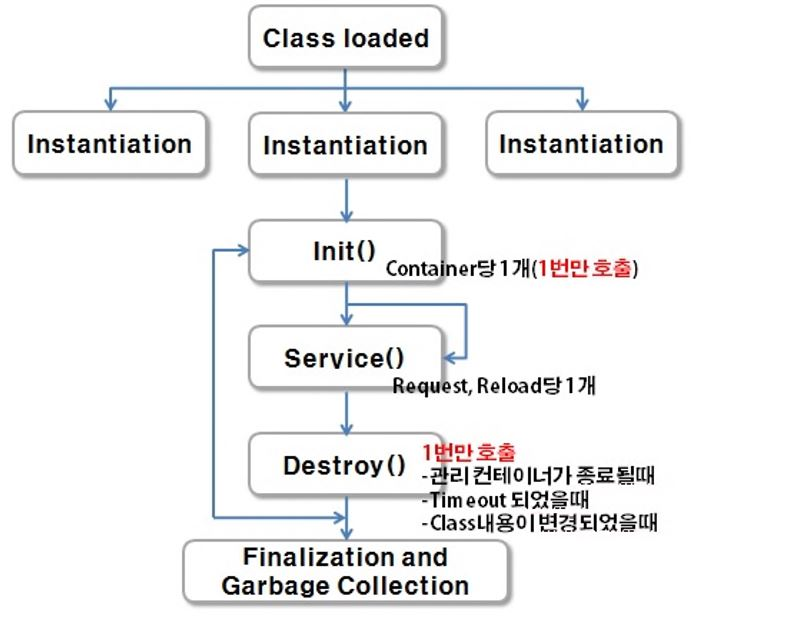

# ORM
* [ORM]('https://gmlwjd9405.github.io/2019/02/01/orm.html')
* Object Relational Mapping, 객체-관계 매핑
* 객체와 관계형 데이터베이스의 데이터를 자동으로 매핑(연결)해주는 것을 말한다.
* 객체 지향 프로그래밍은 클래스를 사용하고, 관계형 데이터베이스는 테이블을 사용한다.
* 객체 모델과 관계형 모델 간에 불일치가 존재한다.
* ORM을 통해 객체 간의 관계를 바탕으로 SQL을 자동으로 생성하여 불일치를 해결한다.
* 데이터베이스 데이터 <—매핑—> Object 필드
* 객체를 통해 간접적으로 데이터베이스 데이터를 다룬다.
* Persistant API라고도 할 수 있다.
* Ex) JPA, Hibernate 등
https://gmlwjd9405.github.io/2019/02/01/orm.html

## 영속성(Persistence)
* 데이터를 생성한 프로그램이 종료되더라도 사라지지 않는 데이터의 특성을 말한다.
* 영속성을 갖지 않는 데이터는 단지 메모리에서만 존재하기 때문에 프로그램을 종료하면 모두 잃어버리게 된다.
* Object Persistence(영구적인 객체)
  * 메모리 상의 데이터를 파일 시스템, 관계형 테이터베이스 혹은 객체 데이터베이스 등을 활용하여 영구적으로 저장하여 영속성 부여한다.

## 데이터를 데이터베이스에 저장하는 3가지 방법
1. JDBC (java에서 사용)
2. Spring JDBC (Ex. JdbcTemplate)
3. Persistence Framework (Ex. Hibernate, Mybatis 등)

## Persistence Layer
* 프로그램의 아키텍처에서, 데이터에 영속성을 부여해주는 계층을 말한다.
* JDBC를 이용하여 직접 구현할 수 있지만 Persistence framework를 이용한 개발이 많이 이루어진다.

## Persistence Framework
* JDBC 프로그래밍의 복잡함이나 번거로움 없이 간단한 작업만으로 데이터베이스와 연동되는 시스템을 빠르게 개발할 수 있으며 안정적인 구동을 보장한다.
* Persistence Framework는 SQL Mapper와 ORM으로 나눌 수 있다.
* Ex) JPA, Hibernate, Mybatis 등

## ORM의 장점
* 객체 지향적인 코드로 인해 더 직관적이고 비즈니스 로직에 더 집중할 수 있게 도와준다.
* ORM을 이용하면 SQL Query가 아닌 직관적인 코드(메서드)로 데이터를 조작할 수 있어 개발자가 객체 모델로 프로그래밍하는 데 집중할 수 있도록 도와준다.
* 선언문, 할당, 종료 같은 부수적인 코드가 없거나 급격히 줄어든다.
* 각종 객체에 대한 코드를 별도로 작성하기 때문에 코드의 가독성을 올려준다.
* SQL의 절차적이고 순차적인 접근이 아닌 객체 지향적인 접근으로 인해 생산성이 증가한다.
* 재사용 및 유지보수의 편리성이 증가한다.
* ORM은 독립적으로 작성되어있고, 해당 객체들을 재활용 할 수 있다.
* 때문에 모델에서 가공된 데이터를 컨트롤러에 의해 뷰와 합쳐지는 형태로 디자인 패턴을 견고하게 다지는데 유리하다.
* 매핑정보가 명확하여, ERD를 보는 것에 대한 의존도를 낮출 수 있다.
* DBMS에 대한 종속성이 줄어든다.
* 객체 간의 관계를 바탕으로 SQL을 자동으로 생성하기 때문에 RDBMS의 데이터 구조와 Java의 객체지향 모델 사이의 간격을 좁힐 수 있다.
* 대부분 ORM 솔루션은 DB에 종속적이지 않다.
* 종속적이지 않다는것은 구현 방법 뿐만아니라 많은 솔루션에서 자료형 타입까지 유효하다.
* 프로그래머는 Object에 집중함으로 극단적으로 DBMS를 교체하는 거대한 작업에도 비교적 적은 리스크와 시간이 소요된다.
* 또한 자바에서 가공할경우 equals, hashCode의 오버라이드 같은 자바의 기능을 이용할 수 있고, 간결하고 빠른 가공이 가능하다.


## ORM 단점
* 완벽한 ORM 으로만 서비스를 구현하기가 어렵다.
* 사용하기는 편하지만 설계는 매우 신중하게 해야한다.
* 프로젝트의 복잡성이 커질경우 난이도 또한 올라갈 수 있다.
* 잘못 구현된 경우에 속도 저하 및 심각할 경우 일관성이 무너지는 문제점이 생길 수 있다.
* 일부 자주 사용되는 대형 쿼리는 속도를 위해 SP를 쓰는등 별도의 튜닝이 필요한 경우가 있다.
* DBMS의 고유 기능을 이용하기 어렵다. (하지만 이건 단점으로만 볼 수 없다 : 특정 DBMS의 고유기능을 이용하면 이식성이 저하된다.)
* 프로시저가 많은 시스템에선 ORM의 객체 지향적인 장점을 활용하기 어렵다.
* 이미 프로시저가 많은 시스템에선 다시 객체로 바꿔야하며, 그 과정에서 생산성 저하나 리스크가 많이 발생할 수 있다.

## Granularity(세분성)
* 경우에 따라 데이터베이스에 있는 해당 테이블 수보다 더 많은 클래스를 가진 객체 모델을 가질 수 있다.
* 예를 들어, “사용자 세부 사항”에 대해 생각해보자.
* 코드 재사용과 유지보수를 위해 “Person”과 “Address”라는 두 개의 클래스로 나눌 수 있다.
* 그러나 데이터베이스에는 person이라는 하나의 테이블에 “사용자 세부 사항”을 저장할 수 있다.
* 이렇게 Object 2개와 Table 1개로 두 개의 갯수가 다를 수 있다.
* 1) Coarse Granularity(굵은/거친): PersonDetails Class
* 2) Fine Granularity(가는/세밀한): Persion Class, Address Class

## Inheritance(상속)
* RDBMS는 객체지향 프로그래밍 언어의 자연적 패러다임인 상속과 유사한 것을 정의하지 않는다.
* 즉, 상속의 개념이 없다.

## Identity(일치)
* RDBMS는 ‘sameness’라는 하나의 개념을 정확히 정의하는데, 바로 ‘기본키(primary key)’이다.
* 그러나 자바에서는 객체 식별(a==b)과 객체 동일성(a.equales(b))을 모두 정의한다.
* RDBMS에서는 PK가 같으면 서로 동일한 record로 정의하지만, Java에서는 주솟값이 같거나 내용이 같은 경우를 구분하여 정의한다.

## Associations(연관성)
* 객체지향 언어는 객체 참조(reference)를 사용하는 연관성을 나타내는 반면, RDBMS는 연관성을 ‘외래키(foreign key)’로 나타낸다.
* 아래 참고

## Navigation(탐색/순회)
* Java 및 RDBMS에서 객체에 액세스하는 방법은 근본적으로 다르다.
* Java에서는 하나의 연결에서 다른 연결로 이동하면서 탐색/순회한다. (그래프 형태)
* 예를 들어, aUser.getBillingDetails().getAccountNumber()
* 이는 RDBMS에서 데이터를 검색하는 효율적인 방법이 아니다.
* RDBMS에서는 일반적으로 SQL 쿼리 수를 최소화하고 JOIN을 통해 여러 엔터티를 로드하고 원하는 대상 엔터티를 선택(select)한다.

## Association(연관성)
* Java에서의 객체 참조(Object References)
* 방향성이 있다. (Directional
* Java에서 양방향 관계가 필요한 경우 연관을 두 번 정의해야 한다.
* 즉, 서로 Reference를 가지고 있어야 한다.
* RDBMS의 외래키(Foreign Key)
* FK와 테이블 Join은 관계형 데이터베이스 연결을 자연스럽게 만든다.
* 방향성이 없다


# MyBastis
1. 객체 지향 언어인 자바의 관계형 데이터 베이스 프로그래밍을 보다 쉽게 도와주는 프레임 워크
2. 자바에서는 관계형 데이터베이스 프로그래밍을 하기위해 JDBC를 제공
     * ※JDBC(Java Database Connectivity) : 자바 프로그램이 데이터베이스와 연결되어 데이터를 주고 받을 수 있게 해주는 프           로그래밍 인터페이스이다(DriverClass, Connection, PreparedStatement, ResultSet etc)
3. JDBC는 다양한 관계형 데이터베이스 프로그래밍을 위해 API 제공.
* --> 결론 : MyBatis는 JDBC를 보다 편하게 사용하기 위해 개발되었다.

## MyBastis 특징
1. SQL문이 코드로부터 완전히 분리 : 기존에는 DAO파일에 모든 SQL문을 작성하였다. 하지만 MyBatis에서는 Mapper 파일에 SQL코드를 입력해 놓고 DAO 파일에서 필요할 때마다 가져와서 사용할 수 있다.
2. 생산성 : 코드가 짧아진다.
3. 유지보수성 향상 : Mapper 파일에만 SQL 코드를 입력하고 나중에 SQL 코드를 변경할 때 이곳에서 유지보수만 하면, DAO에서는 아무런 영향을 받지 않는다. 왜냐하면 DAO에서는 Mapper파일에서 작성된 SQL 코드를 갖다 쓰기만 하기 때문이다.


## [MyBatis의 구성]
1. MyBatis 환경설정 파일(SqlSessionConfig.xml) : MyBatis가 JDBC 코드를 실행하는데 필요한 전반에 걸친 세팅을 한다
- TypAlias 설정 : 사용할 모델 클래스에 대한 별칭 설정. <typeAlias>
-  DB 연동을 위한 설정 : DataBase에 어떻게 접속할 것인지에 대한 설정. <enviroment>
- Mapper 설정 파일 등록 : 매핑 설정이 어디있는지. <mapper>

2. Mapper 설정 파일(member.xml, company.xml) : Sql문과 관련된 설정을 하는 파일로서 MyBatis 설정파일(SqlSessionConfig.xml)에 등록을 하여야 한다.
- 주요 구성 요소
         * 1) SQL문 등록 태그
               - SQL문 태그의 구성 요소 : Parameter, Result, ,SQL문 등록
               - SQL 태그 : insert, delete, update, select
               - 공통 SQL문 설정 태그 : <sql>
          * 2) select 결과 처리 설정
               - <resultMap>

# Tier
## Client Tier
* 웹 브라우저
- 사용자와 상호 작용하는 인터페이스
* HTML, CSS, 플래쉬, 자바 스크립트

## Middle TIer
* 비즈니스 로직 수행
* 동적인 콘텐츠 제공
* CGI, ASP, PHP, JSP, 서블릿 -> 서블릿 콘테이너


## Server Tier
* 데이터를 저장하고 관리하는 역할
* 오라클, MS SQL, MySQL과 같은 DBMS

# 웹 서버 언어
## CGI(Common Gateway Interface)
- ⎼ 는 의 약어로 응용 프로그램과 웹 CGI Common Gateway Interface 서버 사이의 정보를 주고받는 방식이나 규약들을 정해 놓은 것을 말한다.
- ⎼크게 보면 JSP나 PHP, Perl, ASP 등이 모두 CGI의 범주에 들어간다고 볼 수 있는데 CGI가 개발된 이유는 단순한 HTML 방식으로는 동적인 웹 페이지를 만들기 어렵기 때문에 서버 측에서 동적인 데이터를 처리해 클라이언트에
HTML 문서로 전송해 줄 수 있는 응용 프로그램의 필요성 때문이다.
⎼초기 CGI 프로그래밍에서 사용된 Perl 웹 프로그램의 경우 파일 DB인 텍스트 파일이나 MDB 등의 사용은 편리하지만 데이터베이스(DBMS)와의 연동이 매우 불편하고 쉽게 익히기 어려운 단점이 있다.

## ASP
- Active Server Page의 약어로 동적인 웹 페이지의 구현을 위해 Visual Basic 언어를 기반으로 만들어진 VBScript라는 스크립트 언어를 사용해서 구성된 웹 프로그래밍 기술이다.
- ⎼스크립트 언어(Script Language)는 컴파일이 필요 없이 해석기(인터프리터)에 의해 즉시 실행될 수 있는 프로그램 언어를 스크립트 언어로 대표적으로는 브라우저에 의해 해석되어 실행되는 JavaScript 등이 있다.
- ⎼ASP는 Visual Basic을 기반으로 하여 만들어 졌기 때문에 쉬운 문법을 가지고 있어서 빠르고 쉽게 개발할 수 있고 Active-X 및 DDL 컴포넌트를 사용하여 어느 정도의 확장성도 갖추었다고 할 수 있지만 웹 서버로 오직 Windows NT 기반의 IIS (Internet Inforrnation Server)만을 사용할 수 있기 때문에 플랫폼에 비독립적이라는
큰 단점을 가지고 있다.
- ⎼ASP.NET이 ASP와 유사하지만 실제로는 아주 다르고 ASP.NET은 전적으로 객체 기반이며 모든 객체는 그 자신의 프로퍼티, 메서드 그리고 이벤트들을 가질 수 있다.
- ⎼웹 어플리케이션들을 개발할 때 객체 지향 접근을 제공하므로 ASP.NET은 모든 개발자에게 웹 어플리케이션 개발을 더욱 쉽고 다양하게 그리고 유용하게 개발할 수 있게 해준다.
- ⎼Java 기반의 JSP에 비해 시스템 자원의 효율성과 확장성이 떨어진다는 단점이 있다.


## PHP
- PHP는 ASP와 유사한 스크립트 기반의 언어이지만 ASP와는 다르게 C를 기반으로 만들어진 언어이기 때문에 빠른 속도를 가지고 있다.
- ⎼다양한 플랫폼에서 사용이 가능하며 개인적인 용도로 개발된 언어이기 때문에 100% 무료로 사용할 수 있다는 장점이 있지만 서버 측의 자원 인프라가 매우 부족하며 확장성이 떨어지고 기업형의 복잡한 시스템 구조에 적용하기가 힘들 뿐만 아니라 보안상의 약점을 가지고 있다는 단점이 있다.


# 서블릿

- 서버에서 실행되는 자바 프로그램(HTML in JAVA)

## 실행 순서
1. 웹 어플리케이션이 실행될 때: ServletContextListner 인터페이스의 contextinitialized 메소드 실행
2. 어노테이션 생성자 init 실행 
3. 웹 서블릿 initParam 메소드 실행(1. web.xml에서 설정하거나 2. annotation으로 실행하거나)
4. 종료 시 서블릿 destroy
웹 어플리케이션이 종료될 때: ServletContextListner 인터페이스의 contextDestroyed 메소드 실행

```java
1. annotation

2. 
<web-app>

    <!-- 1. aliases 설정 -->
    <servlet>
        <servlet-name>welcome</servlet-name>
	//매핑할 클래스 파일명을 패키지명을 포함하여 정확하게 입력
        <servlet-class>servlets.WelcomeServlet</servlet-class>
    </servlet>

    <!-- 2. 매핑 -->
    <servlet-mapping>
    	//입의의 이름 입력
        <servlet-name>welcome</servlet-name>
	//  /로 시작해야 한다
        <url-pattern>/welcome</url-pattern>
    </servlet-mapping>

</web-app>
https://gmlwjd9405.github.io/2018/10/29/web-application-structure.html

```

## JSP가 나온 이유
*  HTML을 코딩하기 너무 어렵고 불편해서 HTML 내부에 Java코드를 삽입하는 형식이 JSP이다. 다시 말해 서블릿의 단점을 보완하고자 만든 서블릿 기반의 스크립트 기술이다. 서블릿을 이용하게 되면 웹프로그래밍을 할 수 있지만 자바에 대한 지식이 필요하며 화면 인터페이스 구현에 너무 많은 코드를 필요로 하는 등 비효율적인 측면들이 있다. 때문에 서블릿을 작성하지 않고도 간편하게 웹프로그래밍을 구현하게 만든 기술이 JSP(Java Server Pages)이다.
* 조금더 알아보자면 JSP(Java Server Pages)는 서블릿 기반의 '서버 스크립트 기술'이다.
* 여기서 스크립트 기술이란 ASP, PHP 처럼 미리 약속된 규정에 따라 간단한 키둬드를 조합하여 입력하면, 실행 시점에 각각의 키워드에 매핑이 되어 있는 어떤 코드로 변환 후에 실행되는 형태이다.
*  내용만 보게 된다면 서블릿이나 JSP나 만드는 방법에 차이가 있을 뿐 동일한 역할을 한다는 것을 알수 있다. 초기에 자바 웹개발은 서블릿을 이용한 개발이였다. 이후 JSP기술이 발표되면서 JSP형태의 개발이 유행하게 되고 지금에 와서 각각의 역할을 나누어 Servlet+JSP형태의 개발이 이루어지고 있다.
* JSP는 JSP기술의 장점을 최대한 활용 할 수 있는 웹에플리케이션 구조에서 사용자에게 결과를 보여주는 프리젠테이션 층을 담당하고 Servlet은 Servlet기술의 장점을 최대한 활용 할 수 있는 사용자의 요청을 받아 분석하고 비지니스 층과 통신하여 처리하고 처리한 결과를 다시 사용자에게 응답하는 컨트롤러 층을 담당한다.

## JSP와 서블릿의 차이점
### 서블릿
- 자바코드로 구현하고 컴파일하고 배포해야 한다.
- HTML태그로 문자열("")스크림으로 처리해야 한다.
- 코드가 수정되면 다시 컴파일하고 배포해야 한다.

### JSP
- 키워드가 태그화 되어 서블릿에 비해 배우기 쉽다.
- 자바코드를 <%%>태그 안에 처리해주어야 한다.
- HTML처럼 태그를 사용하여 자바코드도 사용이 가능하다.
* JSP파일은 결국 서블릿으로 변환이 되어 실행된다. JSP파일이 Servlet으로 변환되는 과정은 오직 한번만 일어나므로 같은 페이지에 수많은 사용자의 요청이 있더라도 처리속도는 거의 떨어지지 않게 된다. 만약 JSP페이지의 코딩 내용이 변경된다면 다시 변환 과정을 거친다. 즉 JSP가 서블릿을 기반으로 하고 있기 때문에 JSP의 동작 방식을 이해하기 위해서는 Servlet에 대한 이해도도 필요하다.

## MVC 모델2
* 얼마전까지만 하더라도 JSP만 이용한 개발(Model1 방식)이 유행하다 현재는 유지보수단계에서 많은 단점을 느껴 각각의 역할을 나누어 서블릿과 JSP를 동시에 사용하여 개발하는 방식(Model2 방식)으로 개발하고 있어 현재는 Servlet과 JSP를 나누어 사용하고 있다. 그리하여 JSP는 HTML태그 사용이 용이하고 자바코드 사용이 불편하기 때문에 웹어플리케이션에서 사용자에게 결과를 보여주는 View(Client)를 담당하고 Servlet은 자바코드 작성이 편리하기 때문에 주로 화면과 통신하여 자료를 받아 가공하고 가공한 자료를 다시 화면에 전달하는 Controller역할을 하고 있다.
*  JSP와 Servlet 동시에 사용 MVC모델(View는 JSP, Controller는 Servlet을 사용)
*  프리젠테이션 로직과 비즈니스 로직 분리
(보여지는 부분은 HTML이 중심이 되는 JSP, 다른 자바클래스에게 데이터를 넘겨주는 부분은 Java코드가 중심이 되는 Servlet이 담당)
*  유지보수 용이 

### 모델
* 서비스클래스 or 자바빈
* 비지니스 로직을 처리하는 모든 것이 모델에 속한다. 컨트롤러부터 특정 로직에 대한 처리 요청(게시판 글쓰기, 회원 가입 등)이 들어오면 이를 수행하고 수행 결과를 컨트롤러에 반환한다.
* (request 객체나 session객체에 저장하기도 함)

### VIEW
* JSP페이지
* 클라이언트에 출력되는 화면을 말한다. 모델1과는 달리 로직 처리를 위한 코드가 내포되어있지 않다. 요청 결과의 출력 뿐만 아니라 컨트롤러에 요청을 보내는 용도로도 사용된다.
* (request객체나 session객체에 저장된 정보를 토대로 화면 출력)

### Controller
* Servlet
* MVC패턴(Model2)모든 흐름제어츨 맡는다. 브라우저로 요청이 들어오면 어떤 요청이 들어오는지 분석하여 이 요청을 처리하기 위한 모델을 사용하여 처리한다. 사용한 모델로 부터 처리결과를 받으면 추가로 처리하거나 가공해야 할 정보가 있다면 처리 후 request객체나 session객체에 저장하고, View(JSP페이지)를 선택하여 Foward나 redirect하여 클라이언트에 출력한다.

### MVC 모델 특징
```java

장점
~ 출력을 위한 뷰 코드와 로직처리를 위한 자바코드를 분리하기 때문에 JSP모델1에 비해 코드가 복잡하지 않다.
~ 뷰, 로직처리에 대한 분업이 용이하다.
~ 기능에 따라 분리되어 있기 때문에 유지보수가 용이하다.


단점
~ 구조가 복잡하여 습득이 어렵고 작업량이 많다.
~ Java에 대한 깊은 이해도가 필요하다.

```


## 서블릿의 동작 원리
* 서블릿은 서블릿 컨테이너라는 실행 환경에서만 동작할 수 있으며 서블릿의 특징은 다음과 같다. 
	1.  자바기반의 웹 컴포넌트로서 확장자를 갖는다 Java . 
	2. 클라이언트의 요청에 의해서 동적으로 실행되므로 다양한 클라이언트 요구 사항을 처리 할 수 있다. 
	3. 클라이언트는 브라우저를 이용한 지정을 통해서 서블릿에 요청이 가능하다 URL . 
	4. 서블릿의 응답 결과는 일반적으로 형식으로 서비스되므로 자바 코드를 이용해서 클라이언트에 HTML HTML 코드로 전송하는 추가 작업이 필요하다. 
	5. 서블릿은 반드시 웹 컨테이너에 의해서 관리되며 자바 스레드로 동작되기 때문에 효율적으로 사용이 기능하다. 
	6. 패턴의 역할로서 서블릿을 사용하고 패턴을 적용하여 웹 어플리케이션을 개발한다면 MVC Controller MVC 서블릿이 아닌 에서 코드를 작성한다 

## 일반적 서블릿 동작
1. 프로토콜에 독립적인 서블릿을 만들려면 서블릿을 상속한다. 
2. 서블릿은 요청을 처리하기 위해 자신의 service 메서드를 오버라이드 해야 한다. 
3. 요청 와 응답 에 대한 접근을 제공한다 request( ) response( ) . 
4. 요청 가 올 때마다 request( ) service 메서드를 자동으로 호출한다. 

## http 서블릿 동작
1. 클라이언트의 요청하고 서블릿 포트에서 요청 받는다 Handler 8080 . 
2. 서블릿 컨테이너에서 해당 서블릿 검색하고 컨테이너에서 request 객체와 response 객체를 생성하고 난 후 이나 어노테이션을 참조한다 web.xml . 
3. 서블릿의 스레드 생성 후 service 메서드 호출하고 service 메서드에서는 요청 방식에 따라 doGot 메서드나 doPost 메서드를 호출한다. 
4. 서블릿이 데이터베이스 작업을 해야 한다면 데이터베이스를 연결한다. 
5. 모든 작업이 완료 되었다면 doGot 메서드나 doPost 메서드에서 응답을 생성하고 응답으로 결과를 리턴한다.


## 서블릿의 응답처리
```java
1. 사용자의 요청 
URL ⎼어떤 사용자의 요청이 서블릿 요청이라는 것을 웹 서버가 알기 위해서는 사전에 웹 서버 측에 과 서블릿 
URL URL 클래스를 미리 매핑 시켜 놓은 배포 서술자 가 필요하다 (Deployment Descriptor) . 
⎼배포 서술자는 받은 사용자의 요청이 특정한 서블릿 클래스를 필요로 하는 서블릿 요청이며 웹 서버가 URL 알 수 있도록 
적어 놓은 파일이며 웹 서버가 배포 서술자를 통해 지금 받은 요청이 서블릿 요청이라는 것을 알게 되면 서블릿을 담당하는 
웹 컨테이너로 그 요청을 전달한다.

2. 객체와 객체 생성 
request response ⎼웹 컨테이너는 받은 요청을 처리하기 위해서는 요청을 처리하기 위한 HTIP HttpServletRequest 
인터페이스의 request 객체와 응답을 위한 HTIP HttpServletResponse 인터페이스의 response 객체를 생성한다.

3. 서블릿 인스턴스와 스레드 생성 
⎼request 객체와 response 객체가 생성된 뒤 사용자의 요청이 어떤 서블릿 클래스를 필요로 하는지를 배포 URL 서술자를 통해 알아내고 
각 서블릿 인스턴스는 웹 컨테이너 당 하나만 존재하기 때문에 init 메서드는 각 서블릿 당 한 번씩만 호출된다. 

(1) 인스턴스 미 존재 ⎼클래스가 웹 컨테이너에서 한 번도 실행된 적이 없거나 현재 메모리에 생성된 인스턴스가 없다면 
새로 인스턴스를 생성하기 위해 메모리에 로드하고 init 메서드를 실행하여 초기화 한 뒤 스레드를 하나 생성한다. 


(2) 인스턴스 존재 ⎼인스턴스가 존재할 경우에는 새로 인스턴스를 생성하지 않고 기존의 인스턴스에 스레드만 하나 새로 생성한다.
⎼인스턴스의 생성 흐름은 다음과 같다. 
① 클라이언트의 서비스를 요청하고 객체 생성의 유무 체크를 한번만 확인한다.
② 객체가 있으면 생성 안하고 객체가 없으면 객체를 생성하고 메모리에 올린다 (Yes) (No) . 
③ 호출자 를 실행한다 Invokoer( ) . 
④ 를 만들며 작업용 당 개만 생성한다 Thread request 
1 . ⑤ 생성된 에서 Thread service 메서드 응답 를 호출하는데 이는 스레드의 (response( )) run 메서드와 유사하다. 
⑥ 결과를 클라이언트에게 전달하는데 결과를 타입으로 보내며 웹 브라우저는 이다 MIME text/html . 


-4. 메서드 호출과 서블릿 클래스 실행 service 
⎼스레드가 생성되면 각 스레드에서 service 메서드가 호출된다. 
① 요청 방식이 방식일 경우 서블릿 클래스의 HTTP GET : doGet 메서드 
② 요청 방식이 방식일 경우 서블릿 클래스의 HTTP POST : doPost 메서드 ⎼doGet 메서드와 doPost 메서드는 
request 와 response 객체를 인자로 자동으로 호출되므로 개발자가 실제로 동적인 웹 페이지 생성을 할 수 있는 
코드를 작성해야 하는 부분이 바로 doGet 메서드와 doPost 메서드 부분이다.

응답과 스레드의 소멸 
⎼doGet 메서드 또는 doPost 메서드가 호출되어 사용자의 요청에 따른 동적인 웹 페이지를 생성하면 
그 결과물이 담긴 response 객체를 웹 컨테이너가 응답 형태로 바꾸어 웹 서버로 전송하게 되고 사용이 
HTTP (Response) 끝난 request 객체와 response 객체를 소멸시키고 스레드를 종료하게 된다. 

⎼웹 서버는 전송 받은 응답 메시지를 사용자의 브라우저로 전송하게 되고 사용자는 브라우저를 통해서 HTTP 동적으로 
생성된 페이지를 받아 보게 된다. ⎼배포 서술자를 통해 서블릿 요청임을 알게 되면 
웹 컨테이너는 서블릿 인스턴스의 유무를 검사해 없을 경우 인스턴스를 생성하고 초기화 한다 
생성된 인스턴스 내에 각각의 서블릿 요청마다 하나씩의 스레드를 생성하며 . 
생성된 스레드는 서비스 메서드를 호출한다. ⎼요청 방식이 인가 인가에 따라 각각 GET POST doGet 메서드와 doPost 메서드가 
자동으로 호출된다. 
⎼doGet 메서드 또는 doPost 메서드를 통해 처리된 결과가 response 객체에 담기고 웹 컨테이너는 
이를 HTTP 응답 메시지로 작성해 최종적으로 클라이언트의 브라우저에 전송되게 된다 
```

## 서블릿을 이용한 클라이언트에서 전송되는 요청 처리 
```java
6-1. 요청이 방식으로 전송되어 올 경우 
GET ⎼ 
방식으로 요청이 전송되어 올 경우는 GET doGet 메서드가 최종적으로 호출되기 때문에 해당 메서드에서 요청을 처리해준다. 
⎼서블릿에서 제공되는 HttpServletRequest 인터페이스에서 제공되는 String getParameter(String 메서드가 name) 존재하는데 
이 메서드는 이라는 요청에 전송되어 오는 파라미터 값도 처리하며 이름으로 전송되어 온 name 파라미터 값을 반환해주는 메서드이다.

6-2. 방식으로 요청이 전송되어 올 경우 POST ⎼ 
방식으로 요청을 처리할 경우도 방식으로 요청을 처리하는 경우와 거의 유사하며 단지 서블릿 쪽에서 POST GET 요청 처리를 수행할 때 
doGet 메서드가 아닌 doPost 메서드에서 요청이 처리된다. 

6-3. 하나의 파라미터 이름으로 다중 처리 
⎼HttpServletRequest 인터페이스에서 제공되는 String getParameter(String 메서드는 하나의 전송 파라미터
name) 이름으로 하나의 파라미터 값이 전송되는 경우에 사용한다면 하나의 파라미터 이름으로 여러 개의 값이 전송되어 올 때는 HttpServletRequest 인터페이스에서 제공되는 String[ ] getParameterValues(String 메서드를 paramName) 사용한다.
⎼ 방식은 현재 실행중인 페이지의 실행을 중단하고 다른 웹 자원이 대신 호출되도록 만드는 기능으로 
Redirect JSP 파라미터로 지정한 을 직접 호출하는 것이 아니라 웹 브라우저에 메시지를 보내 웹 브라우저가 을 가지고 
URL URL 웹 서버에 웹 자원을 다시 요청한다. 
⎼ 방식의 Redirect sendRedirect 메서드는 지정된 로 요청을 재전송하고 클라이언트 요청을 다른 페이지로 URL 보내며 형식은 다음과 같다.

```


##  서블릿 페이지 흐름 제어 
```java
1. 방식 Redirect ⎼ 
방식은 제어권을 다른 페이지로 넘길 때 클라이언트의 주소 표시줄의 이 변경되어 요청이 바뀌게 Redirect URL 된다. 
⎼ 방식으로 제어권을 받은 페이지에서는 영역이 달라 서블릿에서 영역에 공유한 Redirect JSP request  
request 속성값에 접근할 수 없다. ⎼요청과 응답이 한 번 더 일어나므로 를 이용해서 데이터 를 공유할 수 없다
Request Scope (Attribute) .


-2. 방식 Dispatcher 
⎼ 방식은 제어권을 다른 페이지로 넘길 때 주소 표시줄이 변경되지 않는다 Dispatcher . 
⎼ 방식으로 제어권을 받은 페이지에서는 하나의 요청이여서 영역을 공유하고 서버에서 다른 Dispatcher jsp  request   페이지를 호출한다. 
⎼ 방식은 방식과 다르게 가 살아있는 상태에서 수행을 넘기므로 같은 영역을 Dispatcher Redirect request request 공유하게 되고 
를 이용해서 데이터 를 공유할 수 있으므로 공유한 속성값에 접근할 수 Request Scope (Attribute) 있다. ⎼
방식은 요청 정보와 응답 정보가 유지되는 장점이 있기 때문에 모델 기반의 웹 프로그래밍에서 Dispatcher 
2 뷰 페이지에서 요청 영역에 공유되어 있는 속성값을 이용하여 페이지를 구성하는 데 유리하다.


7-3. 메서드와 메서드의 차이점 
sendRedirect forward ⎼sendRedirect 메서드는 을 웹 브라우저로 보내서 간접적으로 웹 자원을 호출하지만 
URL forward 메서드는 웹 서버 쪽에서 직접 호출한다. ⎼sendRedirect 메서드를 이용하면 다른 웹 서버에 있는 
웹 자원도 호출할 수 있지만 forward 메서드를 이용하면 같은 웹서버나 같은 웹 어플리케이션 디렉토리 내에 있는 
웹 자원만 호출할 수 있다. 
⎼sendRedirect 메서드를 이용하면 텍스트 문자열 데이터만 전달할 수 있지만 ( ) forward 메서드를 이용하면 
객체 형태의 모든 데이터를 전달 할 수 있다. ⎼sendRedirect 메서드를 통해 한글 데이터를 전달하기 위해서는 
인코딩을 해야 하지만 URL forward 메서드에서는 그런 작업이 필요치 않다
```

# 웹서버
* 웹 브라우저 <> 웹 서버 소프트웽 <> WAS <> 데이터베이스 서버 소프트웨어

## 웹 애플리케이션 서버의 역할#
* 대대분의 웹 시스템은 웹 서버, 웹 애플리케이션 서버, DB 서버라는 3층 구조로 되어 있다.
* 웹 브라우저로부터 받은 요청을 처리하는 웹 서버
* 데이터를 저장하는 DB 서버
* 그 사이에 다리 역할을 제공하는 서버가 웹 애플리케이션 서버(AP 서버)이다.

## 웹 애플리케이션 서버의 기능
* 대표적인 것으로는 DB 연결 기능이다.
* 정적 콘텐츠 요청 시
* 웹 서버에서 정적 콘텐츠를 반환

### WAS 서버 종류
1. JAVA 애플리케이션 서버
* WebLogic Server, WebSphere, Apache Tomcat
* Java EE에 준거한 Java 애플리케이션을 실행하는 기능을 갖고 있다.

2. .NET 애플리케이션 서버
* IIS: .NET Framework라는 개발 및 개발 환경에서 작성한 애플리케이션을 실행하는 기능을 갖고 있다.

## 동적 콘텐츠 요청 시
* 웹 서버가 웹 AP 서버로 요청 –> 웹 AP 서버는 DB에서 W/R하여 동적 콘텐츠 생성 후 웹 서버에게 반환

# 브라우저; 톰켓 이용 <>http; 컨트롤러(http 파라미터) <> 자바(모델, 서비스, DAO) <> DB 
- 컨트롤러가 자바면 JSP, C#이면 ASP, PHP면 PHP
- 자바에서 중간 연결체: 클래스 -> 웹과 연동을 하는 클래스: 서블릿이라고 부름
- jsp도 서블릿 역할; 컨트롤러 역할도 함# 리눅스
* 무료고 오픈소스라서 다양한 소프트웨어가 돌아감
* 콘솔에서 소프트웨어 설치 가능
* 코드는 오픈소스 무료이고 깃허브에서 코드 볼수 있고 파일을 커스터마이징 가능
* 아마존 서버는 리눅스 서버에서 돌아감


## 쿠키의 룰
1. 같은 도메인에서만 한정
* 자동적으로 보냄
* 자동적으로 세팅
* 페이스북이 만든 쿠키는 페이스북안에서만 보내질 수 있지만 페이스북의 좋아요 버튼이 들어간 링크에의 쿠키가 페북으로 들어감
- 보내주는 방법: 1. 새로운 request 생성(redirect)  2. 기존의 request 유지(forward)
- 포워드 방식을 자주 사용

# url
```java
1. URL ( Uniform Resource Locator ) : 자원

    - 예전에는 URL이 가리키는게 파일소스 였다. 하지만 요즘은 Rewrite 등의 Apache, IIS, Tomcat 등의 핸들러 때문에 자원 이라고 부른다. 즉, 웹 사이트 주소가 (http://bong.com/bongwork/bk) 라고 했을때 요청하는 주소가 파일이라기 보다는 구분자로 보는 것이며 사용자의 라우팅에 따라 실제로 웹 사이트의 bongwork/bk 라는 파일이 있을수도 없을수도 있다. 즉, 웹 상에서 서비스를 제공하는 각 서버들에 있는 파일들의 위치를 표시하기 위한 것으로 접속할 서비스의 종류, 도메인명, 파일의 위치 등을 포함한다.

       ex) 예를 들어 http://bong.com/work/test.pdf 는 bong.com 서버에서 work폴더안의 test.pdf를 요청하는 URL이다.


* 예전에는 URL이 가르키는게 파일 소스
* 요즘은 Rewrite등의 아파치,톰켓등의 핸들러 때문에 자원이라고 부름
* 웹사이트 주소가 요청하는 파일이라기 보다는, 구분자로 보는 것
* 웹 상에 서비스를 제공하는 각 서버들에 있는 파일의 위치를 표시하기 위한 것
* http://blong.com/work/test.pdf 는 blog.com서버에서 work폴더안의 test.pdf를 요청


2. URI ( Uniform Resource Identifier ) : 통합 자원 식별자

    - 인터넷에 있는 자원을 나타내는 유일한 주소이다. URI의 존재는 인터넷에서 요구되는 기본조건으로서 인터넷 프로토콜에 항상 붙어다닌다. URI의 하위 개념으로 URL, URN 이 있다.

       ex)  프로토콜 (HTTP 혹은 FTP) + : + // + 호스트이름 + 주소 -> 예 : http://bong.com

    - URI의 가장 보편적인 형태는 바로 웹페이지 주소인 URL인데 이것은 URI의 특별한 형태이자 부분집합으로 볼 수 있다. 대체로 아래와 같이 설명할 수 있다.

      (1) 자원에 접근하기 위해 사용되는 절차

      (2) 어떤 자원을 가지고 있는 특정한 컴퓨터

      (3) 컴퓨터 상의 유니크한 자원의 이름(파일명) 
      
* URI 특징
- 인터넷에 있는 자원을 나타내는 유일한 주소이다.
- URI의 존재는 인터넷에서 요구되는 기본조건으로서, 인터넷 프로토콜에 항상 붙어다님

- ex) http://www.naver.com (http프로토콜임을 명시하고 있음)
- URI의 하위개념에 URL,URN이 포함되어 있다.

- URI의 보편적인 형태가 URL인데, URI의 부분집합으로 볼 수 있다.

- 자원에 접근하기 위해 사용되는 절차
- 어떤 자원을 가지고 있는 특정한 컴퓨터
- 컴퓨터 상의 유니크한 자원의 이름(파일명)
- http://test.com/test.pdf?docid=111 이라는 주소는 URI이지만 URL은 아니다.
- http://test.com/test.pdf 까지만 URL임(주소의 위치)
- docid=111이라는 쿼리스트링의 값에 따라 결과가 달라지게됨, 따라서 식별자 역할을 하고 있음
- http://test.com/test.pdf?docid=111 ,http://test.com/test.pdf?docid=112는 같은 URL을 가지고 다른 URI를 가짐


* 위 2번 내용중에 URN이라는 개념은 좀 생소할 것 이다. URN이란 Uniform Resource Name 의 약자로 리소스 위치와 상관없이 리소스의 이름값을 이용  하여 접근하는 방식이다. 

예를 들어 네이버나 구글 검색에 노출된 URL http://bong.com/bongwork/323 이라 하면

http://bong.com/bongwork/bk/323 라고 변경 했을 경우에 만약 포털 사이트를 통해 링크를 클릭하여 접근하면 페이지를 찾을 수 없는 404에러를 표시 할 것이다. 이러한 부분을 보완하기 위하여 나온것이 위치 정보와는 상관 없이, 위치 정보가 바뀌어도 리소스를 찾을 수 있게 해당 리소스의 위치정보가 아닌 실제 리소스 이름으로 사용하는 방식이다.


출처: https://bkjeon1614.tistory.com/6 [아무거나]
```

# 브라우저

## 넷스케이프
- MS에서 익스플로러를 windows 95 plus!에서 부터 끼워팔기 해서 넷스케이프 점유율이 50%까지 추락하였으며 이후에 windows 98에서 부터 끼워팔기를 해서 점유율을 떨어뜨려 개망하게 된 것입니다.


## 인터넷 익스플로우
- 11버전: trident, 12버전: msie

## 크롬
- 크롬은 빠른 속도와, 구글과의 연동 기능으로 평이 좋고 널리 쓰이는 브라우저입니다. 구글에서 받쳐주는 브라우저이기 때문에, 각종 미디어 코덱의 지원도 빵빵하고, 구글 계열의 제품들인 구글 닥스, Gmail, 행아웃, 유튜브, 애드센스, 구글 지도 등과의 연계도 당연히 잘 될수밖에 없습니다. 또, 속도가 빠른 편이기도 합니다.
- 하지만, 이런 크롬에도 단점은 있겠죠? 크롬은 각 탭을 별개의 프로세스로 관리합니다. 그 말인 즉슨, 탭 두개를 열면 크롬 2개가 구동되는 메모리와 같다는 말이죠. 때문에 사양이 낮은 컴퓨터에서는 다른 브라우저에 비해 상당히 무겁게 느껴지는 브라우저인 것도 사실입니다.


## 파이어폭스
- 탭 브라우징에도 많이 신경을 쓴 부분이 보입니다. 글을 쓰다보면 이리저리 참고할 부분이 많은데, 이렇게 탭을 많이 열어놓고 참고해서 쓰고, 또 열다보면 어느새 열려있는 탭이 수십개가 되는 경우가 생깁니다. 이럴 때에 타 브라우저에 비해서 탭을 잘 관리하도록 도와주는 브라우저가 파이어폭스입니다. 탭을 좌우로 드래그해서 보기, 모든 탭 북마크 지정, 이 탭을 제외하고 모두 닫기, 닫은 탭 되돌리기.. 이런 기능들이 다른 브라우저들과 겹치는 기능일지도 모르겠지만, 실제로 사용할때에 가장 편리하다는 느낌을 받은 브라우저는 파이어폭스인것 같네요.
- 이런 파이어폭스의 단점이라면, 아무래도 큼지막한 회사 애플, 마이크로소프트, 구글에서 만드는 다른 브라우저들과 달리 비영리인 재단에서 만드는지라 유튜브에서 60fps 동영상도 지원하지 않는다는 기사를 얼마 전에 본 것 같습니다.
 
# 사파리
- 애플에서 개발하는 브라우저입니다. 따라서 아이폰/패드/팟 같은 애플의 모바일 기기에서는 기본으로 내장되어있기 때문에 점유율이 상당히 높지만, 본 글은 PC의 5대 브라우저에 대해 설명하는 글이기 때문에 PC를 기준으로 말씀드리겠습니다. 윈도우용의 경우에는, 솔직히 말하자면 타 브라우저보다 월등히 나은 점을 발견하기 힙듭니다. 사파리의 개발목적이 윈도우와는 먼 탓도 있고요. 또 개인용 컴퓨터에서 매킨토시를 쓰는 분들이 윈도우에 비해 많이 적기에, PC에서의 위상이 많이 크지는 않습니다. 하지만 5대 브라우저에 포함되는 만큼, 웹 프로그램 개발을 할 때에나 사이트를 만들 때에 절대 무시할수 없는 브라우저이기도 하죠.

## 오페라
- 오페라는 노르웨이의 오페라 소프트웨어에서 개발하고 배포하는 브라우저로, 가늘고 길게 연명해온 것이 특징이라고 할 수 있겠습니다. 또한 굉장히 다양한 플랫폼을 지원하고 있어서, 사파리와 마찬가지로 PC에서보다는 모바일/PDA 기기에서 영향력이 큰 브라우저이기도 합니다. 안드로이드에서의 오페라 미니, 아이패드에서의 오페라 코스트처럼 본래 오페라와 차이가 조금 있는 갈래들을 내기도 하고요.
- 우선 오페라는 다양한 환경, 특히 느린 네트워크에서 돌아가는 것에 상당히 신경을 써둔 브라우저입니다. 오페라 터보 기능(느린 네트워크에서 더 빨리 받을 수 있도록, 웹 페이지를 압축한 뒤 보내주어 로딩 속도를 빠르게 해주는 기능)이 그 대표적인 예라고 할 수 있겠지요. '오페라만의' 분위기나 개성이 강한 편이라, 고정 사용자층이 있는 편입니다.
 
## 브라우저 특징
1. html 지원하는 형태
2. 각 브라우저의 공통으로  레이아웃 지원


# 원격 네트워크
- 브라우저를 이용하지 않은 연동
- 브라우저를 이용한 연동은 ‘웹’이라는 말이 들어간다.

# 브라우저
* 익스플로어, 엣지, 파이어폭스, 크롬, 오페라, 사파리

## 시크릿 모드
* 입력정보를 보관하지 않음
* 캐시(임시파일)를 보관하지 않음
* 쿠키를 보관하지 않음

# 웹 서버 (Web Server
 * 클라이언트가 서버에 페이지 요청을 하면 요청을 받아 정적 컨텐츠(.html, .png, .css등)를 제공하는 서버
 * 클라이언트에서 요청이 올 때 가장 앞에서 요청에 대한 처리를 한다.
 * 클라이언트의 요청을 기다리고 요청에 대한 데이터를 만들어서 응답하는 역할 (정적 데이터)
 
## CASE
 * 정적 컨텐츠를 요청(request)했나?
 * 1. 정적 컨텐츠구나! 내가 제공해줄게 => .html, .png 등 응답(response)
 * 2. 정적 컨텐츠가 아니구나.. 웹서버에서 간단히 처리 못하겠군. WAS에게 처리를 부탁해야겠다! => 결국 WAS가 처리해준 컨텐츠를 받은 웹서버는 응답(response)을 해줌
 * 대표 : Apache, nginx
 
 
# WAS (Web Application Server)
 * 동적 컨텐츠를 제공하기 위해 만들어진 애플리케이션 서버 (DB조회, 로직처리가 요구되는 컨텐츠)
 * JSP,Servlet 구동 환경 제공
 * 컨테이너, 웹컨테이너, 서블릿 컨테이너라고도 부름
* JSP, servlet을 실행시킬 수 있는 소프트웨어 = 컨테이너
 
## was 실행 순서
- server.xml -> web.xml
 


## 동작 프로세스
1. 웹서버로부터 요청이 오면 컨테이너가 받아서 처리
2. 컨테이너는 web.xml을 참조하여 해당 서블릿에 대한 쓰레드 생성하고 httpServletRequest와 httpServletResponse 객체를 생성하여 전달한다.
3. 컨테이너는 서블릿을 호출한다.
4. 호출된 서블릿의 작업을 담당하게 된 쓰레드(2번에서 만든 쓰레드)는 doPost()또는 doGet()을 호출한다.
5. 호출된 doPost(), doGet() 메소드는 생성된 동적 페이지를 Response객체에 담아 컨테이너에 전달한다.
6. 컨테이너는 전달받은 Response객체를 HTTPResponse형태로 바꿔 웹서버에 전달하고 생성되었던 쓰레드를 종료하고 httpServletRequest, httpServletResponse 객체를 소멸시킨다.
대표 : Tomcat, Jeus, JBoss
 
## Web Server가 필요한 이유?
 * 클라이언트(웹 브라우저)에 이미지 파일(정적 컨텐츠)을 보내는 과정을 생각해보자.
 * 이미지 파일과 같은 정적인 파일들은 웹 문서(HTML 문서)가 클라이언트로 보내질 때 함께 가는 것이 아니다.
 * 클라이언트는 HTML 문서를 먼저 받고 그에 맞게 필요한 이미지 파일들을 다시 서버로 요청하면 그때서야 이미지 파일을 받아온다.
 * Web Server를 통해 정적인 파일들을 Application Server까지 가지 않고 앞단에서 빠르게 보내줄 수 있다.
 * 따라서 Web Server에서는 정적 컨텐츠만 처리하도록 기능을 분배하여 서버의 부담을 줄일 수 있다.
 * https://gmlwjd9405.github.io/2018/10/27/webserver-vs-was.html
 
## WAS가 필요한 이유?
 * 웹 페이지는 정적 컨텐츠와 동적 컨텐츠가 모두 존재한다.
 * 사용자의 요청에 맞게 적절한 동적 컨텐츠를 만들어서 제공해야 한다.
 * 이때, Web Server만을 이용한다면 사용자가 원하는 요청에 대한 결과값을 모두 미리 만들어 놓고 서비스를 해야 한다.
 * 하지만 이렇게 수행하기에는 자원이 절대적으로 부족하다.
 * 따라서 WAS를 통해 요청에 맞는 데이터를 DB에서 가져와서 비즈니스 로직에 맞게 그때 그때 결과를 만들어서 제공함으로써 자원을 효율적으로 사용할 수 있다.
 * https://gmlwjd9405.github.io/2018/10/27/webserver-vs-was.html
 
 
## WAS와 웹 서버 차이
 * - 클라이언트 - WAS(웹서버 - 웹컨테이너: JSP, Servlet) - 데이터 베이
 * - 동적 컨텐츠 처리를 수행 가능한가 아닌가.
 * WAS는 정적,동적 처리 둘다 가능하지만 정적처리를 WAS가 하게되면 부하가 많이 걸려서 좋지 않음
 *  
 * * 톰캣(WAS)에는 아파치(웹서버)의 기능(웹서비스데몬, Httpd)를 포함하고 있다.
 * - 일반적인 WAS, Web Server 구조가 아닌 걸로 알고 있음.
 *  
 * * WAS, Web Server를 따로 두고 쓰는 이유가 성능때문이라고 하는 건 잘못되었다.
 * 톰캣5.5 이상부터는 httpd의 native모듈을 사용해서 정적파일을 처리하는 기능을 제공하는데 이것이 순수 아파치 Httpd만 사용하는 것과 비교해서 성능이 전혀 떨어지지 않기 때문이다.
 * 그럼에도 톰캣앞에 아파치를 두는 이유는 하나의 서버에서 php애플리케이션과 java애플리케이션을 함께 사용하거나, httpd 서버를 간단한 로드밸런싱을 위해서 사용해야 할 때 필요하기 때문.


# Ajax
* ⎼ 는 자바스크립트로 요청을 보내서 응답을 받아서 사용하는 기술로서 요청을 보내면 Ajax HTTP XML HTTP XML 문서를 응답으로 받게 되므로 사용자가 보고 있는 페이지를 새로 고침 할 필요 없이 서버에 요청하여 (refresh) 데이터를 가져와 특정 부분만을 변경하는 것이 가능하다.
- 클라이언트 - Ajax(XMLHttpRequest) - 웹서버(자바로 보낼 땐 http request로 바뀜) - 서블릿 - 자바
- 새로고침과 같은 기능
- ⎼Ajax는 Asynchronous(비동기) JavaScript and XML의 약어로 비동기로 데이터 통신을 처리하기 위한 기술로 특정 언어나 플랫폼 혹은 프레임워크나 라이브러리를 뜻하는 것이 자바스크립트로 원격지로부터 데이터 를 읽어오는 데 필요한 처리 기술들의 집합체를 뜻한다.
- Ajax는 자바스크립트로 HTTP 요청을 보내서 XML 응답을 받아서 사용하는 기술로서 HTTP 요청을 보내면 XML 문서를 응답으로 받게 되므로 사용자가 보고 있는 페이지를 새로 고침(refresh)할 필요 없이 서버에 요청하여 데이터를 가져와 특정 부분만을 변경하는 것이 가능하다.
- 새로 고침이라는 말을 풀어서 쓰면 http 프로토콜의 request 객체를 계속 사용한다는 말과 같다. 이는 비동기식 방법이고 기존은 동기식 방식이다.
- 비동기식 방식: 포워드;   동기식: 리다이렉트 -> 상태줄이 바뀐다.
* ⎼ 가 적용된 페이지는 전체 이 아닌 이나 형식으로 구성된 새로운 데이터만을 Ajax HTML XML JSON XMLHttpRequest 객체를 통해 받아오기 때문에 페이지 이동 없이 새로운 내용을 사용자에게 제공할 수 있다.
*  는 웹 페이지에 보여야 할 데이터를 웹 프로그램에서 생성하고 그 데이터를 자바스크립트를 통해 페이지 Ajax 이동 없이 화변에 출력한다. 
* 의 특성을 통해 웹 프로그래머와 웹 퍼블리셔의 작업 영역이 완전히 분리되면 더욱 효율적인 작업이 가능하다 Ajax . 

## (1) 웹 퍼블리셔 영역 
* ⎼ 를 사용한 웹 페이지의 를 구성한다 HTML+CSS UI . ⎼ 를 사용하여 사용자가 입력한 내용을 웹 서버에 전달 요청 하고 그에 따른 결과를 화면에 출력하기 위해 Ajax ( ) 을 제어한다 DOM . 

### 웹 프로그래머 영역 
* 웹 페이지의 요청에 따른 데이터를 이나 으로 구성하여 자바스크립트에 전달한다 XML JSON . 
* 데이터를 구성하는 과정에서 데이터베이스를 통한 입력 수정 삭제 조회 등의 작업이 처리될 수 있다 / / / .

## ajax가 필요한 이유
1. 필연적인 페이지 처리 
* Redirect ⎼웹페이지의 동작에는 반드시 요청과 응답의 관계가 성립 되어야 하므로 페이지 처리가 필수적이기 Redirect 때문에 사용자 입장에서는 모든 처리마다 페이지 이동이 발생하는 것처럼 느껴질 수 밖에 없다. 
* 동기식 데이터 통신 처리 는 아주 약간의 변경사항을 보여주기 위해서일지라도 전체 코드를 재전송해야하는 HTML 비효율적인 측면이 있고 그 과정에서 과도한 트래픽을 발생시키게 되고 서버의 유지비용이 더 크게 발생하게 된다. 

2. 작업의 비효율성 ⎼웹 페이지의 를 구성한 퍼블리싱의 결과물에 웹 프로그래머가 재 작업하여 웹 프로그램을 추가하는 기존 UI 방식에서는 웹프로그래머가 퍼블리싱의 결과물이 있어야 작업을 진행할 수 있기에 기간이 오래 걸리고 서로간의 결과물이 뒤섞여 유지보수가 어렵게 된다.

## ajax의 객체 생성
- 경로가 바뀌는 것이 아니라 객체가 생성되는 것임, 예를 들어 메모장에서 파일을 연 것이 아니라 웹에서만 바뀌고 웹 주소에서는 경로가 이동된 것처럼 보여지지만 객체만 생성된 것임.

# request
- 클라이언트   (request 객체; http 프로토콜) ->  ajax -> 서버
- 클라이언트가 보낸 request가 서버에 닿기 전에 ajax가 request 객체를 담아서 XMLHttpRequest 객체를 생성하여 서버로 보내준다. 그럼 페이지가 바뀌지 않고 새로고침 필요없이 특정 부분만을 변경하는 것이 가능하다.
- request만 가로채서 XMLHttpRequest에 담는다.
- 클라이언트 - Ajax(XMLHttpRequest) - 웹서버(자바로 보낼 땐 http request로 바뀜) - 서블릿 - 자바
- 자바에서 서버로 다시 보낼 때 http request를 XMLHttpRequest로 바꿔줘야 하는데 이 때 MIME 확장자로 변경해주어야 한다. 변경해 주지 않으면 XMLHTTPREQUEST값이 null 값이 나옴(MIME 쓸 때는 자바를 이용해서 DB에 있는 정형 데이터를 가져오는 것임)


# Ajax 처리의 크로스 도메인 제약의 극복
- 자바스크립트의 경우에는 동일 출처 정책의 영향을 받지만 웹 프로그램 언어의 경우 동일 출처 정책의 영향을 받지 않는다.
- 웹 프로그램은 서버에서 실행되지만 자바스크립트는 클라이언트 브라우저에서 실행되기 때문에 크로스 도메인 처리를 위해서는 자바스크립트가 하지 못하는 일을 웹 프로그램에 의존하여 처리하는 방법이 가장 일반적으로 사용된다.
- 자바스크립트에서 XMLHttpRequest 객체를 사용하여 원격지의 다른 파일을 페이지 이동 없이 로드하는 기술이 Ajax의 핵심이다.
- Ajax와 같은 원리의 기술은 다른 언어들에서도 구현 가능하며 코드에서의 표현방법은 다르지만 원리는 모두 동일한 것이다.
- 자바스크립트가 자신과 동일한 도메인의 웹 프로그램 에게 요청을 보내면 해당 웹 프로그램은 그 요청을 외부의 다른 도메인에 소속된 페이지로 대신 전달하고 응답을 받는 것이다.
- 웹 프로그램은 자신이 받은 외부로부터의 응답을 자바스크립트에게 전달해 주는데 이처럼 요청과 응답의 중간다리 역할을 하는 페이지를 프록시 페이지라고 한다.


# XML
## XML 데이터 구조
- 텍스트 데이터는 데이터 형식이 비정형적이기 때문에 구조적인 데이터를 표현하기에는 한계가 있으므로 복잡한 데이터 계층을 구별하기가 쉽지 않다.
- 복잡한 계층의 데이터도 어렵지 않게 표현 가능한 XML이 Ajax를 통해 전달되고 읽혀지게 되는 데이터의 구조를 담당하게 된다.
- XML(Extensible Markup Language)은 W3C에서 권장하는 다목적 마크업 언어로 다른 특수 목적의 마크업 언어를 만드는 용도에 주효하며 수많은 종류의 데이터를 기술하는 데 적합하다.
- XML은 주로 다른 시스템끼리 데이터를 쉽게 주고받을 수 있게 하여 HTML의 한계를 극복할 목적으로 만들어졌다.
- XML은 HTML과 같이 문서구조를 트리 형태로 하여 객체화 할 수 있는 DOM(Document Object Model) 구조이다


# 3-1. XMLHttpRequest의 주요 속성
1. readyState 속성
- Ajax 객체의 상태를 나타내는 숫자이다.
- 처음 Ajax 객체를 생성하면 0이고 get 함수로 요청할 페이지 정보를 설정하면 1이 되고 send 함수로 요청을 보내면 2가 되고 서버에서 응답이 오기 시작하면 3이 되고 서버 응답이 완료되면 4가 된다.
- readyState 속성은 읽기 권한을 가진다.

2. status 속성
- 서버로부터 받은 응답의 상태를 나타내는 숫자이다.
- 정상적으로 응답을 받는 읽기전용 경우 200이고 페이지를 찾지 못한 경우 404가 된다.
- status 속성은 읽기 권한을 가진다.
3. statusText 속성
- 서버로부터 받은 응답의 상태를 나타내는 문자열 이다.
- 정상적으로 응답을 읽기전용 받으면 OK가 되고 파일을 찾지 못하면 Not Found가 된다.
- statusText 속성은 읽기 권한을 가진다.

4. responseText 속성
- 서버 응답 내용을 나타내는 문자열이다.
- responseText 속성은 읽기 권한을 가진다.

5. responseXML 속성
- 서버 응답 내용을 나타내는 XML 객체이다.
- responseXML 속성은 읽기 권한을 가진다.

6. onreadystatechange 속성
- readyState 속성이 바뀌었을 때 실행할 이벤트 핸들러를 지정한다.
- onreadystatechange 속성은 읽기와 쓰기 권한을 가진다.

## 로드밸런싱(Loadbalancing)
 * 로드 밸런싱이란 부하 분산을 위해서 가상(virtual) IP를 통해 여러 서버에 접속하도록 분배하는 기능을 말한다.
 * 하나의 인터넷 서비스가 발생하는 트래픽이 많을 때 여러 대의 서버가 분산처리하여 서버의 로드율 증가, 부하량, 속도 저하 등을 고려하여 적절히 분산처리하여 해결해 주는 서비스이다. 로드밸런싱을 해주는 소프트웨어 혹은 하드웨어 장비를 로드밸런서라고 한다. 로드밸런서의 주 목적은 동시에 오는 수 많은 커넥션을 처리하고 해당 커넥션이 요청 노드 중의 하나로 전달될 수 있게 하는 것이다. 그리고 단지 노드를 추가하는 것만으로 서비스가 확장성을 가질 수 있도록 한다. 오픈 소스 로드 밸런서 중 많이 사용되고 있는 것은 HAProxy 이다.

## 로드 밸런싱에서 사용하는 주요 기술은 다음과 같다.
 * NAT(Network Address Translation) : private IP를 public IP로 바꾸는데 사용하는 통신망의 주소변조기
 * DSR(Dynamic Source Routing protocol) : 로드밸런서 사용 시 서버에서 클라이언트로 되돌아가는 경우 목적지 주소를 스위치의 IP주소가 아닌 클라이언트의 IP 주소로 전달해서 네트워크 스위치를 거치지 않고 바로 클라이언트를 찾아가는 개념
 * Tunneling : 인터넷 상에서 눈에 보이지 않는 통로를 만들어 통신할 수 있게 하는 개념으로, 데이터를 캡슐화해서 연결된 상호 간에만 캡슐화된 패킷을 구별해 캡슐화를 해제할 수 있다.
 * 
 * 로드밸런서를 사용할 때 어려운 문제 중 하나는 세션 데이터를 관리하는 것이다. 서버에 액세스 할 때마다 다른 세션을 사용한다면 특정 사용자의 정보를 일관성있게 유지할 수 없게 된다. 이러한 문제를 해결하기 위해 세션을 고정(session sticky)한다. 이 방법으로 특정 사용자의 요청이 전달될 노드를 고정시킬 수 있다. 하지만 이 방법도 문제가 있다. 고정된 세션의 노드에 장애가 발생하면 고정한 의미가 없어진다. 장애가 발생하여 비활성화된 노드에 대한 고려가 필요하다.

## 대용량 서비스를 운영하려면 부하 분산은 필수이다.
 * 대용량 트래픽을 장애없이 처리하려면 여러 대의 서버에 적절히 트래픽을 분배해야 한다.
 * 단지 몇 개의 노드만 있다면 라운드 로빈 DNS와 같은 방식이 합리적이다. 로드 밸런서 자체의 비용이 높고 불필요한 복잡함을 증가시킬 수 있기 때문이다.  DNS에서는 하나의 도메인 이름을 라운드 로빈 방식으로 여러 개의 IP 주소를 변환한다면 이것만으로 쉽게 부하 분산이 가능하다. 하지만 여기에 두 가지 단점이 존재한다. 첫째, 대부분의 클라이언트에서는 DNS 서버의 부하를 줄이고 성능을 향상시키기 위해 일정 시간 동안 캐싱하기 때문에 부하 분산이 균등하게 발생하지 않는다. 둘째, 특정 서버에 장애가 발생하더라도 장애 여부가 감지되지 않아 서비스에서 해당 서버를 제거할 수 없다.
 * 그렇기 때문에 대규모 시스템에는 다양한 알고리즘과 스케줄링이 사용되고 있다 이러한 알고리즘들은 네트워크 트래픽과 분산 요청을 제어하면서 자동 절체나 이상 노드 제거와 같은 신뢰성 관련한 기능을 제공한다.

## 클러스팅
 * - 여러 개의 컴퓨터를 연결한 병렬 시스템으로 마치 하나의 컴퓨터처럼 사용하는 것을 클러스터라고 한다. 클러스터링 환경에서는 특정 장비에 문제가 생기거나 특정 장비에서 실행중인 애플리케이션에 문제가 발생하더라도 전체 서비스에 영향을 미치지 않도록 제어가 가능하다.
 * 클러스터링은 기본적으로 Virtual IP(가상 IP)를 기반으로 구현된다. 서비스를 제공하는 실제 장비는 물리적인 IP를 갖고, 데이터의 처리는 Virtual IP를 통해 이루어진다. 내부 시스템은 철저하게 가려져 있는 것이 원칙이다.
 * 
 * 확장 면에서 비교
 * 둘 다 scale-out 방식, 즉 수평 방향으로 노드를 추가해서 성능을 업그레이드 하는 방법이다. 저렴한 노드를 여러개 묶어서 성능을 업그레이드 하며, scale-up 방식에 비해 비용을 줄일 수 있으며 유연한 구성이 가능하다. 로드밸런싱은 하나의 서비스를 하나 이상의 노드가 처리하는 식으로 작동한다.

### 어떤 점이 좋은가?
 * 1 . 저렴한 비용으로 다수의 서버를 증설하여 비용절감의 효과를 볼 수 있다.
 * 2. 1대의 서버 장애가 발생하여도 서비스 중단없이 다른 서버로 적절히 자동 분배되어 서비스가 계속 운용가능하다.
 * 3. 서버를 확장할 때에도 서비스 중단없이 서버 증설이 가능하다.


# 서버 페이지
- form -> 서버 페이지(자바는 서블릿; jsp) -> 데이터베이스
- 1. sun에서 개발한 서블릿: JSP 2. 개발자가 개발한 서블릿
- 입력폼(JSP)  -> 컨트롤러(커스텀 서블릿; 개발자가 개발)  ->  자바(모델) -> DB -> 모델 -> 컨트롤러(커스텀 서블릿; 개발자가 개발) -> 출력폼(JSP)
- 컨트롤러 역할까지 했던 예전과 달리 지금 JSP는 뷰 역할만 한다.
- 입력폼 -> 웹 서버 -> 웹 어플리케이션 서버 -> 데이터 베이스 -> 웹 어플리케이션 서버 -> 웹서버 -> 출력폼
- 톰켓 8부터는 별도의 설정하지 않아도 인코딩이 된다.	

## 입력폼
- 폼 제어: 자바 스크립트(jQuery가 역할)

## 커스텀 서블릿
- 커스텀 서블릿에서 jsp 출력폼으로 보내거나 모델로 보낼 때 1. 포워드(주소 변경 안함) 2. 리다이렉트 방식 사용(주소지 변경)
- 페이지 수마다 코드가 들어가야 하기 때문에 페이지 수만큼 코드가 길어진다.

## 데이터 유지권
- # 세션: 서버에 저장; 로그인에서 아이디 유지권에 사용
- # 쿠키: 클라이언트에서 유지
- 부하가 크기 때문에 특별한 경우가 아니면 사용하지 않는다.   

# 톰켓
- 톰켓 8부터는 별도의 설정하지 않아도 인코딩이 된다.
- 톰켓 7버전은 get방식일 때 별도의 설정을 해주어야 한다. 실무에서는 아직 7버전을 많이 사용한다.
- ⎼POST 방식은 문제가 없지만 GET 방식으로 전송된 파라미터에 대해서는 request.setCharacterEncoding( ) 메서드로 지정한 캐릭터 셋이 적용되지 않는다.
- ⎼Server 디렉토리의 server.xml 파일을 XML Editor로 열고 Source를 선택한 후 Connetctor 요소에 추가 할 코드를 추가하고 파일을 저장한 후 서버를 반드시 재 시작한다.
- ⎼추가 할 요소는 URIEncoding= “UTF-8” 와 useBodyEncodingForURI= “true” 로 두 요소를 모두 추가해주는 것이 인코딩에 효율적이므로 권장한다.
- <Connector connectionTimeout="20000" port="80" protocol="HTTP/1.1" redirectPort="8443" URIEncoding= “UTF-8” useBodyEncodingForURI= “true” />


# 확장자
- 상속의 개념
- 파일 확장자(영어: filename extension)는 컴퓨터 파일의 이름에서 파일의 종류와 그 역할을 표시하기 위해 사용하는 부분이다.
- 많은 운영 체제들은 파일 이름에서 마지막 점(.) 뒤에 나타나는 부분을 확장자로 인식한다. 

# MIME
- ⎼MIME은 Multipurpose Internet Mail Extensions의 약자로 일종의 인코딩 방식으로 이메일과 함께 동봉할 첨부 파일(attachment file)을 텍스트 문자로 전환해서 이메일 시스템을 통해 전달하기 위해 개발되었기 때문에 이름이 Internet Mail Extension이며 이제는 웹을 통해서 여러 형태의 파일을 전달하는 데 두루 쓰이고 있다.
- ⎼MIME 타입은 클라이언트에게 전송된 문서의 다양성을 알려주기 위한 메커니즘으로 각 문서와 함께 올바른 MIME 타입을 전송하도록 서버가 정확히 설정하는 것이 중요하며 브라라우저들은 리소스를 내려 받았을 때 해야 할기본 동작이 무엇인지를 결정하기 위해 대게 MIME 타입을 사용한다.

# JSP
- JSP 라이브러리: C:\apache-8.5.39\apache-tomcat-8.5.39\lib
- JSP 클래스 저장:  -    
- - C:\workspace\jsptest\.metadata\.plugins\org.eclipse.wst.server.core\tmp0\work\Catalina\localhost\begin\org\apache\jsp\begin
- jsp가 만들어지면 자동으로 서블릿이 만들어진다. 
- 또 jsp 만들면 web.xml에 sevlet 매핑에 jsp가 있다. jsp도 사실상 서블릿이다.
	⎼JSP 에서는 서블릿과 달리 위의 코딩을 추가해 주어야 한다.
	⎼out 객체를 지우고 out 객체를 새로 만들어서 추가한다.
	⎼jsp 에서 다운로드를 위해 OutputStream 추상 클래스를 받아서 처리할 때 JSP 에서 servlet 으로 변환될 때 내부적으로 out 객체가 생성되므로 response.getOutputStream( ) 메서드 호출 시 생기는 out 객체와 jsp 에서 servlet 으로 변환될 때 생성되는 out 객체와 충돌이 일어나서 예외처리가 발생하므로 추가해 준다.
	⎼ServletOutputStream 추상 클래스를 만들면서 out 객체를 재정의 하려고 시도하기 때문에 기본객체로 있는 out 객체에서는 예외가 발생하지만 동작은 잘되지만 이벤트가 서버에 쌓이므로 추가 해주는 것을 권장한다.

## JSP 특징
1. 강력한 이식성
- 이식성은 JSP의 가장 큰 장점이다.
- JVM을 이용한 자바 언어의 특성상 어떤 운영체제에서도 어떤 JSP 컨테이너에서도 사용이 가능하므로 한번 작성한 코드를 별다른 수정 없이 다른 플랫폼으로 얼마든지 이식이 가능하다.

2. 서버 자원의 효율적인 사용
- 사용자가 웹 서버에 요청을 보내면 서버는 각 요청 당 하나의 프로세스를 생성하고 해당 프로세스를 통해 결과를 생산하면 프로세스가 종료되는 구조를 가지고 있었기 때문에 수많은 사용자가 접속할 경우 프로세스 생성에 너무 많은 서버 자원을 필요로 하게 되는데 이러한 문제점을 JSP는 Thread(스레드) 기반의 아키텍처를 사용하여 개선시켰다.
- 스레드 기반의 아키텍처에서는 최초의 요청이 웹 서버에 들어오면 서버는 그 요청에 맞는 JSP 페이지에 대한 서블릿 인스턴스를 단 한 번 생성하고 이후 같은 페이지를 요청하는 사용자가 있을 경우 이미 생성되어 있는 인스턴스에 스레드 단위로 요청을 전송하여 처리하기 때문에 서버 자원의 효율적인 사용이 가능하다.

3. JSTL과 커스텀 태그 등을 이용한 개발 용이성
- .JSP 개발에 있어서 가장 큰 문제점은 JSP 문서 내에 자바 형식의 문법과 태그 형식의 HTML 문법이 같은 페이지 내에 존재하기 때문에 JSP 문서의 코딩 양이 많아질수록 코드의 가독성이 떨어진다는 점이다.
- .JSP 2.0 이후로 JSTL(JSP Standard Tag Library)과 커스텀 태그에 대한 지원이 강화됨으로써 자바 형식의 문법을 태그 라이브러리 파일로 만들어서 JSP를 태그만으로 구성힐 수 있게 만드는 기능이 강력해져 요소들을 태그 형식으로 깔끔하게 정리함으로써 전제적인 JSP 코드의 길이를 대폭 줄일 수 있게 되었으며 코드의 가독성 및 유지 보수의 효율이 대폭 향상되었다.
4. 쓰레드를 이용한 분산처리:  많은 작업 요청을 효율적으로 처리 가능하여 처리속도가 빠르다.
5..자바언어를 기반으로 제작
- 자바언오를 기반으로 제작되었기 때문에 객체지향적인  특징과 플랫폼에 독립적인 장점을 얻을수 있다.
 6. .프레임워크와 완벽한 연동
- 대규모 어플리케이션을 구현할 때 사용되는 SPRING과 같은 프레임워크와 완벽하게 연동된다.


## 인코딩
get방식: 1. <%@ page import="java.net.URLEncoder" %>
- user = URLEncoder.encode(user,"UTF-8");
- 파라미터가 있으니까 redirect, 포워드 사용
2. Post 방식 1. 포워드(객체 그대로 사용)하는 것 사용

## 포워드
- 포워드를 쓰면 객체가 보내기 전의 객체이기 때문에 css나 자바 스크립트 모두 실행되지 않는다.
.- forward(url) 메서드는 현재 페이지의 요청과 응답에 관한 제어권을 URL 로 지정된 주소로 영구적 넘긴다.
- forward(url) 메서드는 포워드 된 페이지의 요청처리가 종료되면 응답도 종료된다.
- 포워딩 방식은 요청과 응답에 대한 제어권을 다른 페이지로 넘기더라도 브라우저에 표시되는 주소가 유지되는 것으로 브라우저에 표시되는 주소가 바뀌는 방식을 리다이렉트 방식과 다르다.
- 포워딩 방식은 현재 페이지의 요청과 응답의 정보에 대한 제어권만이 다른 페이지로 넘어가므로 요청 정보와 응답 정보가 유지되는 장점이 있기 때문에 모델 2 기반의 웹 프로그래밍에서 뷰 페이지에서 요청 영역에 공유되어 있는 속성값을 이용하여 페이지를 구성하는 데 유리하다.
- Forward의 경우는 url1에서 forwar해서 url2로 전달하게 되면 제어권을 다시 url1으로 전달받지 못합니다. 따라서 url1에서 처리한 결과 화면이 전혀 보이지 않고 최종 클라이언트 브라우저에는 url2에서 처리한 화면만이 보여지게 됩니다.

### forward redirect 차이
### forward
- Web Container 차원에서의 페이지 이동, 실제로 웹 브라우저는 다른 페이지로 이동 했는지 알 수 없다.(첫 번째 사례의 경우, 고객은 상담원이 어떤 상담원에게 물어봤는지 알 수 없다.)
- 웹 브라우저는 최초 호출한 URL만 표시되고, 이동한 페이지의 URL정보는 볼 수 없다.(첫 번째 사례의 경우, 고객은 123번으로만 전화 했기 때문이다.)
- 현재 실행중인 페이지와 forward에 의해 호출될 페이지는 request , response 객체를 공유한다.(고객이 요청한 문의 사항은 전화를 끊을 때까지 유효하다.
- forward방식은 다음으로 이동할 URL로 요청정보를 그대로 전달한다. 말 그대로 forward(건네주기) 하는 것이다. 그렇기 때문에 사용자가 최초로 요청한 정보는 다음 URL 에서도 유효하다


## include
- include(url) 메서드는 현재 페이지의 요청과 응답에 관한 제어권을 URL 로 지정된 주소로 임시로 넘긴다.
- include(url) 메서드는 인클루드 된 페이지의 요청처리가 끝나면 제어권은 다시 원래의 페이지로 돌아가므로 인클루드로 지정된 페이지의 내용을 원래 페이지에 포함하는 효과를 가진다.
- 인클루드 방식은 여러 페이지를 한 페이지 안에 포함하며 현재 페이지의 요청과 응답에 관한 제어권을 URL 로 지정된 주소로 임시로 넘긴다.
- Include의 경우는 url1에서 include를 하면 url2로 제어권을 잠시 빌려주고 처리를 다 하면 다시 url1으로 제어권을 반납한다. 따라서 클라이언트화면에서는 url1의 내용속에 url2가 들어가서 보여진다.


## 리다이렉트
- 사례를 통해 redirect와 forward의 차이점에 대해 감을 잡아보자. 여기서 고객은 클라이언트이고, 123번은 URL이며, 상담원은 서버가 된다.
- 포워드랑 달리 외부로 호출 가능; ‘http://’ 사용 가능
- ⎼sendRedirect(url) 메서드는 지정된 URL 로 요청을 재전송하고 클라이언트 요청을 다른 페이지로 보낸다.
- sendRedirect(url) 메서드는 새로운 페이지를 위한 request 객체가 생성되므로 주소창의 주소가 변경되며 특정
- 작업을 완료한 후 다음 페이지로 이동할 때 흔히 sendRedirect 메서드를 사용하는데 sendRedirect 메서드는 두 번의 request 객체를 통해 하나의 작업을 완료하는 방식이다.
- sendRedirect(url) 메서드는 첫번째 요청이 서버에서 처리된 다음 서버는 이동할 다음 페이지의 경로를 클라이언트에 응답하면 클라이언트의 브라우저는 서버에게 새로운 페이지를 다시 요청하여 이동하는 방식이다.
- sendRedirect(url) 메서드를 이용할 경우에는 String 클래스 타입 밖에 전달 할 수 없으므로 세션을 이용하여 다른 타입을 전달한다.

### 리다에릭트, 포워드
- 포스트 방식 -> sendredirect 안됨
 

## sendRedirect 메서드와 forward 메서드의 차이점
- sendRedirect 메서드는 URL 을 웹 브라우저로 보내서 간접적으로 웹 자원을 호출하지만 forward 메서드는 웹서버 쪽에서 직접 호출한다.
- sendRedirect 메서드를 이용하면 다른 웹 서버에 있는 웹 자원도 호출할 수 있지만 forward 메서드를 이용하면 같은 웹서버나 같은 웹 어플리케이션 디렉토리 내에 있는 웹 자원만 호출할 수 있다.
- sendRedirect 메서드를 이용하면 텍스트(문자열) 데이터만 전달할 수 있지만 forward 메서드를 이용하면 객체 형태의 모든 데이터를 전달 할 수 있다.
- sendRedirect 메서드를 통해 한글 데이터를 전달하기 위해서는 URL 인코딩을 해야 하지만 forward 메서드에서는 그런 작업이 필요치 않다.

## get 방식
- RequestDispatcher dispatcher = request.getRequestDispatcher("./assign/view2.jsp?name=" + name + "&addr=" +addr + "&tel=" + tel + "&hobby=" + hobby);

 
- 첫번째 사례(redirect)
1. 고객이 고객센터로 상담원에게 123번으로 전화를 건다.
2. 상담원은 고객에게 다음과 같이 이야기한다. "고객님 해당 문의사항은 124번으로 다시 문의 해주시겠어요?"
3. 고객은 다시 124번으로 문의해서 일을 처리한다.
 
- 두번째 사례(forward)
1. 고객이 고객센터로 상담원에게 123번으로 전화를 건다.
2. 상담원은 해당 문의사항에 대해 잘 알지 못해서 옆의 다른 상담원에게 해당 문의사항에 답을 얻는다.
3. 상담원은 고객에게 문의사항을 처리해준다.


# WAR
* 패키징 된 웹 응용 프로그램

# 컨텍스트
* 하나의 웹 응용프로그램, 공통된 실행 


# 모델 1
1.  정의
- 모든 클라이언트 요청과 응답을 JSP가 담당하는 구조이다.
2. 개요
- JSP 로 구현한 기존 웹 어플리케이션은 모델1 구조로 웹 브라우저의 요청을 JSP 페이지가 받아서 처리하는구조이다.
- JSP 페이지에 비즈니스 로직을 처리하기 위한 코드와 웹 브라우저에 결과를 보여주기 위한 출력 관련 코드가 뒤섞여 있는 구조로 웹 브라우저의 요청이 곧바로 JSP에 전달된다.
- 웹 브라우저의 요청을 받은 JSP 는 자바빈이나 서비스 클래스를 사용해서 웹 브라우저가 요청한 작업을 처리하고 그 결과를 클라이언트에 출력해준다.
- JSP 페이지에서 웹 브라우저가 요청한 것들을 처리한다는 것은 JSP 페이지에 비즈니스 로직을 처리하기 위한 코드와 웹 브라우저에 결과를 보여줄 출력 관련 코드가 섞인다는 것을 의미한다.
- 하나의 JSP 페이지에서 서비스 클래스를 통해서 원하는 작업을수행하고 그 결과를 출력하는 경우가 많았는데 이것이 모델1 구조의 전형적인 예이다.
- 모델1 구조는 JSP 페이지 안에서 모든 정보를 표현(View)하고 저장(Model)하고 처리(Control)되므로 재사용이 힘들고 읽기도 힘들어 가독성이 떨어진다.
- 모델1 구조는 JSP 페이지에서 화면을 보여주는 기능도 하고 요청이 페이지로 들어올 때 요청에 관한 비즈니스 로직을 수행하는 것도 JSP 페이지에서 직접 이루어진다.
- 모델1 구조로 개발할 경우에 개발 시간은 짧아 질 수 있지만 유지보수 시 코드 분석이 어려워지고 디자이너가 디자인을 변경하려고 할 때 태그 외에 자바 코드들이 섞여 있기 때문에 해석하는 데 문제가 발생할 수 있다.
- 모델1 구조의 코드의 복잡성과 디자이너와 개발자 영역의 비분리 등은 프로젝트 규모가 커질수록 더 큰 걸림돌이 된다.

3. 장점
- 단순한 페이지 작성으로 쉽게 구현 가능하며 중소형 프로젝트에 적합하다.

4. 단점
- 웹 애플리케이션이 복잡해지면 유지보수 문제가 발생된다.


# 모델 2
1. 정의
- 클라이언트의 요청처리와 응답처리 및 비즈니스 로직 처리하는 부분을 모듈화 시킨 구조이다.

2. 개요
- 모델2 구조는 모델1 구조와 달리 웹 브라우저의 요청을 하나의 서블릿이 받게 되며 서블릿은 웹 브라우저의 요청을 알맞게 처리한 후 그 결과를 보여줄 JSP 페이지로 포워딩한다.
- 포워딩을 통해서 요청 흐름을 받은 JSP 페이지는 결과 화면을 클라이언트에 전송하여 서블릿이 비즈니스 로직 부분을 처리하게 되는 것 이다.
- 모델2 구조의 특징은 웹 브라우저의 모든 요청이 단일 진입점인 하나의 서블릿에서 처리된다는 점이다.
- 모델2 구조는 하나의 서블릿이 웹 브라우저의 모든 요청을 받기 때문에 서블릿은 웹 브라우저의 요청을 구분할 수 있는 방법을 필요로 하며 서블릿은 웹 브라우저의 요청을 처리한 후 웹 브라우저에 보여줄 JSP 를 선택하게 된다.
- 모델2 구조의 이러한 특징 때문에 MVC 패턴에 기반을 두어 웹 어플리케이션을 구현할 때는 모델2 구조를 주로 사용한다.
- 모델1 구조는 컨트롤러가 모델이나 뷰를 포함한 MV 형태를 띠고 있고 모델2는 완전한 MVC 형태를 적용하고 있다고 볼 수 있다.
- 모델2 구조는 디자인 부분과 비즈니스 로직 부분을 분리해서 개발하기 때문에 디자이너는 디자인 부분만 프로그래머는 로직 부분만 개발하는 것이 가능하다.
- 모델2 구조는 각 담당하는 부분의 페이지가 독립적이므로 디자이너는 JSP 페이지에 그리고 프로그래머는 java 클래스에 존재하므로 동시에 개발이 가능하여 프로젝트 규모가 커지면 오히려 프로젝트 생산성도 좋아진다.
- 모델2 구조 방식으로 개발하면 유지 보수 시 디자인을 변경하거나 로직을 변경할 때 자신이 개발한 부분에만 접근하여 변경할 수 있게 된다.
- 모델2 구조의 경우는 설계 단계가 까다로우므로 모델1 보다는 개발 기간이 더 길어지므로 일반적으로 규모가 그다지 크지 않은 프로젝트에서는 모델1 구조로 구현하는 것이 좋다.

3. 장점
- 처리작업의 분리로 인해 유지보수와 확장이 용이하다.

4. 단점
- 구조 설계를 위한 시간이 많이 소요되므로 개발 기간이 증가한다.


## 서버 페이지 표현
1. <% %>; 태그의 나머지; jsp, asp
- <%@ 지시어>
2. <? ?>; 태그의 질의어; php

# Servlet
- C:\apache-8.5.39\apache-tomcat-8.5.39\lib
- 웹에서 받은 데이터를 자바로 넘겨주는 역할

# WEB-INF
- 웹 애플리케이션 용으로 (servlet 규격으로) 따로 만들어진 디렉터리
- 웹을 중요한 파일들이 노출되지 않도록 만든 폴더


# META-INF
- 자바 패키징 기술인 jar의 일부
- META-INF폴더는 자바에서 설정관련 파일을 저장하는 폴더
- jar 파일들을 풀어보면 META-INF 폴더 아래 MANIFEST.MF 라는 파일이 있고 사양서 내용이 있다.
- 스프링 설정 파일을 META-INF에 두는 이유는  해당 애플리케이션을 war가 아닌 jar로 패키징해서 배포할 수 있기 때문.

# 세션
- 세션 id를 가지고 유지를 시킨다.
- HTTP 프로토콜은 요청(request)과 응답(response)의 구조로 되어 있어 서버가 요청에 대한 응답을 전송하고 나면 연결이 끊어지게(Stateless) 된다.
- 클라이언트의 정보가 유지되어야 할 필요가 있는 경우를 위해 가상 연결(Virtual Connection)이라는 개념의 세션이 등장하였고 JSP 에서는 이러한 세션을 session 내장 객체를 이용하여 구현한다.
- session 객체는 브라우저가 종료되어야 해제된다.
- session 객체는 강제로 끊어주거나 웹브라우저를 닫지 않는 한 계속 정보를 유지할 수 있다.



# request 객체의 request 문자열 인코딩과 요청 파라미터 관련 메서드
1. setCharacterEncoding 메서드
- setCharacterEncoding( ) 메서드는 문자열 인코딩 정보와 관련된 메서드로 문자를 인코딩을 해서 JSP로 전달해주며 한글일 경우 웹 페이지에서 꼭 필요하다.

2. getParameter 메서드
- getParameter(name) 메서드는 지정한 name 의 이름으로 지정된 파라미터에 할당된 값을 리턴 하므로 인자의 문자열과 같은 파라미터 값을 가져온다.
- getParameter(name) 메서드는 지정한 name 의 이름의 파라미터가 없으면 null 을 리턴한다.

3. getParameterValues 메서드
- getParameterValues(name) 메서드는 name 의 이름으로 지정된 파라미터의 모든 값을 문자열 배열로 리턴하고 하나의 이름으로 여러 개의 값을 가질 수 있다.
- getParameterValues(name) 메서드는 HTML 의 checkbox 요소와 같은 태그를 사용했을 때에 주로 사용되고 인자의 문자열과 같은 파라미터의 값을 배열로 가져온다.
- 하나의 이름에 하나의 값만 가지는 파라미터는 getParameter( ) 메서드를 사용하는 것이 좋다.

4. getParameterNames 메서드
- getParameterNames( ) 메서드는 요청에 포함된 모든 파라미터 이름을 Enumeration 인터페이스의 객체로 리턴하고 파라미터의 이름들을 나열하여 넘겨준다.

## request 객체의 쿠키 정보와 세션 정보 관련 메서드
1. getCookies 메서드
- getCookies( ) 메서드는 쿠키 정보와 관련된 메서드로 HTTP 요청 메시지의 헤더에 포함된 쿠키를 Cookie 클래스 배열로 리턴하고 모든 쿠키값을 배열 형태로 가져온다.

2. getSession 메서드
- getSession(Boolean create) 메서드는 세션 정보와 관련된 메서드로 요청한 클라이언트에 지정된 HttpSession 인터페이스의 객체를 반환하고 이전에 생성된 HttpSession 인터페이스의 객체가 없으면 새로운 객체를 생성해 할당한다.
- getSession(Boolean create) 메서드에 인자로 true 지정하면 getSession( ) 메서드와 동일한 결과를 리턴 하지만 false 로 지정하면 이전에 생성된 HttpSession 인터페이스의 객체가 없을 경우 null 을 리턴한다.

3. getRequestedSessionld 메서드
- getRequestedSessionld( ) 메서드는 세션 정보와 관련된 메서드로 요청한 클라이언트에 지정된 세션의 ID를 문자열로 리턴한다.

4. isRequestedSessionldValid 메서드
- isRequestedSessionldValid( ) 메서드는 세션 정보와 관련된 메서드로 요청한 포함된 클라이언트의 세션 ID가 유효하면 true 를 아니면 false 를 리턴한다.


## 필터(Fiter) 
* 필터의 개요 ⎼필터는 특정한 요청을 처리하기 전이나 후에 특정한 작업을 처리하는 기능이다. 
* 필터는 의 요청과 응답을 변경할 수 있는 재사용 가능한 객체이다 http . 
* 클라이언트의 특정 또는 공통의 요청 정보를 점검하거나 알맞게 변경하는 등 다음과 같은 것들을 할 수 있다
* 인증 로깅 요청 처리 데이터 변환 암호화 체크 

# JSP
* JAVA in HTML

## 형식
-   <servlet-name>so</servlet-name>; 이름부터 설정 필요;
-   <servlet-class>a.b.c.Test</servlet-class>; 클래스 이름은 서블릿 이름과 매치


## 서블릿의 의미
- 자바의 클래스 중 오직 서버(http; TCP/IP 프로토콜) 에서만 실행될 수 있는 클래스

# was
- server.xml -> web.xml


## web.xml
- 자바 -- web.xml -- 웹, 모바일
- web.xml을 어노테이션으로 구현(코드의 불필요 부분을 줄임)
- 존슨이 Spring을 이용하여 EJB를 사용하지 않고 구성.
1. 파일의 성격을 구성
2. 오류 페이지 구성
3. http 프로토콜의 영향 설정
4. 리스너 -> TCP/IP
5. 공통된 인코딩 설정 가능
- web.xml 파일은 <web-app> 태그로 시작하고 종료하는 문서로서 web.xml 파일에서는 정의된 Web Application 으로 구성된 임의의 디렉토리는 다음과 같은 것들이 존재한다.
1.  JSP 와 HTML 파일 그리고 이미지 파일과 같은 정형 데이터 파일 등 클라이언트에서 수행되는 파일
2. DD(Deployment Desciptor) 파일
3. 환경 파일
4. Servlet 과 같은 서버 상에서 수행되는 클래스 파일


## 설정파일
- 자바 -> JDK 필요
- 웹, 모바일 -> 서블릿(추상클래스; 자바와 웹을 연동)
- xml: 매핑, 상속

## 실행
- Servlet이 control 역할을 하면 jsp를 바로 실행 못하고 Servlet을 실행시켜야 한다.

## ajax
- put, delete는 ajax와 같이 사용

## HttpServlet

## jsp의 서블릿
- 톰켓 서버의 web.xml 보면 서블릿 이름이 jsp가 있어 동작하게 하는 기본 서블릿이 있다.


## 클래스
- 각 클래스 마다 1개의 서블릿 필요; 입력 서블릿, 수정 서블릿, 삭제 서블릿, 검색 서블릿

## 서블릿 설정
* xml에서 등록 안해놓으면 자바 코드에서 @servlet 찾음
-   <!-- 1. aliases 설정 -->
-     <servlet>
-         <servlet-name>welcome</servlet-name>
-         <servlet-class>servlets.WelcomeServlet</servlet-class>
-     </servlet>

-     <!-- 2. 매핑 -->
-     <servlet-mapping>
-         <servlet-name>welcome</servlet-name>
-         <url-pattern>/welcome</url-pattern>
-     </servlet-mapping>

### url-pattern
- *.me 는 모든 걸 동작시킴
- /클래스 이름; 충돌 방지 위해 클래스와 이름을 매칭함.

### aliases 설정
- 서블릿 이름을 실제 서블릿 클래스에 연결
- <servlet-name>welcome</servlet-name>과 아래 매핑 설정에서의 servlet-name은 반드시 같아야 한다.
- <servlet-class>servlets.WelcomeServlet</servlet-class>은 개발자에 의해 작성된 실제 클래스 이름으로 설정해야 한다.
- Ex. (패키지 이름).(서블릿 클래스 이름)
- 매핑
- URL을 서블릿 이름에 연결
- <url-pattern>/welcome</url-pattern>은 클라이언트(browser)의 요청 URL에서 앱(프로젝트) 이름 뒤에 오는 부분으로, 슬래시(‘/’)로 시작해야 한다.

## 경로
- navigator에서 build와 webContent를 같은 위치로 보고 classes와 WEB-INF와 META-INF가 같은 위치라고 본다. classes 안의 패키지는 경로로 보지 않는다.

# http
## ://
- http 프로토콜을 하위 디렉토리에 영향을 주겠다.


## ASP, PHP, JSP, 서블릿
- ASP는 IIS라는 웹서버에서 동작하는 언어이며 비베스크립트라고 불리운다.
- PHP는 APACHE 혹은  PHP용 웹서버가 있는 웹서버에서 동작하는 언어. 가볍다 빠르다.
IIS에서도 돌릴 수 있다.
- JSP는 자바에서 나온 웹언어. 자바용 서버인  TOMCAT이나 RESIN, JSERV에서 돌릴수 있다.
- APACHE : 공개용 웹서버, 작고 빠르기때문에 중소형 웹서버에 많이 쓰인다. APCHE는 보통 리눅스                  에 많이 설치한다. 무료인데다가 안정성 또한 우수하기 때문이지~
- 스프링 프레임워크가 서블릿 사용: 서블릿

# 커넥터 풀
## tomcat-dbcp
-  톰켓을 사용하지 않을수도 있으니 잘 사용 안함.

## response.setContentType("text/html;charset=UTF-8");


# 액션 태그; 커스텀 테그
- 서블릿 통합

## 종류

- forward, include 액션 사용 안함, useBean만 액션 사용

## useBean
-  <jsp:useBean id="com" class="a.b.c.dto.Command" scope="page" ></jsp:useBean>
- scope=”page”는 이 파일에서만 사용하겠다.
- <jsp:setProperty property="name" name="com" value="길동홍"/>


- 이걸 사용하면 new 선언할 필요 없이 id가 instance 뒤가 클래스
- Command com = new Command(); 와 동일

## EL

### 널 연산자
- a. 사용법 : empty
- b. 내용 : 값이 null 일 경우 true를 반환한다.

## JSP 커스텀 태그; 개발자가 만든 액션 태그; 
- 표준 액션 태그의 기능을 내장하고 있다.

## taglib 다운 
- 1.2버전: http://tomcat.apache.org/taglibs/standard/; impl, el, spec, compat 4개 다운

# import
- 웹은 war파일 export, import

## redirect
- web container는 redirect 명령이 들어오면 웹 브라우저에게 다른 페이지로 이동하라는 명령을 내린다.(두번째 사례의 경우, 고객은 전화를 끊고 124번으로 다시 전화를 건다.
- 웹 브라우저는 URL을 지시된 주소로 바꾸고 그 주소로 이동한다.
- 새로운 페이지에서는 request,response 객체가 새롭게 생성된다. (123번에서 고객이 요청했던 문의사항은 124번으로 다시 걸어서 요청한 문의사항을 다시 말해야한다.)
- redirect의 경우 최초 요청을 받은 URL1에서 클라이언트에 redirect할 URL2를 리턴하고, 클라이언트에게 새로운 요청을 생성하여 URL2에 다시 요청을 보낸다. 따라서 처음 보냈던 최초의 요청정보는 더이상 유효 하지 않다.

# page import
- <%@ page import="java.lang.String" %>


# CheckBox 배열 값 받기; pg308
- paramValues로 배열값 받기

- <c:forEach var="hobby" items="${paramValues.hobby}" varStatus="status">
- ${hobby}
- </c:forEach>


# XPath 개요
- xml 소스 트리의 정확한 위치를 지정해주기 위한 경로지정 문법이고 XSLT 와 XPointer 를 위해서 만들어진 것이며 xml 엘리먼트들을 노드(node)로 접근하고 XSLT 언어에 사용될 목적으로 설계되었다.
- .XML 문서는 트리 구조로 구조화 되어 있기에 XPath 라는 [약속된 경로 표기법]을 사용한다.
- .XML 문서의 프로그래밍 API 인 DOM(Document Object Mode)에서 노드를 검색할 때 사용한다.
- XPath 를 사용하려면 xalan.jar 라이브러리가 필수적으로 필요하며 다음과 같은 특성이 있다.
- ① XPath 는 절대 경로와 상대 경로 사용가능하며 절대경로 /(슬래시) 로 시작하고 상대 경로는 '.'(현재 단계 점1개)'..'(상위단계 점2개)을 사용한다.
- ② //(쌍 슬래시)로 시작할 경우는 모든 영역에서 해당 엘리먼트를 선택하게 된다.
- ③ 동일한 엘리먼트들이 있을 경우 [ ] 안에 포함된 숫자는 엘리먼트의 순번이며 조건식이 올 경우 해당하는 것이 선택된다.
- ④ last 메서드 일 경우는 맨 마지막 엘리먼트를 표시한다.
- ⑤ 속성은 at 기호(@)로 시작된다.
- ⑥ normalize-space 함수는 앞뒤 공백을 제거하는 trim 메서드의 역할을 한다.


